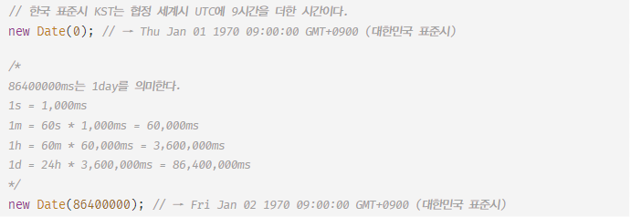

# Date

- 표준 빌트인 객체인 Date는 날짜와 시간을 위한 메서드를 제공하는 빌트인 객체이면서 생성자 함수다.
- UTC(협정 세계시)는 국제 표준시를 말한다.
  - GMT (그리니치 평균시)로 불리기도 한다.
- KST (한국 표준시)는 UTC에 9시간을 더한 시간이다.

<br/>

### 생성자 함수

- Date 생성자 함수로 생성한 Date 객체는 내부적으로 날짜와 시간을 나타내는 정수 값을 갖는다.
  - 1970-01-01 00:00:00 을 기점으로 Date 객체가 나타내는 날짜/시간가지의 밀리초를 나타낸다.

##### 1. new Date()

- Date 생성자 함수를 인수 없이 new 연산자와 함께 호출하면 현재 날짜와 시간을 가지는 Date 객체를 반환한다.
- Date 객체는 내부적으로 정수 값을 갖지만 Date 객체를 콘솔에 출력하면 기본적으로 날짜와 시간 정보를 출력한다.
  
- Date 생서자 함수를 new 연산자 없이 호출하면 Date 객체를 반환하지 않고 날짜와 시간 정보를 나타내는 문자열을 반환한다.
  

##### 2. new Date(milliseconds)

- Date 생성자 함수에 숫자 타입의 밀리초를 인수로 전달하면 1970-01-01 00:00:00을 기점으로 인주로 전달된 밀리초 만큼 경과한 날짜와 시간을 나타내는 Date 객체를 반환한다.
  

##### 3. new Date(dateString)

- Date 생성자 함수에 날짜와 시간을 나타내는 문자열을 인수로 전달하면 지정된 날짜와 시간을 나타내는 Date 객체를 반환한다.
  - 이때 인수로 전달한 문자열은 Date.parse 메서드에 의해 해석 가능한 형식이어야한다.


##### 4. new Date(year, month[, day, hour, minute, second, millisecond])
- Date 생성자 함수에 연, 월, 일 등등을 의미하는 숫자를 인수로 전달하면 지정된 날짜와 시간을 나타내는 Date 객체를 반환한다.
    - 이때 연, 월은 반드시 지정해야 한다. 지정하지 않은 옵션 정보는 0 또는 1로 초기화된다.


<br/>
<br/>

### 메서드

##### 1. Date.now
- 1970-01-01 00:00:00(UTC)를 기점으로 현재 시간까지 경과한 밀리초를 숫자로 반환한다.


##### 2. Date.parse
- 1970-01-01 00:00:00(UTC)를 기점으로 인수로 전달된 지정 시간까지의 밀리초를 숫자로 반환한다.


##### 3. Date.UTC
- 1970-01-01 00:00:00(UTC)를 기점으로 인수로 전달된 지정 시간까지의 밀리초를 숫자로 반환한다.
- new Date(year, month[,day, hour, minute, second, millisec])와 같은 형식의 인수를 사용해야한다.
- Date.UTC 메서드의 인수는 로컬타임(KST)이 아닌 UTC로 인식된다.
- month는 월을 의미하는 0~11까지의 정수이다.
    - 0부터 시작하므로 주의


##### 4. Date.prototype.getFullYear
- Date 객체의 연도를 나타내는 정수를 반환한다.

```javascript
new Date('2023-06-12').getFullYear(); // 2023
```

##### 5. Date.prototype.setFullYear
- Date 객체의 연도를 나타내는 정수를 설정한다.

```javascript
const today = new Date();

today.setFullYear(2000)
today.getFullYear(); // 2000

today.setFullYear(1900, 0, 1)
today.getFullYear(); // 1900
```

##### 6. Date.prototype.getMonth
- Date 객체의 월을 나타내는 0~11의 정수를 반환한다.
    - 1월은 0 12월은 11

```javascript
new Date('2023-06-12').getMonth(); // 5
```

##### 7. Date.prototype.setMonth
- Date 객체에 월을 나타내는 0~11의 정수를 설정한다.

```javascript
const today = new Date();

today.setMonth(0)l // 1월
today.getMonth(); // 1

today.setMonth(10, 1); // 11월 1일
today.getMonth(); // 10
```

##### 8. Date.prototype.getDate
- Date 객체의 날짜(1~31)를 나타내는 정수를 반환한다.

```javascript
new Date('2023-06-12').getDate(); // 12
```

##### 9. Date.prototype.setDate
- Date 객체의 날짜(1~31)를 나타내는 정수를 설정한다.

```javascript
const today = new Date();

today.setDate(1); // 1일
today.getDate(); // 1
```

##### 10. Date.prototype.getDay
- Date 객체의 요일(0~6)을 나타내는 정수를 반환한다.


```javascript
new Date('2023-06-12').getDay(); // 1 월요일
```

##### 11. Date.prototype.getHours
- Date 객체의 시간(0~23)을 나타내는 정수를 반환한다.

```javascript
new Date('2023-06-12 15:03').getHours(); // 15
```

##### 12. Date.prototype.setHours
- Date 객체의 시간(0~23)을 나타내는 정수를 설정한다.

```javascript
const today = new Date();

today.setHours(13);
today.getHours(); // 13

today.setHours(0,0,0,0); // 시, 분, 초, 밀리초 지정
today.getHours(); // 0
```

##### 13. Date.prototype.getMinutes
- Date 객체의 분(0~59)을 나타내는 정수를 반환한다.

```javascript
new Date('2023-06-12 15:03').getMinutes(); // 3
```

##### 14. Date.prototype.setMinutes
- Date 객체의 분(0~59)을 나타내는 정수를 설정한다.

```javascript
const today = new Date();

today.setMinutes(13);
today.getMinutes(); // 13

today.setMinutes(5, 10, 999); // 분, 초, 밀리초 지정
today.getMinutes(); // 5
```

##### 15. Date.prototype.getSeconds
- Date 객체의 초(0~59)를 나타내는 정수를 반환한다.

```javascript
new Date('2023-06-12 15:03:26').getSeconds(); // 26
```

##### 16. Date.prototype.setSeconds
- Date 객체의 초(0~59)를 나타내는 정수를 설정한다.

```javascript
const today = new Date();

today.setSeconds(30);
today.getSeconds(); // 30

today.setSeconds(10, 999); // 초, 밀리초 지정
today.getSeconds(); // 10
```

##### 17. Date.prototype.getMilliseconds
- Date 객체의 밀리초(0~999)를 나타내는 정수를 반환한다.

```javascript
new Date('2023-06-12 15:03:26:150').getMilliseconds(); // 150
```

##### 18. Date.prototype.setMilliseconds
- Date 객체의 밀리초(0~999)를 나타내는 정수를 설정한다.

```javascript
const today = new Date();

today.setMilliseconds(300);
today.getMilliseconds(); // 300
```

##### 19. Date.prototype.getTime
- 1970-01-01 00:00:00(UTC)를 기점으로 Date 객체의 시간까지 경과된 밀리초를 반환한다.

``` javascript
new Date('2023-06-03 15:12:26').getTime(); // 1685772746000
```

##### 20. Date.prototype.setTime
- Date 객체에 1970-01-01 00:00:00(UTC)를 기점으로 경과된 밀리초를 설정한다.

```javascript
const today = new Date();

today.setTime(86400000);
console.log(today); // Fri Jan 02 1970 09:00:00 GMT+0900 (한국 표준시)
```

##### 21. Date.prototype.getTimezoneOffset
- UTC와 Date 객체에 지정된 locale 시간과의 차이를 분 단위로 반환한다.
- KST는 UTC에 9시간을 더한 시간

```javascript
const today = new Date(); // 지정된 locale KST

today.getTimezoneOffset() / 60; // -9
```

##### 22. Date.prototype.toDateString
- 사람이 읽을 수 있는 형식의 문자열로 Date 객체의 날짜를 반환한다.

```javascript
const today = new Date('2023-06-13 15:00:30');

today.toString(); // 'Tue Jun 13 2023 15:00:30 GMT+0900 (한국 표준시)'
today.toDateString(); // 'Tue Jun 13 2023'
```

##### 23. Date.prototype.toTimeString
- 사람이 읽을 수 있는 형식으로 Date 객체의 시간을 표현한 문자열을 반환한다.

```javascript
const today = new Date('2023-06-13 15:00:30');

today.toString(); // 'Tue Jun 13 2023 15:00:30 GMT+0900 (한국 표준시)'
today.toTimeString(); // '15:00:30 GMT+0900 (한국 표준시)'
```

##### 24. Date.prototype.toISOString
- ISO 8601 형식으로 Date 객체의 날짜와 시간을 표현한 문자열을 반환한다.

```javascript
const today = new Date('2023-06-13 15:00:30');

today.toString(); // 'Tue Jun 13 2023 15:00:30 GMT+0900 (한국 표준시)'
today.toISOString(); // '2023-06-13T06:00:30.000Z'
```

##### 25. Date.prototype.toLocaleString
- 인수로 전달한 locale을 기준으로 Date 객체의 날짜와 시간을 표현한 문자열을 반환한다.
- 인수를 생략한 경우 브라우저가 동작 중인 시스템의 locale을 적용한다.

##### 26. Date.prototype.toLocaleTimeString
- 인수로 전달한 locale을 기준으로 Date 객체의 시간을 표현한 문자열을 반환한다.
- 인수를 생략한 경우 브라우저가 동작 중인 시스템의 locale을 적용한다.


<br/>
<br/>

### Date를 활용한 시계 예제
