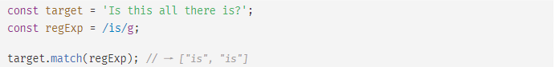
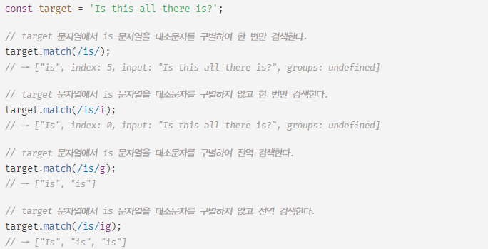
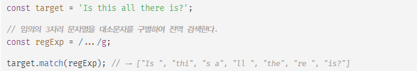

# RegExp

### 정규 표현식

- 일정한 패턴을 가진 문자열의 집합을 표현하기 위해 사용하는 형식 언어
- 자바스크립트의 고유 문법이 아니며, 대부분의 프로그래밍 언어와 코드 에디터에 내장 되어있다.
- 펄(Perl)의 정규 표현식 문법을 ES3부터 도입했다.
- 패턴 매치 기능
  - 문자열을 대상으로 제공하는 기능
  - 특정 패턴과 일치하는 문자열을 검색하거나 추출 또는 치환할 수 있는 기능
- 반복문과 조건문 없이 패턴을 정의하고 테스트하는 것으로 간단하게 체크 가능
- 주석이나 공백을 허용하고 여러 특수 문자를 사용하므로 가독성이 좋지는 않다.

<br/>
<br/>

### 정규 표현식의 생성

* 정규 표현식 문법
  * 정규 표현식 리터럴은 슬래시(/)로 시작해서 슬래시로 끝난다.
  * 리터럴 뒤에 플래그를 추가해 기본 검색 설정을 변경할 수 있다.

```javascript
/검색패턴/플래그
```

* 정규 표현식 리터럴

```javascript
const target = 'Is this all there is?';

const regexp = /is/i; // is 를 /i 대소문자 구별하지 않고 검색

regexp.test(target); // true
```

* RegExp 생성자 함수

```javascript
const target = 'Is this all there is?';

const regexp = new RegExp(/is/i); // ES6

regexp.test(target); // true
```

- RegExp 생성자 함수를 이용하면 변수를 사용해 동적으로 RegExp 객체를 생성할 수 있다.

```javascript
const count = (str, char) => (str.match(new RegExp(char, 'gi')) ?? []).length 
// str 문자열에서 char 단어가 몇개 있는지 찾는 함수
count('Is this all there is?', 'is'); // 3
count('Is this all there is?', 'xx'); // 0
```

<br/>
<br/>

### 메서드

- 정규표현식에서 사용하는 메서드는 여러가지가 있지만 31장에서는 아래 3가지만 정리한다.

##### 1. RegExp.prototype.exec

* 인수로 전달받은 문자열에 대해 정규 표현식의 패턴을 검색하여 매칭 결과를 배열로 반환한다.
  * 매칭 결과가 없는 경우 null 반환
* exec 메서드는 문자열 내의 모든 패턴을 검색하는 g 플래그를 지정해도 첫 번째 매칭 결과만 반환하므로 주의

```javascript
const target = 'Is this all there is?';
const regexp = '/is/';

regexp.exec(target); // ["is", index: 5, input: "Is this all there is?", ...]
```

##### 2. RegExp.prototype.test

* 인수로 전달받은 문자열에 대해 정규 표현식의 패턴을 검색하여 매칭 결과를 불리언 값으로 반환한다.

```javascript
const target = 'Is this all there is?';
const regexp = '/is/';

regexp.test(target); // true
```

##### 3. String.prototype.match

- String 표준 빌트인 객체가 제공하는 match 메서드는 대상 문자열과 인수로 전달받은 정규 표현식과의 매칭 결과를 배열로 반환한다.
- exec 메서드는 문자열 내의 모든 패턴을 검색하는 g 플래그를 지정해도 첫 번째 매칭 결과만 반환한다.
  하지만 match 메서드는 g 플래그가 지정되면 모든 매칭 결과를 배열로 반환한다.



<br/>
<br/>

### 정규표현식 응용

#### 플래그

- 정규 표현식을 구성하는 플래그는 정규 표현식의  검색 방식을 설정하기 위해 사용한다.
- 총 6개가 존재

| 플래그 | 의미       | 설명                                                                                                                              |
| ------ | ---------- | --------------------------------------------------------------------------------------------------------------------------------- |
| i      | Ignore     | 대소문자를 구별하지 않고 패턴을 검색                                                                                              |
| g      | Global     | 대상 문자열 내에서 패턴과 일치하는 모든 문자열을 전역 검색                                                                        |
| m      | Multi line | 문자열의 행이 바뀌더라도 패턴 검색 진행                                                                                           |
| y      | sticky     | 대상 문자열의 현재 위치부터 비교를 시작하도록 설정                                                                                |
| s      | dotall     | . 의 기본 동작은 개행문자 (\n) 를 매칭시키지 않는데,<br />s플래그를 사용하면 메타 문자열인 . 이 개행문자까지 매칭하도록 동작 변경 |
| u      | unicode    | 유니코드 모드를 활성화                                                                                                            |

- 플래그는 옵션이므로 선택적으로 사용할 수 있으며 순서와 상관없이 하나 이상의 플래그를 동시에 설정할 수 있다.
- 아무 플래그도 사용하지 않은 경우 대소문자를 구별해서 패턴을 검색하고, 문자열에 패턴 검색 매칭 대상이 1개 이상 존재해도 첫 번째 매칭 대상만 검색하고 종료한다.



<br/>

#### 특수 문자

- 복잡한 검색 조건을 사용할 때 사용

| 특수 문자 | 설명                                                                                                        |
| --------- | ----------------------------------------------------------------------------------------------------------- |
| \         | 역슬래시(\\) 다음에 일반 문자가 나오면 이스케이프 문자로 해석하고,<br />특수 문자가 나오면 일반 문자로 해석 |
| \d        | 숫자 검색. /[0-9]/ 와 동일                                                                                  |
| \D        | 숫자가 아닌 문자 검색. /[^0-9]/ 와 동일                                                                     |
| \w        | 언더스코어(_)를 포함한 영문자 및 숫자 검색. /[A-Za-z0-9\_]\/ 와 동일                                       |
| \W        | 언더스코어(_), 영문자, 숫자가 아닌 문자를 검색. /[^A-Za-z0-9\_]\/ 와 동일                                |
| \s        | 띄어쓰기, 탭, 줄바꿈 문자 등의 공백 문자를 검색                                                             |
| \S        | 띄어쓰기, 탭, 줄바꿈 문자 등의 공백 문자가 아닌 문자를 검색                                                 |
| \b        | 단어의 맨 앞이나 맨 뒤가 패턴과 일치하는지 검색                                                             |
| \xhh      | 16진수 hh에 해당하는 유니코드 문자 검색                                                                     |
| \uhhhh    | 16진수 hhhh에 해당하는 유니코드 문자 검색                                                                   |

<br/>

#### 양화사

* 정규 표현식에서 특수 문자로 수량을 나타내는 양화사를 사용 가능

| 괄호 | 설명                                                                  |
| ---- | --------------------------------------------------------------------- |
| n*   | 바로 앞의 문자가 0번 이상 나타나는 경우를 검색. /{0, }/ 와 동일      |
| n+   | 바로 앞의 문자가 1번 이상 나타나는 경우를 검색. /{1, }/ 과 동일       |
| n?   | 바로 앞의 문자가 0번 또는 1번만 나타나는 경우를 검색. /{0,1}/ 과 동일 |

<br/>

#### 괄호

* 정규 표현식에서 사용할 수 있는 괄호

| 괄호  | 설명                                                                                  |
| ----- | ------------------------------------------------------------------------------------- |
| a(b)c | 전체 패턴을 검색한 후에 괄호 안에 명시된 문자열을 저장. ) "abc"를 검색한 후에 b 저장 |
| [abc] | 꺾쇠 괄호 [] 안에 명시된 문자를 검색. ) "abc"를 검색                                  |
| [0-3] | 꺾쇠 괄호 안에 명시된 숫자를 검색. ) 0부터 3까지의 숫자를 검색                        |
| [\b]  | 백스페이스 문자를 검색                                                                |
| {n}   | 앞의 문자가 정확히 n번 나타나는 경우를 검색. ) n은 반드시 양의 정수                   |
| {m,n} | 앞의 문자가 최소 m번 이상 n번 이하로 나타나는 경우를 검색. ) m과 n은 반드시 양의 정수 |

#### 위치 문자

* 패턴을 검색할 단어의 위치 지정

| 문자 | 설명                                                                                                                      |
| ---- | ------------------------------------------------------------------------------------------------------------------------- |
| ^a   | 단어의 맨 앞에 위치한 해당 패턴만을 검색. ) 'a'로 시작하는 단어의 'a'만을 검색<br />[ ] 내에서 사용하면 not의 의미를 가짐 |
| a$   | 단어의 맨 뒤에 위치한 해당 패턴만을 검색. ) 'a'로 끝나는 단어의 'a'만을 검색                                              |

<br/>
<br/>

#### 패턴

* 패턴은 문자열의 일정한 규칙을 표현하기 위해 사용
* 패턴은 / 로 열고 닫으며 문자열의 따옴표는 생략한다.
  * 따옴표를 포함하면 따옴표까지도 포함되어 검색
* 메타 문자 또는 기호로 표현 가능
* 어떤 문자열 내에 패턴과 일치하는 문자열이 존재할 때 "정규 표현식과 매치한다." 라고 표현

##### 1. 문자열 검색

* 정규 표현식 패턴에 문자 또는 문자열을 지정하면 검색 대상 문자열에서 패턴으로 지정한 문자 또는 문자열을 검색한다.
  * RegExp 메서드를 사용해 검색 대상 문자열과 정규 표현식의 매칭 결과를 구하면 검색이 수행된다.

```javascript
const target = 'Is this all there is?';
// 'is' 문자열과 매치하는 패턴. 플래그가 생략되었으므로 대소문자를 구별한다.
let regexp = /is/;

regexp.test(target); // true

target.match(regexp); // ["is", index: 5, ...]

// 대소문자를 구별하지 않으려면 i 플래그를 사용한다.
regexp = /is/i;

target.match(regexp); // ["is", index: 0, ...]

// g 플래그를 추가하면 대상 문자열 내에서 패턴과 일치하는 모든 문자열을 검색한다.
regexp = /is/ig;
target.match(regexp); // ["is", "is", "is"]
```

##### 2. 임의의 문자열 검색

- .은 문자 한 개를 의미한다. 문자의 내용은 무엇이든 상관 없다.
- 아래 예제의 경우 .을 3개 연속하여 패턴을 생성했으므로 문자의 내용과 상과넝ㅄ이 3자리 문자열과 매치한다.



##### 3. 반복 검색

- {m,n}은 앞선 패턴이 최소 m번, 최대 n번 반복되는 문자열을 의미한다.
  콤마 뒤에 공백이 있으면 정상동작 하지 않으므로 주의
- +는 앞선 패턴이 최소 1번 이상 반복되는 문자열을 의미한다.
  +은 {1,}와 같다.
- ?는 앞선 패턴이 최대 1번(0번 포함) 이상 반복되는 문자열을 의미한다.
  ?은 {0,1}와 같다.

```javascript
const target 'A AA B BB Aa Bb AAA';

// A가 최소 2번 이상 반복되는 문자열 전역 검색
let regExp = /A{2}/g;
target.match(regExp); // ['AA', 'AAA']

// A가 최소 1번, 최대 2번 반복되는 문자열 전역 검색
regExp = /A{1,2}/g;
target.match(regExp); // ['A', 'AA', 'A', 'AA', 'A']

// A가 최소 2번 이상 반복되는 문자열 전역 검색
regExp = /A{2,}/g;
target.match(regExp); // ['AA', 'AAA']

// A가 최소 한번 이상 반복하는 문자열 전역 검색
regExp = /A+/g;
target.match(regExp); // ['A', 'AA', 'A', 'AAA']

const str = 'color colour';

// colo 다음 u가 최대 1번(0번 포함) 이상 반복되고 r이 이어지는 문자열 전역 검색
regExp = /colou?r/g;
str.match(regExp); // ['color', 'colour']
```

##### 4. OR 검색

- |은 or의 의미를 갖는다.

```javascript
const target 'A AA B BB Aa Bb';

// A or B를 전역 검색
let regExp = /A|B/g;
target.match(regExp); // ['A', 'A', 'A', 'B', 'B', 'B', 'A', 'B']

// 분해되지 않는 단어 레벨로 검색하기 위해 +를 함께 사용
// {1,}로 검색하면 1개 이상 패턴과 일치하는 문자열을 통으로 매치하니 단어별로 검색된다.
regExp = /A+|B+/g;
target.match(regExp); // ['A', 'AA', 'B', 'BB', 'A', 'B']

// [] 내의 문자는 or로 동작하기에 위 패턴을 간단히 표현 가능
regExp = /[AB]+/g;
target.match(regExp); // ['A', 'AA', 'B', 'BB', 'A', 'B']

// 범위를 지정하려먼 -을 사용
// 대문자 알파벳을 검색
let target2 = 'A AA BB ZZ Aa Bb';
regExp = /[A-Z]+/g;
target2.match(regExp); // ['A', 'AA', 'BB', 'ZZ', 'A', 'B']

target2 = 'AA BB ZZ Aa 12 34 56,78';
// 대소문자를 구별하지 않고 알파벳 검색
regExp = /[A-Za-z]+/g;
regExp = /[a-z]+/gi;
target2.match(regExp); // ['AA', 'BB', 'ZZ', 'Aa']

// 숫자 검색
regExp = /[0-9]+/g;
target2.match(regExp); // ['12', '34', '56', '78']

// 쉼표 포함 숫자 검색
regExp = /[0-9,]+/g;
target2.match(regExp); // ['12', '34', '56,78']

target2 = 'AA BB 12 34,56';

// 숫자 검색 간략 표현
// 0-9숫자 또는 ,가 포함된 문자열 검색
regExp = /[\d,]+/g;
target2.match(regExp); // ['12', '34,56']

// 0-9숫자가 아닌 문자 또는 ,가 포함된 문자 검색
regExp = /[\D,]+/g;
target2.match(regExp); // ['AA BB ', ',']

// \w는 알파벳, 숫자, 언더스코어를 의미 \w == [A-Za-z0-9_]와 동일
// \W는 \w와 반대로 동작
target2 = 'Aa Bb 12,34 _$%^';

regExp = /[\w,]+/g;
target2.match(regExp); // ['Aa','Bb','12,34', '_']

// 알파벳, 숫자, 언더스코어가 아닌 문자 또는 ,가 한번 이상 반복되는 전역 검색
regExp = /[\W,]+/g;
target2.match(regExp); // [' ', ' ', ',', ' ', '$%^']
```

##### 5. NOT 검색

- []내의 ^는 not을 의미한다.

``` javascript
const target = 'AA BB 12 Aa Bb';
//숫자를 제외한 모든 문자열 검색
let regExp = /[^0-9]+/g;
target.match(regExp); // ['AA BB ', 'Aa Bb']

// 알파벳 대문자를 제외한 문자열 전역 검색
regExp = /[^A-Z]+/g;
target.match(regExp); // [' ', ' 12 ', 'a ', 'b']
```

##### 6. 시작 위치로 검색
- [] 밖에서 ^은 문자열의 시작을 의미한다.

``` javascript
const target = 'http://www.google.com';
// http로 시작하는지 검사
const regExp = /^http/;
regExp.test(target); // true
```

##### 7. 마지막 위치로 검색
- $은 문자열의 마지막을 의미한다.

``` javascript
const target = 'http://www.google.com';
// com로 끝나는지 검사
const regExp = /com$/;
regExp.test(target); // true
```

<br/>
<br/>

### 자주 사용하는 정규 표현식

##### 1. 특정 단어로 시작하는지 검사
``` javascript
const target = 'https://www.google.com';
/^https/.test(target); // true
```

##### 2. 특정 단어로 끝나는지 검사
``` javascript
const target = 'https://www.google.com';
/com$/.test(target); // true
```

##### 3. 숫자로만 이루어진 문자열인지 검사
``` javascript
const target = '12345';
/^\d+$/.test(target); //true
```

##### 4. 하나 이상의 공백으로 시작하는지 검사
``` javascript
const target = ' Hi!';
/^[\s]+/.test(target); // true
```

##### 5. 아이디로 사용 가능한지 검사
- 검색 대상 문자열이 알파벳 대소문자 또는 숫자로 시작하고 끝나며 4~10자리 숫자인지 확인
``` javascript
const target = 'abc123';
/^[A-Z0-9]{4,10}$/i.test(target); // true
```

##### 6. 메일 주소 형식에 맞는지 검사
``` javascript
const target = 'soeun.lim@google.com';
/^[0-9a-z]([-_\.]?[0-9a-z])*@[0-9a-z]([-_\.]?[0-9a-z])*\.[a-z]{2,3}$/i.test(target);
// true
```

##### 7. 핸드폰 번호 형식에 맞는지 검사
``` javascript
const target = '010-9021-7397';
/^\d{3}-\d{3,4}-\d{4}$/.test(target); // true
```

##### 8. 특수 문자 포함 여부 검사
``` javascript
const target = 'abc#$%123';
/[^0-9a-z]/gi.test(target); //true

// 특수문자를 제거할 때 replace 메서드 사용
target.replace(/[^a-z0-9]/gi, ''); // abc123
```

<br/>
<br/>

### 퀴즈

1. 다음 중 정규식 검사 값이 다른 것을 고르시오.(1개)

``` javascript
const email = 'soeun.lim@google.com';
const phoneNumber = '010-9021-7397';

/^[0-9a-z]([-_\.]?[0-9a-z])*@[0-9a-z]([-_\.]?[0-9a-z])*\.[a-z]{2,3}$/i.test(email); // 1
/^[\w]@*[\w].[\w]/.test(email); // 2
/^[a-z].*[a-z]*@[\w].[a-z]{2,3}/.test(email); // 3
/^[a-z]\.[a-z]@*[\w]\.[a-z]{2,3}/.test(email); // 4
/^\d{3}-\d{3,4}-\d{4}$/.test(phoneNumber); // 5
/^[0-9]{3}-[0-9]{3,4}-[0-9]{4}$/.test(phoneNumber); // 6
```


<br/>
<br/>

###### 정답
``` javascript
/^[a-z]\.[a-z]@*[\w]\.[a-z]{2,3}/.test(email); // 4
```