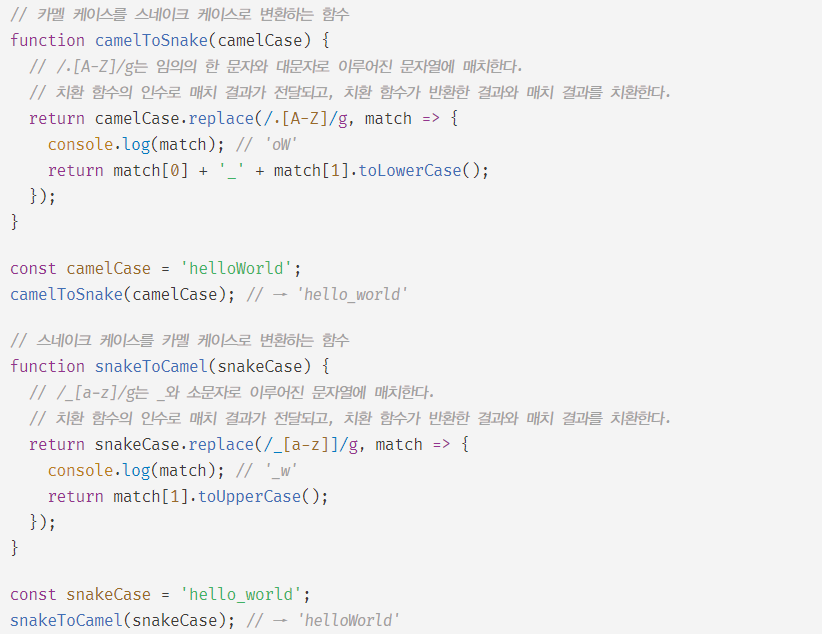

# String

- 표준 빌트인 객체인 String은 원시 타입인 물자열을 다룰 때 유용한 프로퍼티와 메서드를 제공한다.

### 생성자 함수

- 표준 빌트인 객체인 String 객체는 생성자 함수 객체이다.
  new 연산자와 함께 호출하여 String 인스턴스를 생성할 수 있다.
- String 생성자 함수에 인수를 전달하지 않고 new 연산자와 함께 호출하면 [[StringData]] 내부 슬롯에 빈 문자열을 할당한 String 래퍼 객체를 생성한다.
  - PrimitiveValue라는 접근 불가능한 프로퍼티가 [[StringData]] 내부 슬롯을 가리킨다.
- String 생성자 함수의 인수로 문자열을 전달하면서 new 연산자와 함께 호출하면 [[StringData]] 내부 슬롯에 인수로 전달받은 문자열을 할당한 String 래퍼 객체를 생성한다.

```javascript
// 인수 미전달
const strObj = new String();
console.log(strObj); // String {length: 0, [[PrimitiveValue]: ""]}
// 인수 전달
const strObj = new String("Lim");
console.log(strObj); // String {0: "L", 1: "i" ...., length: 3, [[PrimitiveValue]: "Lim"]}
```

- String 래퍼 객체는 유사 배열 객체이면서 이터러블이므로 배열과 유사하게 인덱스를 이용해 각 문자에 접근 가능하다.

```javascript
console.log(strObj[0]); // L

// *문자열은 원시값이므로 변경할 수 없다. 이때 에러가 발생하지 않는다.
strObj[1] = 'e';
console.log(strObj); // 'Lim'
```

- String 생성자 함수에 인수로 문자열이 아닌 값을 전달하면 인수를 문자열로 강제 변환 후, [[StringData]] 내부 슬롯에 변환된 문자열을 할당한 String 래퍼 객체를 생성한다.

```javascript
let strObj = new String(123);
console.log(strObj); // String {0: '1', 1: '2', 2: '3', length: 3, ...}

strObj = new String(null);
console.log(strObj); // String {0: 'n', 1: 'u', 2: 'l', ...}
```

- new 연산자를 사용하지 않고 String 생성자 함수를 호출하면 String 인스턴스가 아닌 문자열을 반환한다.
  - 이를 이용해 명시적 타입 변환을 한다.

```javascript
String(1); // "1"
String(NaN); // "NaN"
String(Infitiny); // "Infitiny"
String(true); // "true"
```

<br/>
<br/>

### 프로퍼티

- length 프로퍼티는 문자열의 문자 개수를 반환한다.

```javascript
'Hello'.length; // 5
'안녕하세요~!'.length; // 7
```

<br/>
<br/>

### 메서드

- String 객체에는 원본 String 래퍼 객체를 직접 변경하는 메서드는 없다.
  - 언제나 새로운 문자열을 반환한다.
  - 문자열은 변경 불가능한 값이기 때문에 String 래퍼도 읽기 전용 객체로 제공된다.

##### 1. String.prototype.indexOf

- indexOf 메서드는 대산 문자열에서 인수로 받은 문자열을 검색하여 첫 번째 인덱스를 반환한다.
  - 검색 실패 시 -1 반환.
- 2번째 인수로 검색을 시작할 인덱스를 전달할 수 있다.
- includes 메서드를 사용하면 더 가독성이 좋아진다.

```javascript
const tre = 'Hello World';

str.indexOf('l'); // 2
str.indexOf('Word'); // -1
str.indexOf('Hello'); // 0

str.indexOf('l', 5); // 9
```

##### 2. String.prototype.search

- search 메서드는 대상 문자열에서 인수로 전달받은 정규 표현식과 매치하는 문자열을 검색하여 일치하는 문자열의 인덱스를 반환한다.
  - 검색에 실패하면 -1 반환

```javascript
const str = 'Hello World';

str.search(/o/); // 4
str.search(/x/); // -1
str.search(/Wor/); // 6
```

##### 3. String.prototype.includes

- 대상 문자열에 인수로 전달받은 문자열이 포함되어 있는지 확인하여 true / false 로 반환한다.
- 2번째 인수로 검색을 시작할 인덱스를 전달할 수 있다.

```javascript
const str = 'Hello World';

str.includes('Hello'); // true
str.includes('Word'); // false

str.includes('o', 5); // true
str.includes('e', 5); // false
```

##### 4. String.prototype.startsWith

- 대상 문자열이 인수로 전달받은 문자열로 시작하는지 확인하여 결과를 true / false 로 반환한다.
- 2번째 인수로 검색을 시작할 인덱스를 전달할 수 있다.

```javascript
const str = 'Hello World';

str.startsWith('Hell'); // true
str.startsWith('Wor'); // false

str.startsWith('lo', 2); // true
```

##### 5. String.prototype.endsWith

- 대상 문자열이 인수로 전달받은 문자열로 끝나는지 확인하여 그 결과를 true / false 로 반환한다.
- 2번째 인수로 검색할 문자열의 길이를 전달할 수 있다.

```javascript
const str = 'Hello World';

str.endsWith('ld'); // true
str.endsWith('lo'); // false

str.endsWith('lo', 5); // true
```

##### 6. String.prototype.charAt

- 대상 문자열에서 인수로 전달받은 인덱스에 위치한 문자를 검색하여 반환한다.
- 인덱스는 문자열의 범위 (0 ~ 문자열의 length - 1) 사이의 정수이어야 한다.
- 인덱스가 문자열의 범위를 벗어난 정수인 경우 빈 문자열을 반환한다.

```javascript
const str = 'Hello';

str.charAt(3); // l
str.charAt(5); // ''
```

- charAt 메서드와 유사한 문자열 메서드
  - String.prototype.charCodeAt
  - String.prototype.codePointAt

##### 7. String.prototype.substring

- 대상 문자열에서 첫 번째 인수로 전달받은 인덱스에 위치하는 문자부터 두 번째 인수로 전달받은 인덱스에 위치하는 문자 이전까지 부분 문자열을 반환한다.
- 두 번째 인수는 생략 가능하다.


```javascript
const str = 'Hello World';

str.substring(1, 5); // 'ello'
str.substring(6); // 'World'
```

- 첫 번째 인수는 두 번째 인수보다 작은 정수여야 정상이다.
  하지만 다음과 같이 인수를 전달하여도 정상 동작한다.
  
- indexOf 메서드와 함께 사용하면 특정 문자열을 기준으로 앞 뒤에 위치한 부분 문자열을 취득할 수 있다.

```javascript
const str = 'Hello World';

str.substring(0, str.indexOf(' ')); // 'Hello'
str.substring(str.indexOf('o', 5)); // 'orld'
```

##### 8. String.prototype.slice

- slice 메서드는 substring 메서드와 동일하게 동작한다.
  단 slice 메서드는 음수인 인수를 전달할 수 있다.
  음수인 인수를 전달하면 대상 문자열의 가장 뒤부터 시작하여 문자열을 잘라내어 반환한다.

```javascript
const str = 'Hello World';

str.slice(0, 5); // 'Hello'
str.slice(7); // 'orld'

str.slice(6, -1); // 'Worl'
str.slice(-3); // 'rld'
```

##### 9. String.prototype.toUpperCase

- 대상 문자열을 모두 대문자로 변경한 문자열을 반환한다.

```javascript
'Hello World'.toUpperCase(); // 'HELLO WORLD'
```

##### 10. String.prototype.toLowerCase

- 대상 문자열을 모두 소문자로 변경한 문자열을 반환한다.

```javascript
'Hello World'.toLowerCase(); // 'hello world'
```

##### 11. String.prototype.trim

- 대상 문자열에 앞뒤에 포함된 공백을 제거한 문자열을 반환한다.

```javascript
'   hello   '.trim(); // 'hello'
```

- String.prototype.trimStart
  - 대상 문자열 앞에 공백문자가 있는 경우 공백 제거한 문자열 반환
- String.prototype.trimEnd
  - 대상 문자열 뒤에 공백문자가 있는 경우 공백 제거한 문자열 반환

```javascript
const str = '   hello   '
str.trimStart(); // 'hello   '
str.trimEnd(); // '   hello'

// 정규식을 이용한 공백 제거
str.replace(/\s/g, ''); // 'hello'
str.replace(/^\s+/g, ''); // 'hello   '
str.replace(/\s+$/g, ''); // '   hello'
```

##### 12. String.prototype.repeat

- 대상 문자열을 인수로 전달받은 정수 만큼 반복해 연결한 새로운 문자열을 반환한다.
- 인수로 전달받은 정수가 0이면 빈 문자열 반환
- 인수로 전달된 문자가 음수이면 RangeError 발생
- 인수 생략 시 기본값 0
- 인수가 실수이면 정수로 내림처리

```javascript
const str = 'abc';

str.repeat(); // ''
str.repeat(0); // ''
str.repeat(2); // 'abcabc'
str.repeat(-3); // RangeError: 
str.repeat(2.5); // 2.5 -> 2 'abcabc'
```

##### 13. String.prototype.replace

- 대상 문자열에서 첫 번째 인수로 받은 문자열 또는 정규표현식을 검색하여 두 번째 인수로 전달한 문자열로 치환한 문자열을 반환한다.
- 검색된 문자열이 여럿 존재할 경우 첫 번째로 검색된 문자열만 치환한다.
- 특수한 교체 패턴 사용 가능

```javascript
const str = 'Hello World';

str.replace('o', 'y'); // 'Helly World'
str.replace(/^[A-Z][a-z]+/g, 'Soeun'); // 'Soeun World'
str.replace(/[A-Z][a-z]+/g, 'Soeun'); // 'Soeun Soeun'

// 특수한 교체 패턴 ($& -> 검색된 문자열)
str.replace('Hello', '<b>$&</b>');
```

- replace 메서드는 두 번째 인수로 치환 함수를 전달할 수 있다.
  

##### 14. String.prototype.split

- 대상 문자열에서 첫 번째 인수로 전달한 문자열 또는 정규표현식을 검색하여 문자열을 구분한 후 분리된 각 문자열로 이루어진 배열을 반환한다.
  - 인수로 빈 문자열을 전달하면 각 문자를 모두 분리한다.
  - 인수를 생략하면 대상 문자열 전체를 단일 요소로 하는 배열을 반환한다.
- 두 번째 인수로 배열의 길이를 지정할 수 있다.
- split 메서드는 배열을 반환하므로, Array.prototype.reverse, Array.prototype.join 메서드와 함께 사용하면 문자열을 역순으로 뒤집을 수 있다.

```javascript
const str = 'How are you doing?';

str.split(' '); // ["How", "are", "you", "Doing?"]
str.split(); // ["How are you doing?"]
str.split(''); // ["H", "o", "w", " ","a", ... ,"?"]
str.split(/\s/); // ["How", "are", "you", "Doing?"]

str.split(' ', 3); // ["How", "are", "you"]

str.split(' ').reverse().join(' '); // "doing? you are How"
```
