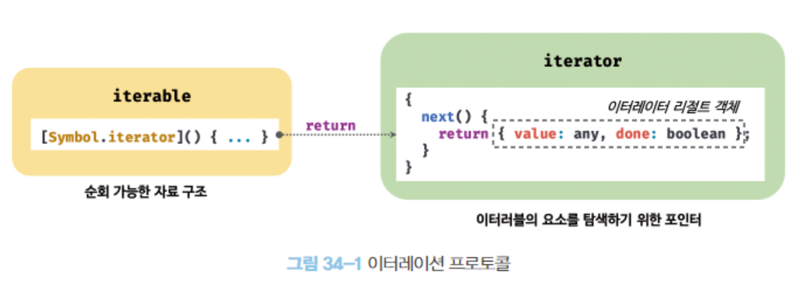
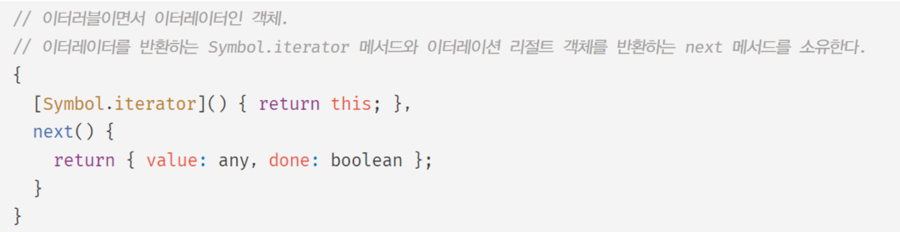

# 이터러블

### 이터레이션 프로토콜

- ES6에서 도입된 이터레이션 프로토콜은 순회 가능한 데이터 컬렉션(자료구조)을 만들기 위해 ECMAScript 사양에 정의하여 미리 약속한 규칙이다.
- ES6 이전의 순회 가능한 데이터 컬렉션들은 통일된 규약없이 다양한 방법으로 순회할 수 있었지만,
  ES6에서는 순회 가능한 데이터 컬렉션을 이터레이션 프로토콜을 준수하는 이터러블로 통일하여 사용할 수 있도록 일원화했다.
- 이터러블
  - for ...of
  - 스프레드 문법
  - 배열 디스트럭처링 할당의 대상




##### 1. 이터러블

- 이터러블 프로토콜을 준수한 객체를 이터러블이라고 한다.
- 이터러블은 Symbol.iterator를 프로퍼티 키로 사용한 메서드를 직접 구현하거나 프로토타입 체인을 통해 상속받은 객체를 말한다.
- 이터러블인지 확인하는 함수는 다음과 같다.

```js
const isIterable = v=> v !== null && typrof v[Symbol.iterator] === 'function';

isIterable([]); // true
isIterable(''); // true
isIterable(new Map()); // true
isIterable(new Set()); // true
isIterable({}); // false
```

- 이터러블은 for ...of 문으로 순회할 수 있으며, 스프레드 문법과 배열 디스트럭처링 할당의 대상으로 사용할 수 있다.

```js
const array = [1,2,3];
// 배열은 Array.prototype의 Symbol.iterator 메서드를 상속받는 이터러블이다.
console.log(Symbol.iterator in array) // true

// 이터러블은 배열은 for ..of 문으로 순회 가능하다.
for (const item of array) {
    console.log(item);
}

// 이터러블인 배열은 스프레드 문법의 대상으로 사용할 수 있다.
console.log([...array]); // [1,2,3]

// 이터러블인 배열은 배열 디스트럭처링 할당의 대상으로 사용할 수 있다.
const [a, ...rest] = array;
console.log(a, rest); // 1, [2,3]
```

- Symbol.iterator 메서드를 직접 구현하지 않거나 상속받지 않은 일반 객체는 이터러블 프로토콜을 준수한 이터러블이 아니다.
  따라서 일반 객체는 for ...of 문으로 순회할 수 없으며 스프레드 문법과 배열 디스트럭처링 할당의 대상으로 사용할 수 없다.

```javascript
const obj = { a:1, b:2 };

console.log(Symbol.iterator in obj); // false

// 이터러블이 아닌 일반 객체는 for ...of 문으로 순회할 수 없다
for (const item of obj) { // TypeError: obj is not iterable
    ...
}

// 이터러블이 아닌 일반 객체는 배열 디스트럭처링 할당의 대상으로 사용할 수 없다.
const [a, b] = obj; // TypeError: obj is not iterable
```

- 단, 스프레드 프로퍼티의 제안은 일반 객체에 스프레드 문법의 사용을 허용한다.
- 하지만 일반 객체도 이터러블 프로토콜을 준수하도록 구현하면 이터러블이 된다.
  - 34.6장 사용자 정의 이터러블

##### 2. 이터레이터

- 이터러블의 Symbol.iterator 메서드를 호출하면 이터레이터 프로토콜을 준수한 이터레이터를 반환한다.
- 이터러블의 Symbol.iterator 메서드가 반환한 이터레이터는 next 메서드를 갖는다.

```javascript
// 배열은 이터러블 프로토콜을 준수한 이터러블이다.
const array = [1,2,3];

// Symbol.iterator 메서드는 이터레이터를 반환한다.
const iterator = array[Symbol.iterator]();

// Symbol.iterator 메서드가 반환한 이터레이터는 next 메서드를 갖는다.
console.log('next' in iterator); // true
```

- 이터레이터의 next 메서드는 이터러블의 각 요소를 순회하기 위한 포인터 역할을 한다.
- 이터레이터 리절트 객체 (iterator result object)
  - next 메서드를 호출하면 반환된다.
  - 이터러블을 순차적으로 한 단계씩 순회하며 순회 결과를 나타내는 객체
- 이터레이터 리절트 객체의 프로퍼티
  - value
    - 현재 순회중인 이터러블의 값을 나타낸다.
  - done
    - 이터러블의 순회 완료 여부를 나타낸다.

```javascript
const array = [1,2,3];

// Symbol.iterator 메서드는 이터레이터를 반환한다. 이터레이터는 next 메서드를 갖는다.
const iterator = array[Symbol.iterator]();

// next 메서드를 호출하면 이터러블을 순회하며 순회 결과를 나타내는 이터레이터 리절트 객체를 반환한다.
// 이터레이터 리절트 객체는 value와 done 프로퍼티를 갖는 객체이다.
console.log(iterator.next()); // { value: 1, done: false }
console.log(iterator.next()); // { value: 2, done: false }
console.log(iterator.next()); // { value: 3, done: false }
console.log(iterator.next()); // { value: undefined, done: true }
```

##### 이터레이션 프로토콜을 준수하는 이터러블

| Array      | String   | Map            | Set       |
| ---------- | -------- | -------------- | --------- |
| TypedArray | NodeList | HTMLCollection | arguments |
|            |          |                |           |

<br/>
<br/>

### 빌트인 이터러블

- 자바스크립트는 이터레이션 프로토콜을 준수한 객체인 빌트인 이터러블을 제공한다.
  아래의 표준 빌트인 객체들은 빌트인 이터러블이다.
  
  

<br/>
<br/>

### for ...of 문

- 이터러블을 순회하면서 이터러블의 요소를 변수에 할당한다.
- for ...of 문 문법
  
- for ...of문의 동작방식
  1. 이터레이터의 next 메서드를 호출하여 이터러블을 순회
  2. next 메서드가 반환한 이터레이터 리절트 객체의 value 프로퍼티 값을 변수에 할당
  3. 이터레이터 리절트 객체의 done 프로퍼티 값이 false이면 이터러블 순회 중단

```javascript
for (const item of [1,2,3]) {
    console.log(item); // 1 2 3
}
```

- for ...of 문과 유사한 for ...in 문
  
- for ...in 문은 객체의 프로포타입 체인 상에 존재하는 모든 프로포타입의 프로퍼티 중에서 프로퍼티 어트리뷰트 [[Enumerable]]의 값이 true인 프로퍼티를 순회하며 열거한다.
  - 프로퍼티 키가 심벌인 프로퍼티는 열거하지 않는다.

```javascript
const obj = { a: 1, b: 2 };
for (const key in obj) {
    console.log(`${key}: ${obj[key]}`); // a: 1 b: 2
}
```

<br/>
<br/>

### 이터러블과 유사 배열 객체

- 유사 배열 객체는 마치 배열처럼 인덱스로 프로퍼티 값에 접근할 수 있고, length 프로퍼티를 갖는 객체를 말한다.
  - for 문으로 순회 가능
- 유사 배열 객체는 이터러블이 아닌 일반 객체이다. 따라서 유사 배열 객체에는 Symbol.iterator 메서드가 없다.
  - for ...of 문으로 순회 불가

```javascript
const arrayLike = {
    0:1,
    1:2,
    2:3,
    length: 3
};

// 유사 배열 객체는 for 문으로 순회 가능하다.
for (let i = 0; i < arrayLike.length; i++) {
    console.log(arrayLike[i]); // 1 2 3
}

// 유사 배열 객체는 이터러블이 아니기 대문에 for ...of 문으로 조회할 수 없다.
for (const item of arrayLike) { // TypeError: arrayLike is not iterable
    console.log(item);
}
```

- 유사 배열 객체이면서 이터러블

  - arguments
  - ModeList
  - HTMLCollection
  - ES6에서 이터러블이 도입되면서 위 객체에 Symbol.iterator 메서드를 구현하여 이터러블이 되었다.
  - 이터러블이 된 후에서 length 프로퍼티를 가지며 인덱스로 접근할 수 있으므로 유사 배열 객체이며 이터러블이다.
    - 배열도 마찬가지로 ES6에서 Symbol.iterator를 구현하여 이터러블이 되었다.
- 유사 배열 객체를 배열로 변환하기

  - Array.from 메서드
    - 유사 배열 객체 또는 이터러블을 인수로 전달받아 배열로 변환하여 반환한다.

```javascript
const arrayLike = {
    0:1,
    1:2,
    2:3,
    length: 3
};

// Array.from은 유사 배열 객체 또는 이터러블을 배열로 변환한다.
const arr = Array.from(arrayLike);
console.log(arr); // [1,2,3]
```

<br/>
<br/>

### 이터레이션 프로토콜의 필요성

- ES6에서 순회 가능한 데이터 컬렉션을 이터레이션 프로토콜을 준수하는 이터러블로 통일하여 for ...of 문, 스프레드 문법, 배열 디스트럭처링 할당의 대상으로 사용할 수 있도록 일원화했다.
- 이터러블은 데이터 소비자에 의해 사용되므로 데이터 공급자의 역할을 한다고 할 수 있다.
  
- 데이터 공급자가 각자의 순회 방식을 갖는다면 데이터 소비자는 다양한 데이터 순회 방식을 모두 지원해야한다.
  다양한 공급자가 이터레이션 프로토콜을 준수하도록 규정하면 데이터 소비자는 이터레이션 프로토콜만 지원하도록 구현하면 된다.
- 이터레이션 프로토콜은 다양한 데이터 공급자가 하나의 순회 방식을 갖도록 규정하여 데이터 소비자가 효율적으로 다양한 데이터 공급자를 사용할 수 있도록 데이터 소비자와 데이터 공급자를 연결하는 인터페이스의 역할을 한다.

<br/>
<br/>

### 사용자 정의 이터러블

##### 1. 사용자 정의 이터러블 구현

- 이터레이션 프로토콜을 준수하지 않는 일반 객체도 이터레이션 프로토콜을 준수하도록 구현하면 사용자 정의 이터러블이 된다.
- 아래는 피보나치 수열을 구현한 사용자 정의 이터러블이다.
  
  
- 사용자 정의 이터러블

  1. 이터레이션 프로토콜을 준수하도록 Symbol.iterator 메서드를 구현한다.
  2. Symbol.iterator 메서드가 next 메서드를 갖는 이터레이터를 반환하도록 한다.
  3. 이터레이터의 next 메서드는 value 와 done 프로퍼티를 가지는 이터레이터 리절트 객체를 반환한다.
  4. for ...of 문은 done 프로퍼티가 true가 될 때까지 반복하여 done 프로퍼티가 true가 되면 반복을 중지한다.

  - 이터러블은 for ...of 문 분 아니라 스프레드 문법, 배열 디스트럭처링 할당에도 사용 가능

##### 2. 이터러블을 생성하는 함수

- 수열의 최대 값을 외부에서 전달받아 이터러블을 반환하는 함수
  

##### 3. 이터러블이면서 이터레이터인 객체를 생성하는 함수

- 이터레이터를 생성하려면 이터러블의 Symbol.iterator 메서드를 호출해야 한다.
  
- 이터러블이면서 이터레이터인 객체를 생성하면 Symbol.iteration 메서드를 호출하지 않아도 된다.
- 다음 객체는 Symbol.iterator 메서드와 next 메서드를 소유한 이터러블이면서 이터레이터인 객체다.
  
- 아래 함수는 위의 fibonacciFunc 함수를 이터러블이면서 이터레이터인 객체를 생성하여 반환하는 함수로 변경한 함수이다.
  
  

##### 4. 무한 이터러블과 지연 평가

- 무한 이터러블 함수를 통해 무한 수열을 구현할 수 있다.
  
  
- 위 예제의 이터러블은 지연 평가를 통해 데이터를 생성한다.
- 지연 평가

  - 데이터가 필요한 시점 이전까지는 미리 데이터를 생성하지 않다가 데이터가 필요한 시점이 되면 그때 데이터를 생성하는 기법
  - 평가 결과가 필요할 때까지 평가를 늦추는 기법
  - for ..of 문 등 이 실행되기 전까지 데이터를 생성하지 않는다
  - for ..of 문의 경우 이터러블을 순회할 때 내부에서 이터레이터의 next 메서드를 호출하는데 이때 데이터가 생성된다.
- 지연 평가를 사용하면 불필요한 데이터를 미리 생성하지 않고 필요한 데이터를 필요한 순간에만 생성하므로 빠른 실행 속도를 기대할 수 있고 불필요한 메모리를 소비하지 않으며 무한도 표현할 수 있는 장점이 있다.
