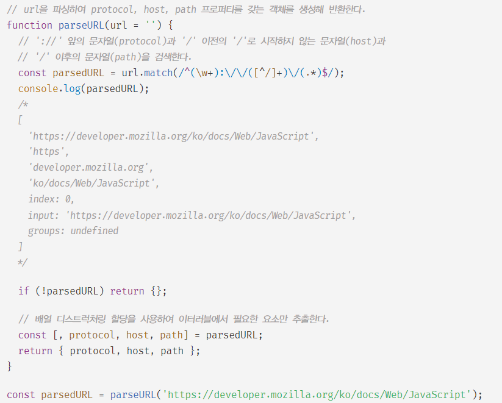
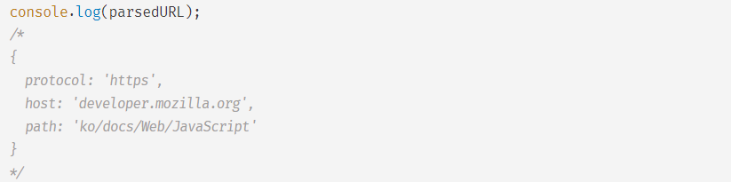

# 디스트럭처링 할당

- 구조 분해 할당
- 구조화된 배열과 같은 이터러블 또는 객체를 destructuring(비구조화, 구조 파괴)하여 1개 이상의 변수에 개별적으로 할당하는 것
- 배열과 같은 이터러블 또는 객체 리터럴에서 필요한 값만 추출하여 변수에 할당할 때 유용

### 배열 디스트럭처링 할당
- ES6의 배열 디스트럭처링 할당은 배열의 각 요소를 배열로부터 추출하여 1개 이상의 변수에 할당한다.
- 할당의 대상은 이터러블이어야 하며, 할당 기준은 배열의 인덱스이다.
    - 순서대로 할당

```javascript
//ES5 
var arr = [1,2,3];

var one = arr[0];
var two = arr[1];
var three = arr[2];
console.log(one, two, three); // 1 2 3

//ES6
const arr = [1,2,3];

const [one, two, three] = arr;
console.log(one, two, three); // 1 2 3
```

- 배열 디스트럭처링 할당을 위해서는 할당 연산자 왼쪽에 값을 할당받을 변수를 선언해야한다.
    - 변수는 배열 리터럴 형태로 선언
- 우변에 이터러블을 할당하지 않으면 에러가 발생한다.

```javascript
const [x,y] = [1,2];

const [a,b]; // SyntaxError

const [m,n] = {}; // TypeError: {} is not iterable
```

- 배열 디스트럭처링 할당의 변수 선언문은 다음처럼 선언과 할당을 분리할 수도 있지만 const 키워드로 변수를 선언할 수 없으므로 권장하지 않는 방법

```js
let x,y;

[x,y] = [1,2];
```

- 배열 디스트럭처링 할당의 기준은 배열의 인덱스라 순서대로 할당된다.
- 변수의 개수와 이터러블의 개수가 일치하지 않아도 된다.

```js
const [a,b] = [1,2];
console.log(a,b); // 1 2

const [c,d] = [1];
console.log(c,d); // 1 undefined

const [e, f] = [1,2,3];
console.log(e,f); // 1 2

const [g, , h] = [1,2,3];
console.log(g, h); // 1 3
```

- 배열 디스트럭처링 할당을 위해 변수에 기본값을 지정할 수 있다.

```js
const [a,b,c = 3] = [1,2];
console.log(a,b,c); // 1 2 3

// 기본값보다 할당된 값이 우선이다
const [e,f = 10,g = 3] = [1,2];
console.log(e,f,g); // 1 2 3
```

- 배열 디스트럭처링 할당을 이용해 이터러블에서 추출하고 싶은 요소만 추출하여 변수에 할당하는 예제



- 배열 디스트럭처링 할당을 위한 변수에 Rest 파라미터와 유사하게 Rest 요소 ...을 사용할 수 있다.
Rest 요소는 Rest 파라미터와 마찬가지로 반드시 마지막에 위치해야한다.

```javascript
const [x, ...y] = [1,2,3];
console.log(x, y); // 1 [2,3]
```

<br/>
<br/>

### 객체 디스트럭처링 할당
- ES6의 객체 디스트럭처링 할당은 객체의 각 프로퍼티를 객체로부터 추출하여 1개 이상의 변수에 할당한다.
- 객체 디스트럭처링 할당의 대상은 객체이고, 할당 기준은 프로퍼티 키다.
    - 순서는 상관 없고 선언된 변수 이름과 프로퍼티 키가 일치하면 할당된다.

```javascript
//ES5
var user = { first: 'Soeun', last: 'Lim' };
var first = user.first;
var last = user.last;

console.log(first, last); // Soeun Lim

//ES6
const user = { first: 'Soeun', last: 'Lim' };
const { last, first } = user;

console.log(first, last); // Soeun Lim
```

- 객체 디스트럭처링 할당을 위해서 할당 연산자 왼쪽에 프로퍼티 값을 할당받을 변수를 선언해야한다.
    - 변수를 객체 리터럴 형태로 선언
- 우변에 객체 또는 객체로 평가될 수 있는 표현식을 할당하지 않으면 에러가 발생한다.

```javascript
const { first, last } = { first: 'Soeun', last: 'Lim' };
const { first, last }; //SyntaxError
const { first, last } = null; // TypeError
```

- 프로퍼티 축약 표현을 통해 선언 가능
- 객체의 프로퍼티 키와 다른 변수 이름으로 프로퍼티 값을 할당 받으려면 객체의 프로퍼티 키와 같은 프로퍼티 키에 값을 할당할 변수를 선언한다.

```javascript
// 아래 두 개는 동치다
const { first, last } = { first: 'Soeun', last: 'Lim' };
const { first: first, last: last } = { first: 'Soeun', last: 'Lim' };

const { last: ln, first: fn } = { first: 'Soeun', last: 'Lim' };
console.log(fn, ln); // Soeun Lim
```

- 객체 디스트럭처링 할당을 위한 변수에 기본 값을 설정할 수 있다.
- 객체 디스트럭처링 할당은 객체에서 프로퍼티 키로 필요한 프로퍼티 값만 추출하여 변수에 할당하고 싶을 때 유용하다.
- 객체 디스트럭처링 할당은 객체를 인수로 전달받는 함수의 매개변수에도 사용할 수 있다.

```javascript
// 기본값 설정
const { first = 'Soeun', last = 'Kim' } = { last: 'Lim' };
console.log(first, last); // Soeun Lim

// 필요한 프로퍼티 키 값만 추출
const str = 'Hello';
const { length } = str;
console.log(length); // 5

const todo = { id: 1, content: 'HTML', completed: true };
const { id } = todo;
console.log(id); // 1

// 함수 매개변수 사용
function printTodo({ content, completed }) {
    console.log(`${content} ${completed ? '완료' : '미완료'} 상태`);
}
printTodo({ id: 1, content: 'HTML', completed: true });
// HTML 완료 상태
```

- 배열의 요소가 객체인 경우 배열 디스트럭처링 할당과 객체 디스트럭처링 할당을 혼용할 수 있다.
- 객체 디스트럭처링 할당을 중첩 객체에서도 사용 가능하다.

```javascript
const todos = [
    { id: 1, content: 'HTML', completed: true },
    { id: 2, content: 'JS', completed: true },
    { id: 3, content: 'CSS', completed: false },
]
// 배열의 두번째 요소인 객체에서 id만 추출
const [, { id }] = todos;
console.log(id); // 2

// 중첩의 경우
const user = {
    name: 'Lim',
    address: {
        zipCode: 17375,
        city: 'Icheon'
    }
}
const { address: { city } } = user;
console.log(city); // 'Icheon'
```

- 객체 디스트럭처링 할당을 위한 변수에 Rest 파라미터나 Rest 요소와 유사하게 Rest 프로퍼티 ...을 사용할 수 있다.
Rest 프로퍼티는 반드시 마지막에 위치해야한다.
Rest 프로퍼티는 스프레드 프로퍼티와 함께 2021-1 기준 TC39 프로세스의 stage4 단계에 제안되어있다.

```javascript
const { x, ...rest } = { x: 1, y: 2, z: 3 };
console.log(x, rest); // 1, { y: 2, z: 3 }
```
