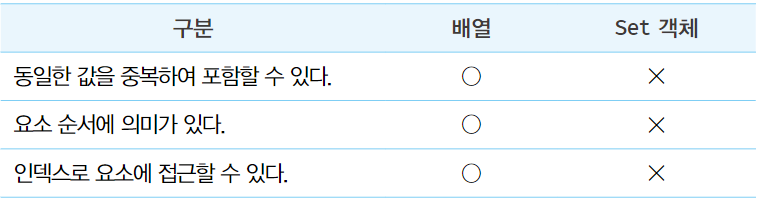
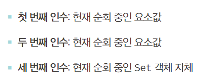
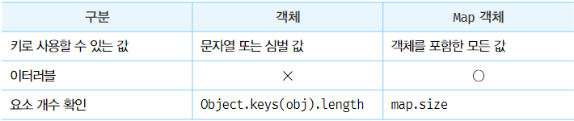
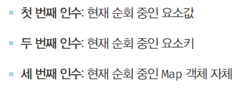
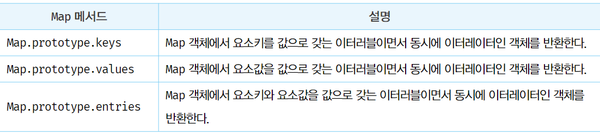
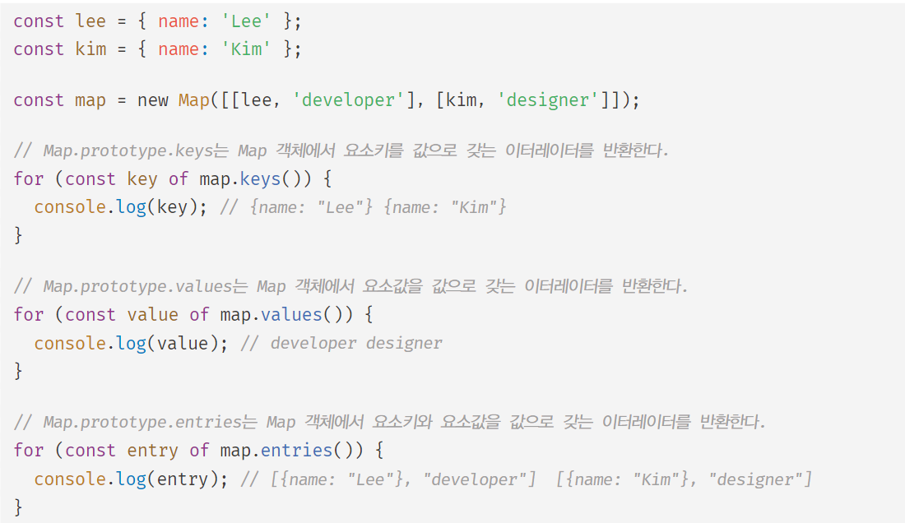

# Set Map

### Set

- Set 객체는 중복되지 않는 유일한 값들의 집합이다.
- 배열과 유사하지만 다음과 같은 차이가 있다.
  
- Set 객체의 특성
  - 수학적 집합의 특성과 일치
  - 수학적 집합을 구현하기 위한 자료구조
  - Set을 통해 교집합, 합집합, 차집합, 여집합 등을 구할 수 있다.

##### 1. Set 객체의 생성

- Set 객체는 Set 생성자 함수로 생성한다.
- Set 생성자 함수에 인수를 전달하지 않으면 빈 Set 객체가 생성된다.

```js
const set = new Set();
console.log(set); // Set(0) {}
```

- Set 생성자 함수는 이터러블을 인수로 받아 Set 객체를 생성한다.
  - 이때 이터러블의 중복된 값은 Set 객체에 요소로 저장되지 않는다.
- 중복을 허용하지 않는 Set 객체의 특성을 활용하여 배열에서 중복된 요소를 제거할 수 있다.

```javascript
const set = new Set([1,2,2,3]);
consoel.log(set); // Set(3) {1, 2, 3}

const set2 = new Set('Hello');
console.log(set2); // Set(4) {'H', 'e', 'l', 'o'} 중복값은 저장되지 않음

// 배열의 중복 요소 제거
const uniq = array => [...new Set(array)];
console.log(uniq([3,1,2,3,3,2,4,2])); // [3,1,2,4]
```

##### 2. 요소 개수 확인

- Set.prototype.size
  - Set 객체의 요소 개수를 나타내는 프로퍼티
  - setter 함수 없이 getter 함수만 존재하는 접근자 프로퍼티다.
    size 프로퍼티에 값을 할당하여 Set 객체의 요소 개수를 변경할 수 없다.

```javascript
const set = new Set([1,2,3]);
console.log(set.size); // 3

set.size = 10; // 무시된다
console.log(set.size); // 3
```

##### 3. 요소 추가

- Set.prototype.add
  - Set 객체에 요소를 추가하는 메서드
  - 새로운 요소가 추가된 Set 객체를 반환한다.
    add 메서드 호출 후 add 메서드를 연속 호출 할 수 있다.
  - Set 객체에 중복된 요소는 추가되지 않는다.
    중복된 요소가 추가될 때 에러가 발생하지 않고 무시된다.
  - 일치 비교 연산자 === 를 사용하면 NaN === NaN 은 다르다고 평가하지만 Set 객체는 같다고 판단하기 때문에 중복 추가를 허용하지 않는다.
    +0과 -0도 마찬가지로 같다고 평가한다.
  - 자바스크립트의 모든 값을 요소로 추가할 수 있다.

```js
const set = new Set();
console.log(set); // Set(0) {}

set.add(1).add(2);
console.log(set); // Set(2) {1, 2}

set.add(2);
console.log(set); // Set(2) {1, 2}

set.add(NaN).add(+0).add(NaN).add(-0);
console.log(set); // Set(4) {1, 2, NaN, 0}

const set2 = new Set();

set2
    .add(1)
    .add('a')
    .add(true)
    .add(undefined)
    .add(null)
    .add({})
    .add([])
    .add(NaN)
    .add(() => {});
console.log(set2); // Set(9) {1, 'a', true, undefined, null, {}, [], NaN, () => {}}
```

##### 4. 요소 존재 여부 확인

- Set.prototype.has
  - Set 객체에 특정 요소가 있는지 판단하여 존재 여부를 불리언 값으로 반환하는 메서드

```js
const set = new Set([1,2,3]);

console.log(set.has(2)); // true
console.log(set.has(5)); // false
```

##### 5. 요소 삭제

- Set.prototype.delete
  - Set 객체의 요소를 삭제하는 메서드
  - 삭제 성공 여부를 불리언 값으로 반환
    - add 메서드와 달리 불리언 값을 반환하므로 연속해서 사용할 수 없다.
  - delete 메서드에는 인덱스가 아니라 삭제하려는 요소 값을 인수로 전달한다.
    Set 객체는 모두 유일한 값이기 때문에 순서는 의미가 없으므로 인덱스를 갖지 않는다.
  - 존재하지 않는 요소를 삭제하려하면 에러없이 무시된다.

```javascript
const set = new Set([1,2,3]);

set.delete(2);
console.log(set); // Set(2) {1, 3}
set.delete(4);
console.log(set); // Set(2) {1, 3}

set.delete(0).delete(1); // TypeError
```

##### 6. 요소 일괄 삭제

- Set.prototype.clear
  - Set 객체의 모든 요소를 일괄 삭제하는 메서드
  - 반환 값은 언제나 undefined

```javascript
const set = new Set([1,2,3]);

const clear = set.clear();
console.log(clear); // undefined
console.log(set); // Set(0) {}
```

##### 7. 요소 순회

- Set.prototype.forEach
  - Set 객체의 요소를 순회하는 메서드
  - Array.prototype.forEach와 유사하게 콜백함수와 forEach 메서드의 콜백 함수 내부에서 this로 사용될 객체(옵션)를 인수로 전달한다.
    - 콜백 함수의 3가지 인수
      
    - 첫 번째 인수와 두 번째 인수는 같은 값이다.
      Array.prototype.forEach와 인터페이스를 맞추기 위함이며, Arrays.prototype.forEach의 두 번째 인수는 인덱스 값이지만 Set은 인덱스가 없기 때문에 요소 값을 한번 더 인수로 받는다.

```javascript
const set = new Set([1,2,3]);

set.forEach((v, v2, set) => console.log(v, v2, set));
/* 
1 1 Set(3) {1,2,3}
2 2 Set(3) {1,2,3}
3 3 Set(3) {1,2,3}
*/
```

- Set 객체는 이터러블이므로 for ...of문을 사용할 수 있고, 스프레드 문법과 배열 디스트럭처링 할당의 대상이 될 수 있다.

```js
const set = new Set([1,2,3]);

// Set 객체는 Set.prototype의 Symbol.iterator 메서드를 상속받은 이터러블이다.
console.log(Symbol.iterator in set); // true

for (const value of set) {
    console.log(value); // 1 2 3
}

console.log([...set]); // [1,2,3]

const [a, ...rest] = set;
console.log(a, rest); // 1, [2,3]
```

- Set 객체는 요소의 순서에 의미를 두지 않지만 Set 객체를 순회하는 순서는 요소가 추가된 순서를 따른다. 규정되어 있지는 않지만 다른 이터러블의 순회와 호환성을 유지하기 위함이다.

##### 8. 집합 연산

- Set 객체는 수학적 집합을 구현하기 위한 자료구조이다. 따라서 교집합, 합집합 등을 구현할 수 있다.

###### 교집합

- 교집합 A ∩ B 은 A와 B의 공통 집합으로 공통된 요소로 구성된다.

```javascript
// 방법1
Set.prototype.intersection = function (set) {
    const result = new Set();

    for (const value of set) {
        if (this.has(value)) {
            // 대상 집합과 인수로 받은 비교 집합의 요소가 공통되면 교집합의 대상
            result.add(value);
        }
    }
    return result;
}

// 방법2
Set.prototype.intersection = function (set) {
    return new Set([...this].filter(v => set.has(v)));
}

const setA = new Set([1,2,3,4]);
const setB = new Set([2,4,6]);

console.log(setA.intersection(setB)); // Set(2) {2,4}
console.log(setB.intersection(setA)); // Set(2) {2,4}
```

###### 합집합

- 합집합 A ∪ B 은 A와 B의 요소를 중복 없는 모든 요소로 구성된다.

```javascript
// 방법1
Set.prototype.union = function (set) {
    const result = new Set(this);

    for (const value of set) {
        // 합집합은 모든 요소를 합친다. 중복 요소는 포함되지 않는다.
        result.add(value);
    }
    return result;
}

// 방법2
Set.prototype.union = function (set) {
    return new Set([...this, ...set]);
}

const setA = new Set([1,2,3,4]);
const setB = new Set([2,4,6]);

console.log(setA.union(setB)); // Set(5) {1,2,3,4,6}
console.log(setB.union(setA)); // Set(5) {1,2,3,4,6}
```

###### 차집합

- 차집합 A - B 는 집합 A에는 존재하지만 집합 B에는 존재하지 않는 요소로 구성된다.

```js
// 방법1
Set.prototype.difference = function (set) {
    const result = new Set(this);

    for (const value of set) {
        // 존재하지 않는 요소는 무시된다.
        result.delete(value);
    }
    return result;
}

// 방법2
Set.prototype.difference = function (set) {
    const result = new Set(this);

    for (const value of this) {
        if (set.has(value)) {
            result.delete(value);
        }
    }
    return result;
}

// 방법3
Set.prototype.difference = function (set) {
    return new Set([...this].filter(v => !set.has(v)));
}

const setA = new Set([1,2,3,4]);
const setB = new Set([2,4,6]);

console.log(setA.difference(setB)); // Set(2) {1,3}
console.log(setB.difference(setA)); // Set(1) {6}
```

###### 부분 집합과 상위 집합

- 집합 A가 집합B에 포함되는 경우 (A ⊆ B) 집합 A는 집합B의 부분 집합이며,
  집합 B는 집합 A의 상위 집합이다.

```javascript
// 방법1
Set.prototype.isSuperset = function (subset) {
    // 대상 set이 인수로 받은 set의 상위 집합인지 확인
    for (const value of subset) {
        if (!this.has(value)) {
            return false;
        }
    }
    return true;
}

// 방법2
Set.prototype.isSuperset = function (subset) {
    return ![...subset].filter(v => !this.has(v)).length;
}

// 방법3
Set.prototype.isSuperset = function (subset) {
    const superset = [...this];
    return [...subset].every(v => superset.includes(v));
}

const setA = new Set([1,2,3,4]);
const setB = new Set([2,4]);

console.log(setA.isSuperset(setB)); // true
console.log(setB.isSuperset(setA)); // false
```

<br/>
<br/>

### Map

- Map 객체는 키와 값의 쌍으로 이루어진다.
- 객체와 유사하지만 다음과 같은 차이가 있다.
  

##### 1. Map 객체의 생성

- Map 생성자 함수
  - Map 객체를 생성하는 생성자 함수
  - 이터러블을 인수로 받아 Map 객체를 생성한다.
    - 이때 인수로 전달되는 이터러블은 키와 값의 쌍으로 이루어진 요소로 구성되어야 한다.
  - 인수를 전달하지 않으면 빈 Map 객체가 생성된다.
  - 중복된 키를 갖는 요소는 덮어써지므로 Map 객체에는 중복된 키는 존재하지 않는다.

```javascript
const map = new Map();
console.log(map); // Map(0)

const map1 = new Map([['key1', 'value1'], ['key2', 'value']]);
console.log(map1); // Map(2) {"key1" => "value1", "key2" => "value2"}

const map2 = new Map([1,2]); // TypeError

const map3 = new Map([['key1', 'value1'], ['key1', 'value2']]);
console.log(map3); // Map(1) {"key1" => "value2"}
```

##### 2. 요소 개수 확인

- Map.prototype.size
  - Map 객체의 요소 개수를 나타내는 프로퍼티
  - setter 함수 없이 getter 함수만 존재하는 프로퍼티이므로 값을 변경할 수 없다.

```javascript
const {size} = new Map([['key1', 'value1'], ['key2', 'value']]);
console.log(size); // 2
```

##### 3. 요소 추가

- Map.prototype.set
  - Map 객체에 요소를 추가할 때 사용하는 메서드
  - set 메서드는 새로운 요소가 추가된 Map 객체를 반환하므로 연속 호출 가능하다.

```js
const map = new Map();

map.set('k', 'v');
console.log(map); // Map(1) {"k" => "v"}

map.set('k2','v2').set('k3', 'v3');
console.log(map); // Map(1) {"k" => "v", "k2" => "v2", "k3" => "v3"}
```

- Map 객체는 중복된 키를 갖는 요소를 추가하면 값이 덮어써진다.
  - 이 때 에러가 발생하지 않음
  - 일치 비교 연산자 === 로 NaN을 비교하면 다르다고 평가하지만 Map 객체는 NaN과 NaN을 같다고 평가하여 중복추가를 허용하지 않는다.
  - +0과 -0도 Map 객체는 같다고 평가하여 중복추가를 허용하지 않는다.

```javascript
const map = new Map();
map.set('k', 'v').set('k','v2');
console.log(map); // Map(1) {"k" => "v2"}

map.set(NaN, 'NaN-false').set(NaN, 'NaN-true');
console.log(map); // Map(1) {"k" => "v2", NaN => "NaN-true"}

map.set(+0, '+0').set(-0, '-0');
console.log(map); // Map(1) {"k" => "v2", NaN => "NaN-true", 0 => "-0"}
```

- 객체는 문자열 또는 심벌값만 키로 사용할 수 있지만, Map 객체는 키 타입 제한이 없다.
- 객체를 포함한 모든 값을 키로 사용할 수 있다.

```js
const map = new Map();

const lim = { name: 'Lim' };

map.set(lim, 'myName');
```

##### 4. 요소 취득

- Map.prototype.get
  - Map 객체에서 요소를 취득하는 메서드
  - 인수로 키를 전달하면 Map 객체에서 인수로 전달한 키를 갖는 값을 반환한다.
  - 일치하는 키를 갖는 요소가 존재하지 않으면 undefined를 반환한다.

```javascript
const map = new Map();

const lim = { name: 'Lim' };
map.set(lim, 'myName');

console.log(map.get(lim)); // myName
console.log(map.get('key')); // undefined
```

##### 5. 요소 존재 여부 확인

- Map.prototype.has
  - Map 객체에 특정 요소가 존재하는지 확인하는 메서드
  - 결과를 불리언 값으로 반환한다.
  - 인수로 찾는 요소의 키를 넘긴다.

```javascript
const map = new Map();
const lim = { name: 'Lim' };
map.set(lim, 'myName');

console.log(map.has(lim)); // true
console.log(map.has('key')); // false
```

##### 6. 요소 삭제

- Map.prototype.delete
  - Map 객체의 요소를 삭제하는 메서드
  - 요소 삭제 성공 여부를 불리언으로 반환한다.
  - 존재하지 않는 키를 인수로 전달하면 에러 없이 무시된다.
  - 불리언을 반환하기 때문에 set과 달리 연속 호출할 수 없다.

```javascript
const map = new Map();
const lim = { name: 'Lim' };
const kim = { name: 'Kim' };
const woo = { name: 'Woo' };
const choi = { name: 'Choi' };
map.set(lim, 'myName').set(kim, 'userName1')
  .set(woo, 'userName2').set(choi, 'userName3');

map.delete(kim); // true
map.delete('key'); // 무시
map.delete(woo).delete(choi); // TypeError
```

##### 7. 요소 일괄 삭제

- Map.prototype.clear
  - Map객체의 요소를 일괄 삭제하는 메서드
  - 반환값은 언제나 undefined이다.

```js
const map = new Map();
const lim = { name: 'Lim' };
const kim = { name: 'Kim' };
map.set(lim, 'myName').set(kim, 'userName1');

console.log(map); // Map(2) {...}

map.clear();
console.log(map); // Map(0) {}
```

##### 8. 요소 순회

- Map.prototype.forEach
  - Map 객체의 요소를 순회하는 메서드
  - Array.prototype.forEach 메서드와 유사하게 콜백 함수와 forEach 메서드의 콜백 함수 내부에서 this로 사용될 객체를 인수로 전달한다.
    - 콜백 함수의 인수 3가지
      
- Map 객체는 이터러블이기 때문에 for ...of 문, 스트레드 문법, 배열 디스트럭처링 할당의 대상이 될 수 있다.
- Map 객체는 이터러블 이면서 동시에 이터레이터인 객체를 반환하는 메서드를 제공한다.
  
  

- Map 객체는 요소의 순서에 의미를 두지 않지만 Map 객체를 순회하는 순서는 요소가 추가된 순서를 따른다. 규정되어 있지는 않지만 다른 이터러블의 순회와 호환성을 유지하기 위함이다.


### 퀴즈

1. 다음 함수 중 함수의 내용이 console.log 에 찍히는 결과 값과 맞지 않는 함수를 고르시오.

```javascript
const setU = new Set([1,2,3,4,5,6,7,8,9,10]);
const setA = new Set([1,2,3,4,5]);
const setB = new Set([2,4,6,8,10]);

// A ⊆ B 부분 집합임을 확인하는 함수
Set.prototype.isSubset = function (superset) {
    return ![...this].filter(v => !superset.has(v)).length;
}
console.log(setA.isSubset(setB)); // false
console.log(setB.isSubset(setU)); // true

// Ac 여집합을 구하는 함수
Set.prototype.complement = function (set) {
    return new Set([...this].filter(v => set.has(v)));
}
console.log(setU.complement(setA)); // Set(5) {6,7,8,9,10}

// A ⊖ B 두 집합의 공통 요소를 제외한 모든 요소를 구하는 함수
Set.prototype.symmetric = function (set) {
    const result = new Set(this);

    for (const value of set) {
        if (result.has(value)) {
            result.delete(value);
        } else {
            result.add(value);
        }
    }
    return result;
}
console.log(setA.symmetric(setB)); // Set(6) {1,3,5,6,8,10}
```

<br/>

<details>
    <summary>정답</summary> 
    <div markdown="1">
        // Ac 여집합을 구하는 함수
        <br/>
        return new Set([...this].filter(v => !set.has(v)));
    </div>
</details>
<br/>
<br/>
