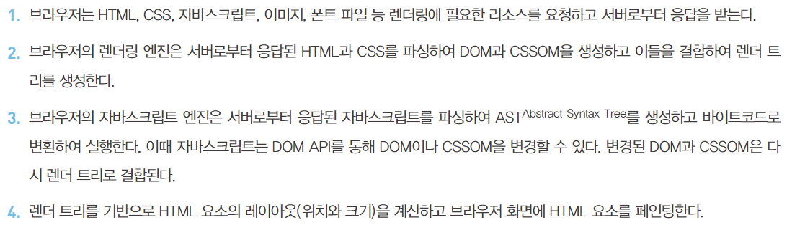
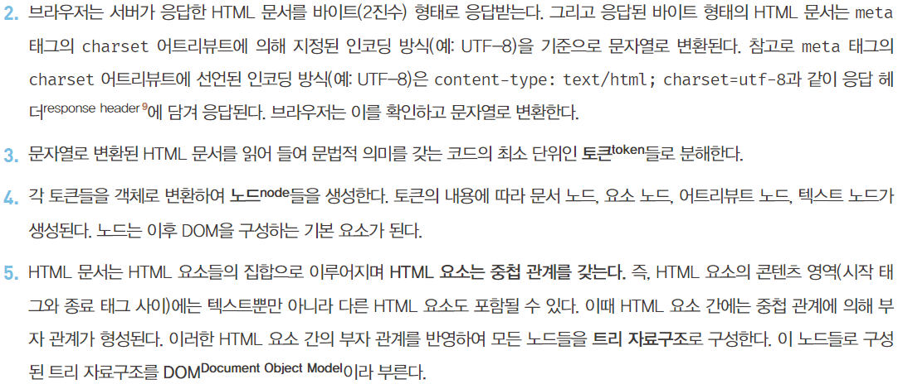

# 브라우저의 렌더링 과정

### 요청과 응답
- 브라우저의 핵심 기능은 필요한 리소스를 서버에 요청하고 서버로부터 응답받아 브라우저에 시각적으로 렌더링하는 것이다.
- 렌더링에 필요한 리소스는 모두 서버에 존재하므로 서버에 요청하고 서버가 응답한 리소스를 파싱하여 렌더링하는 것이다.

- 브라우저 주소창 제공
  - 서버에 요청하기 위해 브라우저에서 제공하는 주소창
  - URL을 주소창에 입력하고 엔터키를 누르면 URL의 호스트 이름이 DNS를 통해 IP 주소로 변환되고 IP 주소를 갖는 서버에게 요청을 전송한다.

- 루트 요청
  - 브라우저 주소창에 [scheme://host(domain)] 스키마와 호스트만으로 구성된 URL을 요청하면 루트요청으로 간주된다.
  - 루트 요청에는 명확한 리소스를 요청하는 내용이 없지만 서버는 일반적으로 루트 요청에 대해 index.html을 응답하도록 설정되어있다.
  https://google.com === https://google.com/index.html 이다.
- 특정 정적 파일 요청
  - 브라우저 주소창에 https://github.com/soeun.lim 과 같이 정적 파일의 경로를 호스트 뒤의 path에 기술하여 서버에 요청한다.
- 개발자도구 - Network 패널
  - 브라우저에서 서버에 요청한 내용과 서버에서 응답한 내용을 확인할 수 있다.
  - 요청하지 않은 css, js 등의 파일들도 응답하는 것을 확인할 수 있다.
    - 브라우저의 렌더링 엔진이 HTML(index.html)을 파싱하는 도중 외부 리소스를 로드하는 태그 (css link, 이미지 link, js script 등)를 만나면 HTML 파싱을 중단하고 해당 리소스 파일을 서버로 요청하기 때문

 
 

### HTTP 1.1과 HTTP 2.0
- HTTP
  - 웹에서 브라우저와 서버가 통신하기 위한 프로토콜(규약)이다.
  - 1989년 HTML, URL과 함께 팀 버너스 리 경이 고안했다.
  - 1991년 최초로 문서화
  - 1996년 HTTP/1.0 발표
  - 1999년 HTTP/1.1 발표
  - 2015년 HTTP/2 발표

##### HTTP/1.1 
- 기본적으로 커넥션당 하나의 요청과 응답만 처리한다.
  - 여러 개의 요청을 한 번에 전송할 수 없고, 응답도 마찬가지다.
- HTML 문서 내에 포함된 여러 개의 리소스 요청이 개별적으로 전송되고 응답 또한 개별적으로 전송된다.
- HTTP/1.1은 리소스의 동시 전송이 불가능한 구조이므로 요청할 리소스 개수에 비례하여 응답 시간도 증가하는 단점이 있다.

##### HTTP/2
- 커넥션당 여러 개의 요청과 응답이 가능하다.
  - 다중 요청/응답
- 여러 리소스의 동시 전송이 가능하므로 HTTP/1.1에 비해 페이지 로드 속도가 약 50% 정도 빠르다고 알려져있다.

 
 

### HTML 파싱과 DOM 생성
- 브라우저의 요청에 의해 서버가 응답한 HTML 문서는 문자열로 이루어진 순수한 텍스트다.
- 순수한 텍스트인 HTML 문서를 브라우저에 시각적인 픽셀로 렌더링 하려면 HTML 문서를
브라우저가 이해할 수 있는 자료구조(객체)로 변환하여 메모리에 저장해야 한다.
- 브라우저의 렌더링 엔진은 다음 그림과 같은 과정을 통해 응답받은 HTML 문서를 파싱하여
브라우저가 이해할 수 있는 자료구조인 DOM(Document Object Model)을 생성한다.
- DOM은 HTML 문서를 파싱한 결과물이다.

 
 

### CSS 파싱과 CSSOM 생성
- 렌더링 엔진은 HTML을 처음부터 한줄 씩 순차적으로 파싱하여 DOM을 생성하다가
CSS를 로드하는 link 태그나 style 태그를 만나면 DOM 생성을 일시 중단한다.
- CSS를 HTML과 동일한 파싱 과정(바이트 -> 문자 -> 토큰 -> 노드 -> CSSOM)을 거치며 해석하여 CSSOM(CSS Object Model)을 생성한다.
- CSS 파싱이 마무리되면 DOM 생성을 재개한다.
- CSSOM은 CSS의 상속을 반영하여 생성된다.

 
 

### 렌더 트리 생성
- DOM과 CSSOM은 렌더링을 위해 렌더 트리로 결합된다.
- 렌더 트리
  - 렌더링을 위한 트리 구조의 자료구조
  - 브라우저 화면에 렌더링 되는 노드만 구성된다.
    - css에 의해 미표시(ex -> display: none)되는 노드들은 포함하지 않는다.

- 완성된 렌더 트리는 각 HTML 요소의 레이아웃을 계산하는데 사용되며 브라우저 화면에 픽셀을 렌더링하는 페인팅 처리에 입력된다.

- 위의 브라우저 렌더링 과정은 반복해서 실행될 수 있다.
  - 다음의 경우 반복해서 레이아웃 계산과 페인팅이 실행된다.

- 레이아웃 계산과 페인팅을 다시 실행하는 리렌더링은 성능에 악영향을 주는 작업이므로 가급적 리렌더링이 빈번하게 발생하지 않도록 주의할 필요가 있다.

 
 

### 자바스크립트 파싱과 실행
- 자바스크립트의 파싱과 실행은 브라우저 렌더링 엔진이 아닌 자바스크립트 엔진이 처리한다.
- HTML을 한줄 씩 파싱하다 script 태그를 만나면 자바스크립트 코드를 파싱하기 위해 브라우저 렌더링 엔진에서 자바스크립트 엔진으로 제어권을 넘긴다.
- 자바스크립트 엔진은 자바스크립트 코드를 파싱하여 CPU가 이해할 수 있는 저수준 언어로 변환하고 실행하는 역할을 한다.
  - 자바스크립트 엔진은 다양한 종류가 있으며, 모두 ECMAScript 사양을 준수한다.
- 렌더링 엔진이 HTML과 CSS를 파싱하듯 자바스크립트 엔진은 자바스크립트를 해석하여 AST를 생성한다.
- AST 기반으로 인터프리터가 실행할 수 있는 중간코드인 바이트코드를 생성하여 실행한다.

##### 토크나이징
- 단순한 문자열인 자바스크립트 소스코드를 어휘 분석하여 문법적 의미를 갖는 코드의 최소 단위인 토큰들로 분해한다.
- 이 과정을 렉싱(lexing)이라고 부르기도 하지만 토크나이징과 미묘한 차이가 있다.

##### 파싱
- 토큰들의 집합을 구문 분석을 하여 AST(abstract syntax tree) 추상 구문 트리를 생성한다.
- AST
  - 토큰에 문법적 의미와 구조를 반영한 트리 구조의 자료구조다.
  - AST는 인터프리터나 컴파일러만이 사용하는 것은 아니고 TypeScript, Babel, Prettier 같은 트랜스파일러를 구현할 수도 있다.
  

##### 바이트코드 생성과 실행
- 파싱의 결과물로서 생성된 AST는 인터프리터가 실행할 수 있는 중간 코드인 바이트코드로 변환되고 인터프리터에 의해 실행된다.
- 참고
  - V8 엔진의 경우 자주 사용되는 코드는 터보펜이라 불리는 컴파일러에 의해 최적화된 머신 코드(optimized machine code)로 컴파일되어 성능을 최적화 한다.
  - 코드의 사용 빈도가 적어지면 다시 디옵티마이징(deopimizing)하기도 한다.

 
 

### 리플로우와 리페인트
- 자바스크립트 코드에 DOM이나 CSSOM을 변경하는 DOM API가 사용된 경우 DOM이나 CSSOM이 변경된다.
- 변경된 DOM, CSSOM은 다시 렌더 트리로 결합되고, 변경된 렌더 트리를 기반으로 레이아웃과 페인트 과정을 거쳐 브라우저 화면에 다시 렌더링한다.

- 리플로우
  - 레이아웃 계산을 다시 하는 것
  - 노드 추가/삭제, 요소의 크기/위치 변경, 윈도우 리사이징 등 레이아웃에 영향을 주는 변경이 발생할 경우에 한하여 실행된다.
- 리페인트
  - 재결합된 렌더 트리를 기반으로 다시 페인트 하는 것
- 리플로우와 리페인트가 반드시 순차적으로 동시에 실행되는 것은 아니다. 
레이아웃에 영향이 없는 변경은 리플로우 없이 리페인트만 실행된다. 

 
 

### 자바스크립트 파싱에 의한 HTML 파싱 중단
- 렌더링 엔진과 자바스크립트 엔진은 병렬적으로 파싱을 진행하지 않고 직렬적으로 파싱을 수행한다.

- 브라우저는 동기적으로 HTML, CSS, Javascript를 파싱하고 실행한다.
script 태그의 위치에 따라 HTML 파싱이 블로킹 되어 DOM 생성이 지연될 수 있다는 것을 의미한다. 따라서 script 태그의 위치는 중요한 의미를 갖는다.

##### script 태그 위치의 중요성

- DOM API인 document.getElementById('apple')을 실행하는 시점에 아직 id가 apple인 HTML 요소를 파싱하지 않았기 때문에 위 예제는 정상적으로 동작하지 않는다.
- 이러한 문제를 해결하기 위해 script 태그를 body 요소의 가장 아래에 위치시키는 것은 좋은 아이디어다.

- 자바스크립트를 가장 아래에 배치하면 자바스크립트가 실행될 시점에는 DOM 생성이 완료되어 있으므로, 자바스크립트가 DOM을 조작해도 에러가 발생할 우려가 없다.
또한 자바스크립트가 실행되기 이전에 DOM 생성이 완료되어 렌더링 되므로 페이지 로딩 시작이 단축되는 이점이 있다.

 
 

### script 태그의 async/defer 어트리뷰트
- 자바스크립트 파싱에 의한 DOM 생성 중단 이슈를 근본적으로 해결하기 위해 HTML5부터 script 태그에 async와 defer 어트리뷰트가 추가되었다.
- async와 defer 어트리뷰트는 scr 어트리뷰트를 통해 외부 자바스크립트 파일을 로드하는 경우에만 사용할 수 있다.
  - scr 어트리뷰터가 없는 인라인 자바스트립트에는 사용할 수 없다.

- async와 defer 어트리뷰트를 사용하면 HTML 파싱과 외부 자바스크립트 파일의 로드가 비동기적으로 동시에 진행된다.
  - 하지만 자바스크립트 실행 시점에는 차이가 있다. 

##### async 어트리뷰트
- HTML 파싱과 외부 자바스크립트 파일의 로드가 비동기적으로 동시에 진행된다.
- 자바스크립트의 파싱과 실행은 자바스크립트 파일의 로드가 완료된 직후에 진행되며, 이때 HTML 파싱이 중단된다.

- 여러 개의 script 태그에 async 어트리뷰트를 지정하면 태그의 순서와 상관없이 먼저 로드가 완료된 자바스크립트부터 먼저 실행되므로 순서가 보장되지 않는다.
- 순서 보장이 필요한 script 태그에는 async 어트리뷰트를 지정하지 않아야한다.

##### defer 어트리뷰트
- HTML 파싱과 외부 자바스크립트 파일의 로드가 비동기적으로 동시에 진행된다.
- 자바스크립트의 파싱과 실행은 DOM 생성이 완료된 직후에 진행된다.
- DOM 생성이 완료된 이후 실행되어야할 자바스크립트에 유용하다.

 
 

### 퀴즈

1. HTML의 파싱 과정을 순서대로 나열하시오.

- 토큰
- DOM
- 바이트
- 노드
- 문자

