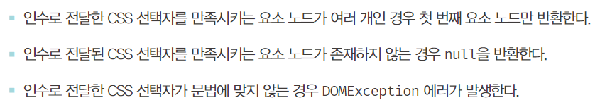

# DOM

- DOM
  - HTML 문서의 계층적 구조와 정보를 표현하며 이를 제어할 수 있는 API(프로퍼티, 메서드)를 제공하는 트리 자료구조다.

### 노드

##### 1. HTML 요소와 노드 객체

- HTML 요소는 HTML 문서를 구성하는 개별적인 요소를 의미한다.
  
- HTML 요소는 렌더링 엔진에 의해 파싱되어 DOM을 구성하는 요소 노드 객체로 변환된다.
  - HTML 요소의 어트리뷰트는 어트리뷰트 노드로, 텍스트 콘텐츠는 텍스트 노드로 변환된다.
    
- HTML 문서는 HTML 요소들의 집합으로 이루어지며 HTML 요소는 중첩 관계를 갖는다.
  - HTML 요소 사이에 다른 HTML 요소를 포함시킬 수 있다.
- HTML 요소 간에 중첩관계에 의해 계층적인 부자(parent-child) 관계가 형성된다.
- HTML 요소간의 부자 관계를 반영하여 HTML 요소를 객체화한 모든 노드 객체들을 트리 자료구조로 구성한다.

###### 트리 자료구조

- 노드들의 계층 구조로 이루어진다.
- 노드간의 계층적 구조(부자, 형제 관계)를 표현하는 비선형 자료구조
- 하나의 최상위 노드에서 시작한다.
- 루트 노드
  - 최상위 노드
  - 부모 노드가 없다.
  - 0개 이상의 자식 노드를 갖는다.
- 리프 노드
  - 자식 노드가 없는 노드


- 노드 객체들로 구성된 트리 자료구조를 DOM 이라고 한다.
- 노트 객체의 트리로 구조화되어 있기 때문에 DOM을 DOM 트리라고 부르기도 한다.

##### 2. 노드 객체의 타입


- 렌더링 엔진은 위 HTML 문서를 파싱하여 다음과 같이 DOM을 생성한다.


- DOM은 노드 객체의 계층적인 구조로 구성된다.
- 노드 객체는 총 12개의 종류가 있고 상속 구조를 갖는다.

###### 문서 노드

- 문서 노드는 DOM 트리의 최상위에 존재하는 루트 노드로서 document 객체를 가리킨다.
- document 객체는 전역 객체 window의 document 프로퍼티에 바인딩 되어있다.
  - 즉 문서노드는 window.document 또는 document로 참조 가능하다.
- 모든 자바스크립트 코드는 전역 객체 window의 document 프로퍼티에 바인딩되어 있는 하나의 document를 바라본다. 즉 HTML 문서당 document 객체는 유일하다.
- document 객체는 DOM 트리의 루트 노드이므로 DOM 트리의 노드들이 접근하기 위한 진입점 역할을 담당한다.
  - 나머지 노드들에 접근하려면 문서 노드르르 통해야한다.

###### 요소 노드

- HTML 요소를 가리키는 객체이다.
- HTML 요소 간의 중첩에 의해 부자 관계를 가지며, 부자 관계를 통해 정보를 구조화한다.
  - 부모 노드와 연결되어 있다.
- 즉 요소노드는 문서의 구조를 표현한다 할 수 있다.
- tag 네임

###### 어트리뷰트 노드

- HTML 요소의 어트리뷰트를 가리키는 객체이다.
- 어트리뷰트 노드는 어트리뷰트가 지정된 HTML 요소의 요소 노드와 연결되어 있다.
- 부모 노드와 연결되어 있지 않고 요소 노드에만 연결되어 있다.
  - 부모 노드가 없으므로 요소 노드와 형제 노드는 아니다.
- 어트리뷰트 노드에 접근하려면 먼저 요소 노드에 접근해야한다.

###### 텍스트 노드

- HTML 요소의 텍스트를 가리키는 객체다.
- 요소 노드가 문서의 구조를 표현한다면 텍스트 노드는 문서의 정보를 표현한다고 할 수 있다.
- 텍스트 노드는 요소 노드의 자식이며, 자식 노드를 가질 수 없는 리프 노드이다.
- DOM 트리의 최종단
- 텍스트 노드에 접근하려면 요소 노드에 접근해야 한다.

###### 전체 노드 타입

| 노드 타입(12개) |                    |                        |            |
| --------------- | ------------------ | ---------------------- | ---------- |
| Document 노드  | element 노드      | attribute 노드        | text 노드 |
| Comment 노드    | DocumentType 노드 | DocumentFragment 노드 |            |
|                 |                    |                        |            |

##### 3. 노드 객체의 상속 구조

- DOM은 HTML 문서의 계층적 구조와 정보를 표현하며 이를 제어할 수 있는 프로퍼티와 메서드를 제공하는 트리 자료구조다.
  - 프로퍼티와 메서드를 사용해 노드 객체의 부모, 형제, 자식을 탐색할 수 있으며, 자신의 어트리뷰트와 텍스트를 조작할 수 있다.
- DOM을 구성하는 노드 객체는 ECMAScript 사양에 정의된 표준 빌트인 객체가 아니라 브라우저 환경에서 추가적으로 제공하는 호스트 객체이다.
  하지만 노드도 자바스크립트 객체이므로 프로토타입에 의한 상속구조를 갖는다.
  
- 위 그림과 같이 모든 노드 객체는 Object, EventTarget, Node 인터페이스를 상속받는다.
- 문서노드
  - Document, HTMLDocument 인터페이스 상속 받음
- 어트리뷰트 노드
  - Attr 상속 받음
- 텍스트 노드
  - CharacterData 인터페이스 상속 받음
- 요소 노드
  - Element 인터페이스 상속 받음
  - 요소 노드는 HTMLElement와 태그의 종류별로 세분화 된
    HTMLHtmlElement, HEMLHeadElement, HTMLBodyElement, HTMLUListElement 등의 인터페이스를 상속받는다.


- 위 그림의 프로토타입 관점에서 보면 input 요소 노드 객체는 프로토타입 체인에 있는 모든 프로토타입의 프로퍼티나 메서드를 상속받아 사용할 수 있다.


- 노드 객체의 상속 구조는 개발자 도구의 Elements 패널 우측의 Properties 패널에서 확인 가능
- DOM은 HTML 문서의 계층적 구조와 정보를 표현하는 것은 물론 노드 객체의 종류(노드 타입)에 따라 필요한 기능을 프로퍼티와 메서드의 집합인 DOM API로 제공한다.
  이 DOM API를 통해 HTMl 구조나 내용 또는 스타일 등을 동적으로 조작할 수 있다.

<br/>
<br/>

### 요소 노드 취득
- HTML의 구조나 내용 또는 스타일 등을 동적으로 조작하려면 요소 노드를 취득해야한다.
- DOM은 요소 노드를 취득할 수 있는 다양한 메서드를 제공한다.

##### 1. id를 이용한 요소 노드 취득
- Document.prototype.getElementById
  - 인수로 전달한 id 어트리뷰트 값을 갖는 하나의 요소 노드를 탐색하여 반환한다.
  - Document.prototype의 프로퍼티 이므로 반드시 문서 노드인 document를 통헤 호출해야한다.

```html
<!DOCTYPE html>
<html>
  <body>
    <ul>
      <li id="apple">apple</li>
    </ul>
    <script>
      const element = document.getElementById('apple');
    </script>
  </body>
</html>
```
- id 값은 문서 내에 유일한 값이어야하며, class 어트리뷰트와 달리 공백 문자로 구분하여 여러개의 값을 가질 수 없다.
  - 단, HTML 문서 내에 중복된 id 값을 갖는 HTML 요소가 여러 개 존재해도 에러가 발생하지 않는다.
  - 중복된 id 값을 갖는 요소가 여러 개 존재할 가능성도 있다.
- 중복된 id를 갖는 요소가 있는 경우 첫 번째 요소 노드만 반환한다.
  - 항상 하나의 요소만 반환한다.
- 인수로 전달된 id 값을 갖는 요소가 존재하지 않을 경우 null을 반환한다.
- HTML 요소에 id 어트리뷰트를 부여하면 id 값과 동일한 이름의 전역 변수가 암묵적으로 선언되고 해당 노드 객체가 할당되는 부수 효과가 있다.
  - 단, id 값과 동일한 이름의 전역 변수가 이미 선언되어 있으면 이 전역 변수에 노드 객체가 재할당되지 않는다.
 
##### 2. 태그 이름을 이용한 요소 노드 취득
- Document.prototype/Element.prototype.getElementsByTagName
  - 인수로 전달한 태그 이름을 갖는 모든 요소 노드를 탐색하여 반환한다.
  - 여러 개의 요소 노드 객체를 갖는 DOM 컬렉션 객체인 HTMLCollection 객체를 반환한다.
    - HTMLCollection 객체는 유사 배열 객체이면서 이터러블이다.

```html
<!DOCTYPE html>
<html>
  <body>
    <ul>
      <li id="apple">apple</li>
      <li id="banana">banana</li>
      <li id="orange">orange</li>
    </ul>
    <script>
      const elements = document.getElementsByTagName('li');
      console.log(elements.length); // 3
    </script>
  </body>
</html>
```


- HTML 문서의 모든 요소를 취득하려면 getElementsByTagName 메서드의 인수로 '*'를 전달한다.
- Document.prototype.getElementsByTagName
  - DOM의 루트 노드인 document를 통해 호출하며 DOM 전체에서 요소 노드를 탐색하여 반환한다.
- Element.prototype.getElementsByTagName
  - 특정 요소 노드만 호출하며, 특정 요소 노드의 자손 노드 중에서 요소 노드를 탐색하여 반환한다.
- 인수로 전달된 태그 이름을 갖는 요소가 존재하지 않을 경우 getElementsByTagName 메서드는 빈 HTMLCollection 객체를 반환한다.

##### 3. class를 이용한 요소 노드 취득
- Document.prototype/Element.prototype.getElementsByClassName
  - 인수로 전달한 class 어트리뷰트 값을 갖는 모든 요소를 탐색하여 반환한다.
  - 인수로 전달할 class 값은 공백으로 구분하여 여러 개의 class를 지정할 수 있다.
  - 여러 개의 요소 노드 객체를 갖는 DOM 컬렉션 객체인 HTMLCollection 객체를 반환한다.
- Document.prototype.getElementsByClassName
  - DOM의 루트 노드인 document를 통해 호출하며 DOM 전체에서 요소 노드를 탐색하여 반환한다.
- Element.prototype.getElementsByClassName
  - 특정 요소 노드만 호출하며, 특정 요소 노드의 자손 노드 중에서 요소 노드를 탐색하여 반환한다.
- 인수로 전달된 class 값을 갖는 요소가 존재하지 않을 경우 getElementsByClassName 메서드는 빈 HTMLCollection 객체를 반환한다.

```js
const elements = document.getElementsByClassName('my-style');
```

##### 4. CSS 선택자를 이용한 요소 노드 취득
- CSS 선택자는 스타일을 적용하고자 하는 HTML 요소를 특정할 때 사용하는 문법이다.


- Document.prototype/Element.prototype.querySelector
  - 인수로 전달한 CSS 선택자를 만족시키는 하나의 요소 노드를 탐색하여 반환한다.


- Document.prototype/Element.prototype.querySelectorAll
  - 인수로 전달한 CSS 선택자를 만족시키는 모든 요소 노드를 탐색하여 반환한다.
  - querySelectorAll 메서드는 여러 요소 노드 객체를 갖는 DOM 컬렉션인 NodeList 객체를 반환한다.
    - NodeList 객체는 유사 배열 객체이면서 이터러블이다.
- Document.prototype.querySelector/querySelectorAll
  - DOM의 루트 노드인 document를 통해 호출하며 DOM 전체에서 요소 노드를 탐색하여 반환한다.
- Element.prototype.querySelector/querySelectorAll
  - 특정 요소 노드만 호출하며, 특정 요소 노드의 자손 노드 중에서 요소 노드를 탐색하여 반환한다.
- CSS 선택자 문법을 사용하는 querySelector/querySelectorAll는 getElementsById ... 보다 느린 것으로 알려져있다.
하지만 구체적으로 요소 노드를 취득할 수 있고, 일관된 방식으로 요소 노드를 취득할 수 있다는 장점이 있다.
  - 따라서 id 어트리뷰트가 있는 경우에는 getElementById 메서드를 사용하고 그 외의 경우에는 querySelector/querySelectorAll 메서드를 사용하는 것을 권장

```js
const element = document.querySelector('.my-style');
const elements = document.querySelector('ul > li');
```

##### 5. 특정 요소 노드를 취득할 수 있는지 확인
- Element.prototype.matches
  - 인수로 전달한 CSS 선택자를 통해 특정 요소 노드를 취득할 수 있는지 확인한다.
  - 이벤트 위임을 할 때 유용하다.

```javascript
const element = document.querySelector('.my-style');
console.log(element.matches('.my-style')); // true
console.log(element.matches('.my-style > div')); // true
```

##### 6. HTMLCollection과 NodeList
- DOM 컬렉션 객체인 HTMLCollection과 NodeList는 DOM API가 여러 개의 결과값을 반환하기 위한 DOM 컬렉션 객체다.
- 두개 모두 유사 배열 객체이자 이터러블이다.
- 중요한 특징은 노드 객체의 상태 변화를 실시간으로 반영하는 살아있는 개체라는 것이다.
  - HTMLCollection은 언제나 live로 동작한다.
  - NodeList는 대부분의 경우 노드 객체의 상태 변화를 실시간으로 반영하지 않고 과거의 정적 상태를 유지하는 non-live 객체로 동작하지만, 경우에 따라 live로 동작할 때가 있다.


###### HTMLCollection
- getElementsByTagName, getElementsByClassName 메서드가 반환하는 HTMLCollection 객체는 노드 객체의 상태 변화를 실시간으로 반영하는 live DOM 컬렉션 객체다.
  - 살아있는 객체라고 부르기도 함
- 실시간으로 노드 객체의 상태 변경을 반영하여 요소를 제거할 수 있기 때문에 HTMLCollection 객체를 for문으로 순회하면서 노드 객체의 상태를 변경할 때 주의가 필요하다.
  - for문을 역순으로 순회하면 부작용을 피할 수 있다.
  - 더 간단한 해결책은 부장용을 발생시키는 원인인 HTMLCollection 객체를 사용하지 않는 것
  - HTMLCollection을 배열로 변환하면 부작용을 발생시키는 HTMLCollection를 사용하지 않아도 되고, 유용한 배열의 고차함수를 이용할 수 있다. 

###### NodeList
- querySelectorAll 메서드는 DOM 컬렉션 객체인 NodeList 객체를 반환한다.
  - 이때 NodeList 객체는 실시간으로 노드 객체의 상태를 변경하지 않는 non-live 객체다.
- childNodes 프로퍼티가 반환하는 NodeList 객체는 HTMLCollection 객체와 같이 실시간으로 노드 객체의 상태를 반영하는 live 객체로 동작하므로 주의가 필요하다.
- NodeList 객체는 NodeList.prototype.forEach 메서드를 상속받아 사용할 수 있다.
  - Array.prototype.forEach와 사용법이 동일
  - NodeList.prototype 은 forEach 외에도 item, entries, keys, values 메서드를 제공한다.


<br/>

- HTMLCollection과 NodeList 객체는 예상과 다르게 동작할 때가 있기 때문에, 노드 객체의 상태 변경과 상관없이 안전하게 DOM 컬렉션을 사용하려면 배열로 변환하여 사용하는 것을 권장
  - HTMLCollection과 NodeList 객체가 메서드를 제공하긴 하지만 배열의 고차함수 만큼 다양한 기능을 제공하진 않으므로, HTMLCollection과 NodeList를 배열로 변환하면 유용한 고차함수를 사용할 수 있다는 장점이 있다.
- HTMLCollection과 NodeList 객체 모두 유사 배열 객체이면서 이터러블이므로 간단하게 배열로 변환할 수 있다.
  - Array.from 메서드
  - 스프레드 문법 등

<br/>
<br/>
