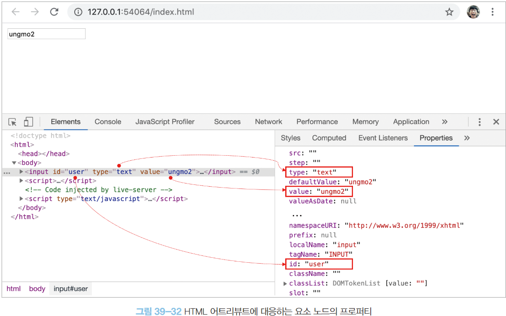

# DOM

- DOM
  - HTML 문서의 계층적 구조와 정보를 표현하며 이를 제어할 수 있는 API(프로퍼티, 메서드)를 제공하는 트리 자료구조다.

### 노드

##### 1. HTML 요소와 노드 객체

- HTML 요소는 HTML 문서를 구성하는 개별적인 요소를 의미한다.
  
- HTML 요소는 렌더링 엔진에 의해 파싱되어 DOM을 구성하는 요소 노드 객체로 변환된다.
  - HTML 요소의 어트리뷰트는 어트리뷰트 노드로, 텍스트 콘텐츠는 텍스트 노드로 변환된다.
    
- HTML 문서는 HTML 요소들의 집합으로 이루어지며 HTML 요소는 중첩 관계를 갖는다.
  - HTML 요소 사이에 다른 HTML 요소를 포함시킬 수 있다.
- HTML 요소 간에 중첩관계에 의해 계층적인 부자(parent-child) 관계가 형성된다.
- HTML 요소간의 부자 관계를 반영하여 HTML 요소를 객체화한 모든 노드 객체들을 트리 자료구조로 구성한다.

###### 트리 자료구조

- 노드들의 계층 구조로 이루어진다.
- 노드간의 계층적 구조(부자, 형제 관계)를 표현하는 비선형 자료구조
- 하나의 최상위 노드에서 시작한다.
- 루트 노드
  - 최상위 노드
  - 부모 노드가 없다.
  - 0개 이상의 자식 노드를 갖는다.
- 리프 노드
  - 자식 노드가 없는 노드


- 노드 객체들로 구성된 트리 자료구조를 DOM 이라고 한다.
- 노트 객체의 트리로 구조화되어 있기 때문에 DOM을 DOM 트리라고 부르기도 한다.

##### 2. 노드 객체의 타입


- 렌더링 엔진은 위 HTML 문서를 파싱하여 다음과 같이 DOM을 생성한다.


- DOM은 노드 객체의 계층적인 구조로 구성된다.
- 노드 객체는 총 12개의 종류가 있고 상속 구조를 갖는다.

###### 문서 노드

- 문서 노드는 DOM 트리의 최상위에 존재하는 루트 노드로서 document 객체를 가리킨다.
- document 객체는 전역 객체 window의 document 프로퍼티에 바인딩 되어있다.
  - 즉 문서노드는 window.document 또는 document로 참조 가능하다.
- 모든 자바스크립트 코드는 전역 객체 window의 document 프로퍼티에 바인딩되어 있는 하나의 document를 바라본다. 즉 HTML 문서당 document 객체는 유일하다.
- document 객체는 DOM 트리의 루트 노드이므로 DOM 트리의 노드들이 접근하기 위한 진입점 역할을 담당한다.
  - 나머지 노드들에 접근하려면 문서 노드르르 통해야한다.

###### 요소 노드

- HTML 요소를 가리키는 객체이다.
- HTML 요소 간의 중첩에 의해 부자 관계를 가지며, 부자 관계를 통해 정보를 구조화한다.
  - 부모 노드와 연결되어 있다.
- 즉 요소노드는 문서의 구조를 표현한다 할 수 있다.
- tag 네임

###### 어트리뷰트 노드

- HTML 요소의 어트리뷰트를 가리키는 객체이다.
- 어트리뷰트 노드는 어트리뷰트가 지정된 HTML 요소의 요소 노드와 연결되어 있다.
- 부모 노드와 연결되어 있지 않고 요소 노드에만 연결되어 있다.
  - 부모 노드가 없으므로 요소 노드와 형제 노드는 아니다.
- 어트리뷰트 노드에 접근하려면 먼저 요소 노드에 접근해야한다.

###### 텍스트 노드

- HTML 요소의 텍스트를 가리키는 객체다.
- 요소 노드가 문서의 구조를 표현한다면 텍스트 노드는 문서의 정보를 표현한다고 할 수 있다.
- 텍스트 노드는 요소 노드의 자식이며, 자식 노드를 가질 수 없는 리프 노드이다.
- DOM 트리의 최종단
- 텍스트 노드에 접근하려면 요소 노드에 접근해야 한다.

###### 전체 노드 타입

| 노드 타입(12개) |                    |                        |            |
| --------------- | ------------------ | ---------------------- | ---------- |
| Document 노드  | element 노드      | attribute 노드        | text 노드 |
| Comment 노드    | DocumentType 노드 | DocumentFragment 노드 |            |
|                 |                    |                        |            |

##### 3. 노드 객체의 상속 구조

- DOM은 HTML 문서의 계층적 구조와 정보를 표현하며 이를 제어할 수 있는 프로퍼티와 메서드를 제공하는 트리 자료구조다.
  - 프로퍼티와 메서드를 사용해 노드 객체의 부모, 형제, 자식을 탐색할 수 있으며, 자신의 어트리뷰트와 텍스트를 조작할 수 있다.
- DOM을 구성하는 노드 객체는 ECMAScript 사양에 정의된 표준 빌트인 객체가 아니라 브라우저 환경에서 추가적으로 제공하는 호스트 객체이다.
  하지만 노드도 자바스크립트 객체이므로 프로토타입에 의한 상속구조를 갖는다.
  
- 위 그림과 같이 모든 노드 객체는 Object, EventTarget, Node 인터페이스를 상속받는다.
- 문서노드
  - Document, HTMLDocument 인터페이스 상속 받음
- 어트리뷰트 노드
  - Attr 상속 받음
- 텍스트 노드
  - CharacterData 인터페이스 상속 받음
- 요소 노드
  - Element 인터페이스 상속 받음
  - 요소 노드는 HTMLElement와 태그의 종류별로 세분화 된
    HTMLHtmlElement, HEMLHeadElement, HTMLBodyElement, HTMLUListElement 등의 인터페이스를 상속받는다.


- 위 그림의 프로토타입 관점에서 보면 input 요소 노드 객체는 프로토타입 체인에 있는 모든 프로토타입의 프로퍼티나 메서드를 상속받아 사용할 수 있다.


- 노드 객체의 상속 구조는 개발자 도구의 Elements 패널 우측의 Properties 패널에서 확인 가능

<br/>

- EventTarget 인터페이스
  - 이벤트에 관련된 기능 제공
    - EventTartget.addEventListener, EventTarget.removeEventListener 등
- Node 인터페이스
  - 트리 탐색 기능 제공
    - Node.parentNode, Node.childNodes 등
  - 노드 정보 제공 기능
    - Node.nodeType, Node.nodeName 등
- HTMLElement 인터페이스
- HTML 요소가 갖는 공통적인 기능 제공
  - 요소의 스타일을 나타내는 style 프로퍼티 등
- HTML 요소에 따라 필요한 인터페이스를 제공하는 인터페이스들이 각각 존재한다.
  - HTMLInputElement
    - input 요소 노드 객체에 필요한 value 프로퍼티 제공

<br/>
<br/>

- DOM은 HTML 문서의 계층적 구조와 정보를 표현하는 것은 물론 노드 객체의 종류(노드 타입)에 따라 필요한 기능을 프로퍼티와 메서드의 집합인 DOM API로 제공한다.
  이 DOM API를 통해 HTMl 구조나 내용 또는 스타일 등을 동적으로 조작할 수 있다.

<br/>
<br/>

### 요소 노드 취득

- HTML의 구조나 내용 또는 스타일 등을 동적으로 조작하려면 요소 노드를 취득해야한다.
- DOM은 요소 노드를 취득할 수 있는 다양한 메서드를 제공한다.

##### 1. id를 이용한 요소 노드 취득

- Document.prototype.getElementById
  - 인수로 전달한 id 어트리뷰트 값을 갖는 하나의 요소 노드를 탐색하여 반환한다.
  - Document.prototype의 프로퍼티 이므로 반드시 문서 노드인 document를 통헤 호출해야한다.

```html
<!DOCTYPE html>
<html>
  <body>
    <ul>
      <li id="apple">apple</li>
    </ul>
    <script>
      const element = document.getElementById('apple');
    </script>
  </body>
</html>
```

- id 값은 문서 내에 유일한 값이어야하며, class 어트리뷰트와 달리 공백 문자로 구분하여 여러개의 값을 가질 수 없다.
  - 단, HTML 문서 내에 중복된 id 값을 갖는 HTML 요소가 여러 개 존재해도 에러가 발생하지 않는다.
  - 중복된 id 값을 갖는 요소가 여러 개 존재할 가능성도 있다.
- 중복된 id를 갖는 요소가 있는 경우 첫 번째 요소 노드만 반환한다.
  - 항상 하나의 요소만 반환한다.
- 인수로 전달된 id 값을 갖는 요소가 존재하지 않을 경우 null을 반환한다.
- HTML 요소에 id 어트리뷰트를 부여하면 id 값과 동일한 이름의 전역 변수가 암묵적으로 선언되고 해당 노드 객체가 할당되는 부수 효과가 있다.
  - 단, id 값과 동일한 이름의 전역 변수가 이미 선언되어 있으면 이 전역 변수에 노드 객체가 재할당되지 않는다.

##### 2. 태그 이름을 이용한 요소 노드 취득

- Document.prototype/Element.prototype.getElementsByTagName
  - 인수로 전달한 태그 이름을 갖는 모든 요소 노드를 탐색하여 반환한다.
  - 여러 개의 요소 노드 객체를 갖는 DOM 컬렉션 객체인 HTMLCollection 객체를 반환한다.
    - HTMLCollection 객체는 유사 배열 객체이면서 이터러블이다.

```html
<!DOCTYPE html>
<html>
  <body>
    <ul>
      <li id="apple">apple</li>
      <li id="banana">banana</li>
      <li id="orange">orange</li>
    </ul>
    <script>
      const elements = document.getElementsByTagName('li');
      console.log(elements.length); // 3
    </script>
  </body>
</html>
```


- HTML 문서의 모든 요소를 취득하려면 getElementsByTagName 메서드의 인수로 '*'를 전달한다.
- Document.prototype.getElementsByTagName
  - DOM의 루트 노드인 document를 통해 호출하며 DOM 전체에서 요소 노드를 탐색하여 반환한다.
- Element.prototype.getElementsByTagName
  - 특정 요소 노드만 호출하며, 특정 요소 노드의 자손 노드 중에서 요소 노드를 탐색하여 반환한다.
- 인수로 전달된 태그 이름을 갖는 요소가 존재하지 않을 경우 getElementsByTagName 메서드는 빈 HTMLCollection 객체를 반환한다.

##### 3. class를 이용한 요소 노드 취득

- Document.prototype/Element.prototype.getElementsByClassName
  - 인수로 전달한 class 어트리뷰트 값을 갖는 모든 요소를 탐색하여 반환한다.
  - 인수로 전달할 class 값은 공백으로 구분하여 여러 개의 class를 지정할 수 있다.
  - 여러 개의 요소 노드 객체를 갖는 DOM 컬렉션 객체인 HTMLCollection 객체를 반환한다.
- Document.prototype.getElementsByClassName
  - DOM의 루트 노드인 document를 통해 호출하며 DOM 전체에서 요소 노드를 탐색하여 반환한다.
- Element.prototype.getElementsByClassName
  - 특정 요소 노드만 호출하며, 특정 요소 노드의 자손 노드 중에서 요소 노드를 탐색하여 반환한다.
- 인수로 전달된 class 값을 갖는 요소가 존재하지 않을 경우 getElementsByClassName 메서드는 빈 HTMLCollection 객체를 반환한다.

```js
const elements = document.getElementsByClassName('my-style');
```

##### 4. CSS 선택자를 이용한 요소 노드 취득

- CSS 선택자는 스타일을 적용하고자 하는 HTML 요소를 특정할 때 사용하는 문법이다.
  
  
- Document.prototype/Element.prototype.querySelector

  - 인수로 전달한 CSS 선택자를 만족시키는 하나의 요소 노드를 탐색하여 반환한다.
    
- Document.prototype/Element.prototype.querySelectorAll

  - 인수로 전달한 CSS 선택자를 만족시키는 모든 요소 노드를 탐색하여 반환한다.
  - querySelectorAll 메서드는 여러 요소 노드 객체를 갖는 DOM 컬렉션인 NodeList 객체를 반환한다.
    - NodeList 객체는 유사 배열 객체이면서 이터러블이다.
- Document.prototype.querySelector/querySelectorAll

  - DOM의 루트 노드인 document를 통해 호출하며 DOM 전체에서 요소 노드를 탐색하여 반환한다.
- Element.prototype.querySelector/querySelectorAll

  - 특정 요소 노드만 호출하며, 특정 요소 노드의 자손 노드 중에서 요소 노드를 탐색하여 반환한다.
- CSS 선택자 문법을 사용하는 querySelector/querySelectorAll는 getElementsById ... 보다 느린 것으로 알려져있다.
  하지만 구체적으로 요소 노드를 취득할 수 있고, 일관된 방식으로 요소 노드를 취득할 수 있다는 장점이 있다.

  - 따라서 id 어트리뷰트가 있는 경우에는 getElementById 메서드를 사용하고 그 외의 경우에는 querySelector/querySelectorAll 메서드를 사용하는 것을 권장

```js
const element = document.querySelector('.my-style');
const elements = document.querySelector('ul > li');
```

##### 5. 특정 요소 노드를 취득할 수 있는지 확인

- Element.prototype.matches
  - 인수로 전달한 CSS 선택자를 통해 특정 요소 노드를 취득할 수 있는지 확인한다.
  - 이벤트 위임을 할 때 유용하다.

```javascript
const element = document.querySelector('.my-style');
console.log(element.matches('.my-style')); // true
console.log(element.matches('.my-style > div')); // true
```

##### 6. HTMLCollection과 NodeList

- DOM 컬렉션 객체인 HTMLCollection과 NodeList는 DOM API가 여러 개의 결과값을 반환하기 위한 DOM 컬렉션 객체다.
- 두개 모두 유사 배열 객체이자 이터러블이다.
- 중요한 특징은 노드 객체의 상태 변화를 실시간으로 반영하는 살아있는 개체라는 것이다.
  - HTMLCollection은 언제나 live로 동작한다.
  - NodeList는 대부분의 경우 노드 객체의 상태 변화를 실시간으로 반영하지 않고 과거의 정적 상태를 유지하는 non-live 객체로 동작하지만, 경우에 따라 live로 동작할 때가 있다.

###### HTMLCollection

- getElementsByTagName, getElementsByClassName 메서드가 반환하는 HTMLCollection 객체는 노드 객체의 상태 변화를 실시간으로 반영하는 live DOM 컬렉션 객체다.
  - 살아있는 객체라고 부르기도 함
- 실시간으로 노드 객체의 상태 변경을 반영하여 요소를 제거할 수 있기 때문에 HTMLCollection 객체를 for문으로 순회하면서 노드 객체의 상태를 변경할 때 주의가 필요하다.
  - for문을 역순으로 순회하면 부작용을 피할 수 있다.
  - 더 간단한 해결책은 부장용을 발생시키는 원인인 HTMLCollection 객체를 사용하지 않는 것
  - HTMLCollection을 배열로 변환하면 부작용을 발생시키는 HTMLCollection를 사용하지 않아도 되고, 유용한 배열의 고차함수를 이용할 수 있다.

###### NodeList

- querySelectorAll 메서드는 DOM 컬렉션 객체인 NodeList 객체를 반환한다.
  - 이때 NodeList 객체는 실시간으로 노드 객체의 상태를 변경하지 않는 non-live 객체다.
- childNodes 프로퍼티가 반환하는 NodeList 객체는 HTMLCollection 객체와 같이 실시간으로 노드 객체의 상태를 반영하는 live 객체로 동작하므로 주의가 필요하다.
- NodeList 객체는 NodeList.prototype.forEach 메서드를 상속받아 사용할 수 있다.
  - Array.prototype.forEach와 사용법이 동일
  - NodeList.prototype 은 forEach 외에도 item, entries, keys, values 메서드를 제공한다.

<br/>

- HTMLCollection과 NodeList 객체는 예상과 다르게 동작할 때가 있기 때문에, 노드 객체의 상태 변경과 상관없이 안전하게 DOM 컬렉션을 사용하려면 배열로 변환하여 사용하는 것을 권장
  - HTMLCollection과 NodeList 객체가 메서드를 제공하긴 하지만 배열의 고차함수 만큼 다양한 기능을 제공하진 않으므로, HTMLCollection과 NodeList를 배열로 변환하면 유용한 고차함수를 사용할 수 있다는 장점이 있다.
- HTMLCollection과 NodeList 객체 모두 유사 배열 객체이면서 이터러블이므로 간단하게 배열로 변환할 수 있다.
  - Array.from 메서드
  - 스프레드 문법 등

<br/>
<br/>

### 노드 탐색

- 요소 노드를 취득한 다음, 취득한 요소 노드 기점으로 DOM 트리의 노드를 옮겨 부모, 형제, 자식 노드 등을 탐색할 수 있다.


- DOM 트리 상의 노드를 탐색할 수 있도록 Node, Element 인터페이스는 트리 탐색 프로퍼티를 제공한다.
- 노드 탐색 프로퍼티
  - setter없이 getter만 존재하여 참조만 가능한 읽기 전용 접근자 프로퍼티
  - 읽기 전용 접근자 프로퍼티에 값을 할당하면 에러없이 무시된다.

[제공하는 프로토타입]

- Node.prototype
  - parentNode
  - previousSibling
  - firstChild
  - childNodes
- Element.prototype
  - previousElementSibling
  - nextElementSibling
  - children

##### 1. 공백 텍스트 노드

- HTML 요소 사이의 스페이스, 탭, 줄바꿈(행) 등의 공백 문자는 텍스트 노드를 생성한다.
  
- 위 HTML 문서는 파싱되어 아래와 같은 DOM을 생성한다.
- 공백 노드가 포함되어 있다.
  
- HTML 문서의 공백 문자는 공백 텍스트 노드를 생성하므로 노드 탐색 시 공백 노드에 주의해야한다.
- 인위적으로 HTML의 공백을 제거하면 공백 텍스트 노드가 생성되지 않지만, 가독성이 좋지 않아 권장하지 않음

##### 2. 자식 노드 탐색

- 자식 노드를 탐색하기 위해서는 다음과 같은 노드 탐색 프로퍼티를 사용한다.
  
  

```html
<body>
  <ul id="fruits">
    <li class="apple">Apple</li>
    <li class="banana">Banana</li>
    <li class="orange">Orange</li>
  </ul>
</body>
<script>
  const $fruits = document.getElementById("fruits");

  // $fruits 요소의 모든 자식노드를 탐색, 요소/텍스트 노드 포함
  console.log($fruits.childNodes); // NodeList(3) [...]
  // $fruits 요소의 모든 자식노드 중 요소 노드만 탐색
  console.log($fruits.children); // HTMLCollrection(3) []
  // $fruits 요소의 첫/마지막 번째 자식 노드 탐색, 텍스트 노드가 반환될 수도 있다.
  console.log($fruits.firstChild); // #text
  console.log($fruits.lastChild); // #text
  // 요소의 첫/마지막 자식 노드 탐색, 요소 노드만 반환된다.
  console.log($fruits.firstElementChild); // #text
  console.log($fruits.lastElementChild); // #text
</script>
```

##### 3. 자식 노드 존재 확인

- Node.prototype.hasChildNodes
  - 자식 메서드가 존재하는지 확인하는 메서드
  - 자식노드가 존재하면 true / 존재하지 않으면 false 반환
  - 텍스트 노드를 포함하여 자식 노드의 존재를 확인한다.
- 자식 노드 중에 텍스트 노드가 아닌 요소 노드가 존재하는지 확인하려면 hasChildNodes 메서드 대신 children.length 또는 Element 인터페이스의 childElementCount 프로퍼티를 사용한다.

```html
<body>
  <ul id="fruits">
  </ul>
</body>
<script>
  const $fruits = document.getElementById("fruits");
  
  console.log($fruits.hasChildNodes); // true
  console.log(!!$fruits.children.length); // 0 -> false 
  console.log(!!$fruits.childElementCount); // 0 -> false 
</script>
```

##### 4. 요소 노드의 텍스트 노트 탐색

- 요소 노드의 텍스트 노드는 요소 노드의 자식 노드이다.
- 요소 노드의 텍스트 노드는 firstChild 프로퍼티로 접근할 수 있다.
  - 첫 번째 자식 노드를 반환한다.
  - 반환되는 노드는 요소 노드이거나 텍스트 노드이다.
    

##### 5. 부모 노드 탐색

- Node.prototype.parentNode
  - 부모 노드를 탐색하는 프로퍼티
- 텍스트 노드는 DOM 트리의 최종단 노드인 리프노드이기 때문에 부모 노드가 텍스트 노드인 경우는 없다.
  

##### 6. 형제 노드 탐색
- 부모 노드가 같은 형제 노드를 탐색하려면 다음과 같은 프로퍼티를 사용한다.
- 어트리뷰트 노드는 요소 노드와 연결되어 있지만 부모 노드가 같은 형제노드는 아니기 때문에 반환되지 않는다.
  - 요소 노드, 텍스트 노드만 반환됨


- 첫 번째 자식노드

- 마지막 자식노드


<br/>
<br/>

### 노드 정보 취득
- 노드 객체에 대한 정보를 취득하려면 다음과 같은 노드 정보 프로퍼티를 사용한다.


<br/>
<br/>

### 요소 노드의 텍스트 조작

##### 1. nodeValue
- Node.prototype.nodeValue
  - setter / getter 모두 존재하는 접근자 프로퍼티이다. 참조와 할당 모두 가능
  - 노드 객체의 nodeValue 프로퍼티를 참조하면 노드 객체의 값을 반환한다.
  - 노드setter / getter 모두 존재하는 접근자 프로퍼티이다. 참조와 할당 모두 가능 객체의 값
    - 텍스트 노드의 텍스트
    - 문서 노드나 요소 노드의 nodeValue 프로퍼티를 참조하면 null 반환
  - 텍스트 노드의 nodeValue 프로퍼티에 값을 할당하면 텍스트 노드의 값을 변경 가능하다.
  - 요소 노드의 텍스트를 변경하는 방법은 다음과 같다.
  - 

##### 2. textContent
- Node.prototype.textContent
  - setter / getter 모두 존재하는 접근자 프로퍼티이다.
  - 요소 노드의 텍스트와 모든 자손 노드의 텍스트를 모두 취득하거나 변경한다.
  - 요소 노드의 textContent 프로퍼티를 참조하면 요소 노드의 콘텐츠 영역 내의 텍스트를 모두 반환한다.
    - 요소 노드의 childNodes 프로퍼티가 반환하는 모든 노드들의 텍스트 노드 모두 반환
    - HTML 마크업은 무시된다.

- nodeValue 프로퍼티를 참조해도 텍스트를 취득할 수 있지만, 요소 노드의 nodeValue 프로퍼티는 null을 반환하므로 의미가 없다
- textContent 프로퍼티를 사용할 때와 비교해서 nodeValue 프로퍼티가 더 복잡하다.

- 요소 노드의 textContent 프로퍼티에 문자열을 할당하면 요소 노드의 모든 자식 노드가 제거되고 할당한 문자열이 텍스트로 추가된다.
  - 할당한 문자열에 HTML 마크업이 포함되어 있더라도 파싱되지 않는다.
  - 문자열 그대로 인식되어 텍스트로 취급된다.

- innerHTML
  - textContent와 비슷한 동작을 하는 프로퍼티
  - 다음과 같은 이유로 사용하지 않는 것이 좋다.


<br/>
<br/>

### DOM 조작
- DOM 조작은 새로운 노드를 생성하여 DOM에 추가하거나 기존 노드를 삭제 또는 교체하는 것
  - 이 때 리플로우와 리페인트가 발생하므로 성능 최적화를 위해 주의해서 다뤄야한다.

##### 1. innerHTML
- Node.prototype.innerHTML
  - setter / getter 모두 존재하는 접근자 프로퍼티
  - 요소 노드의 HTML 마크업을 취득하거나 변경한다.
  - 요소 노드의 콘텐츠 영역(시작 태그와 종료 태그 사이) 내에 포함된 모든 HTML 마크업을 문자열로 반환한다.
  - textContent 프로퍼티를 참조하면 마크업을 무시하고 텍스트만 반환하지만, innerHTML 프로퍼티는 HTML 마크업이 포함된 문자열을 그대로 반환한다.

  - 요소 노드의 innerHTML 프로퍼티에 문자열을 할당하면 요소 노드의 모든 자식 노드가 제거되고, 할당한 문자열에 포함되어 있는 HTML 마크업이 파싱되어 요소 노드의 자식 노드로 DOM에 반영된다.
  - 장점
    - DOM 조작의 구현이 간단하고 직관적
  - 단점
    - 사용자로부터 입력받은 데이터를 그대로 innerHTML 프로퍼티에 할당하는 것은 [크로스 사이트 스크립팅 공격]에 취약하다.
    HTML 마크업 내에 자바스크립트 악성 코드가 포함되어 있다면 파싱 과정에서 그대로 실행될 가능성이 있기 때문.
      - HTML5는 innerHTML 프로퍼티로 삽입된 script 요소 내의 자바스크립트 코드를 실행하지 않기에 HTML5를 지원하는 브라우저에서는 해당 코드가 동작하지 않는다.
      하지만 script 요소 없이도 크로스 사이트 스크립팅 공격은 가능하다.
    - HTML 마크업 문자열을 할당하는 경우 기존 요소 노드의 자식 노드를 모두 제거하고 새로 할당한 HTML 문자열을 파싱하여 DOM을 변경한다.
    - 새로운 요소를 삽입할 때 삽입될 위치를 지정할 수 없다.


##### 2. insertAdjacentHTML 메서드
- Node.prototype.insertAdjacentHTML(position, DOMString)
  - 기존 요소를 제거하지 않으면서 위치를 지정해 새로운 요소를 삽입하는 메서드
  - 첫 번째 인수
    - 삽입할 위치
    - 전달 가능한 문자열
      - 'beforebegin'
      - 'afterbegin'
      - 'beforeend'
      - 'afterend'
    - 
  - 두 번째 인수
    - 마크업 문자열 (DOMString)
  - 전달된 마크업 문자열을 파싱하여 생성된 노드를 첫번째 인수로 전달된 위치에 삽입하여 DOM에 반영한다.
  - 기존 요소에는 영향을 주지 않고 새롭게 삽입될 요소만 파싱하여 자식 요소로 추가하므로 innerHTML 프로퍼티보다 효율적이고 빠르다.
  - HTML 마크업 문자열을 파싱하므로 크로스 사이트 스크립팅 공격에 취약한 점은 동일하다.

##### 3. 노드 생성과 추가

###### 요소 노드 생성
- Document.prototype.createElement(tagName)
  - 요소 노드를 생성하여 반환하는 메서드
  - 태그 이름을 나타내는 문자열을 인수로 전달한다.
  - 바로 DOM에 추가되는건 아니고 홀로 존재하게 된다.
  
  - 처음 생성된 요소 노드는 자식 노드를 가지지 않는다. 추가해야 한다.

###### 텍스트 노드 생성
- Document.prototype.createTextNode(text)
  - 텍스트 노드를 생성하여 반환하는 메서드
  - 텍스트 노드의 값으로 사용할 문자열을 인수로 전달한다.
  - 텍스트 노드는 요소 노드의 자식 노드지만, 최초 생성하면 노드의 자식 노드로 추가되지 않고 홀로 존재한다. 요소 노드에 추가하는 별도 처리를 해야한다.
  

###### 텍스트 노드를 요소 노드의 자식 노드로 추가
- Node.prototype.appendChild(childNode)
  - appendChild 노드를 호출한 노드의 마지막 자식으로 매개변수 childNode 노드를 추가한다.
- 요소 노드에 자식노드가 하나도 없는 경우
  - textContent 프로퍼티를 이용하는 것이 appendChild보다 간편하다.
- 요소 노드에 자식 노드가 있는 경우면 textContent 사용에 주의해야한다.

###### 요소 노드를 DOM에 추가
- Node.prototype.appendChild 메서드를 이용해 부모 노드에 생성한 노드를 마지막 노드로 추가한다.

기존 DOM에 요소 노드를 추가하는 방법은 이 과정 뿐이다.
DOM에 요소가 추가될 때 리플로우와 리페인트가 발생한다.  

##### 4. 복수의 노드 생성과 추가
- DOM 트리에 appendChild를 반복적으로 요청하면 리플로우와 리페인팅이 매번 일어나면서 성능이 저하될 수 있다.
- 컨테이너 요소
  - 새로 추가할 요소 노드의 root와 같은 역할을 하는 요소 노드
  - 컨테이너 요소에 생성한 요소 노드들을 자식노드로 추가하고 마지막으로 컨테이너 요소만 DOM 트리에 추가하면 DOM은 한 번만 변경된다.
  - 성능에는 유리하지만 불필요한 컨테이너 요소 (div)가 DOM에 추가되는 부작용이 있다.
- DocumentFragment 노드
  - 노드 객체의 일종
  - 부모 노드가 없어서 기존 DOM과는 별도로 존재한다.
    - DocumentFragment 노드에 자식 노드를 추가해도 기존 DOM은 영향받지 않는다.
  - 컨테이너 요소와 같이 자식 노드들의 부모 노드로서 별도의 서브 DOM을 구성하여 기존 DOM에 추가하기 위한 용도로 사용한다.
  - DocumentFragment 노드를 DOM에 추가하면 자신은 제거되고 자신의 자식 노드만 DOM에 추가된다.
- Document.prototype.createDocumentFragment
  - 비어있는 DocumentFragment 노드를 생성하여 반환하는 메서드

복수의 노드 생성 순서
1. DocumentFragment 노드를 생성한다.
2. DOM에 추가할 자식 노드들을 생성하여 DocumentFragment 노드에 추가한다.
3. DocumentFragment 노드를 기존 DOM에 추가한다.
- DOM 변경은 한 번만 일어난다.
여러 개의 노드를 추가할 때 효율적이다.

##### 5. 노드 삽입

##### 6. 노드 이동

##### 7. 노드 복사

##### 8. 노드 교체

##### 9. 노드 삭제

<br/>
<br/>

### 어트리뷰트

##### 1. 어트리뷰트 노드와 attributes 프로퍼티
- HTML 문서의 구성요소인 HTML 요소는 여러 개의 어트리뷰트(속성)를 가질 수 있다.
- HTML 요소의 동작을 제어하기 위한 추가정보를 제공하는 HTMl 어트리뷰트는 HTML 요소의 시작 태그에 정의한다.

- 어트리뷰트는 모든 HTML 요소에 사용할 수 있는 것과 특정 HTML 요소만 사용할 수 있는 것으로 나뉜다.
- 모든 HTML 요소에 사용 가능한 어트리뷰트
  - 글로벌 어트리뷰트
    - id
    - class
    - style
    - title
    - 등등
  - 이벤트 어트리뷰트
    - onclick
    - onchange
    - onfocus
    - onblur
    - 등등
- 특정 HTML 요소에만 사용 가능한 어트리뷰트
  - input 요소
    - type
    - value
    - checked
- HTML 문서가 파싱될 때 HTML 요소의 어트리뷰트는 어트리뷰트 노드로 변환되어 요소 노드와 연결된다.
  - 어트리뷰트당 하나의 어트리뷰트 노드가 생성된다.
  - 모든 어트리뷰트 노드의 참조는 유사 배열 객체이자 이터러블인 NamedNodeMap 객체에 담겨서 요소 노드의 attributes 프로퍼티에 저장된다.

- 요소 노드의 모든 어트리뷰트는 요소 노드의 Element.prototype.attributes 프로퍼티로 취득할 수 있다.
  - getter만 존재하는 읽기전용 접근자 프로퍼티이며, 값의 취득만 가능하고 변경은 불가하다.
  - 요소 노드의 모든 어트리뷰트 노도의 참조가 담긴 NamedNodeMap 객체를 반환한다.

##### 2. HTML 어트리뷰트 조작
- Element.prototype.getAttribute/setAttribute
  - attributes 프로퍼티를 통하지 않고 요소 노드에서 메서드를 통해 직접 어트리뷰트 값을 취득하거나 변경할 수 있다.
- Element.prototype.hasAttribute
  - 특정 HTML 어트리뷰트가 존재하는지 확인하는 메서드
- Element.prototype.removeAttribute
  - 특정 HTML 어트리뷰트를 삭제하는 메서드

``` html
<body>
  <input id="user" type="text" value="soeun">
  <script>
    const $input = document.getElementById('user');
    // value 어트리뷰트 값 취득
    const inputValue = $input.getAttribute('value');
    // value 어트리뷰트 값 변경
    $input.setAttribute('value', 'lime');
    // value 어트리뷰트 존재 확인
    const hasAttr = $input.hasAttribute('value');
    if (hasAttr) {
      // 어트리뷰트 삭제
      $input.removeAttribute('value');
    }
  </script>
</body>
```

##### 3. HTML 어트리뷰트 vs DOM 프로퍼티
- 요소 노드 객체에는 HTML 어트리뷰트에 대응하는 DOM 프로퍼티가 존재한다.
DOM 프로퍼티들은 HTML 어트리뷰트의 값을 초기값을 가지고있다.
그렇기에 렌더링된 초기에는 두 값이 동일할 수 있다. 

- 어트리뷰트 노드
  - HTML 요소의 초기 상태를 관리하며, 사용자 입력에 의해 상태가 변경되어도 값이 변하지 않는다.
  - 어트리뷰트 노드가 관리하는 초기 상태 값을 취득/변경하려면 getAttribute/setAttribute 메서드를 사용한다.
- DOM 프로퍼티
  - 요소 노드의 최신 상태를 관리한다.
  사용자가 input 요소에 새로 입력하는 값들을 저장/관리
  - DOM 프로퍼티의 변경은 어트리뷰트 값에는 영향을 주지 않는다.
  - getter, setter 모두 존재하는 접근자 프로퍼티로, 참조와 변경이 가능하다.
  - 사용자 입력에 의한 상태 변화와 관계있는 DOM 프로퍼티만 최신 상태 값을 관리한다.
  사용자 입력에 의한 상태 변화와 관계 없는 어트리뷰트와 DOM 프로퍼티는 사용자 입력과 관계없이 항상 동일한 값을 유지한다.
  이 경우 어트리뷰트 값이 변하면 프로퍼티 값도 변하고, 반대도 마찬가지다.
- HTML 어트리뷰트와 DOM 프로퍼티의 대응 관계
  - 대부분의 어트리뷰트는 어트리뷰트 이름과 동일한 DOM 프로퍼티와  1:1 대응한다.
  하지만 다음과 같이 언제나 1:1로 대응하는 것은 아니며, 어트리튜브 이름과 DOM 프로퍼티 키가 반드시 일치하는 것도 아니다.
  
- DOM 프로퍼티 값의 타입
  - getAttribute 메서드로 취득한 어트리뷰트 값은 언제나 문자열이다.
  - DOM 프로퍼티로 취득한 최신 상태 값은 문자열이 아닐 수 있다.
  - checkbox 요소의 checked 어트리뷰트 값은 문자열이지만, 프로퍼티 값은 불리언 값이다.

##### 4. data 어트리뷰트와 dataset 프로퍼티
- data 어트리뷰트와 dataset 프로퍼티를 사용하면 HTML 요소에 정의한 사용자 정의 어트리뷰트와 자바스크립트 간에 데이터 교환을 할 수 있다.
- data 어트리뷰트
  - data 어트리뷰트는 접두사 [data-] 다음에 임의의 이름은 붙여 사용한다.
  - HTMLElement.dataset 프로퍼티로 값을 취득할 수 있다.
- dataset 프로퍼티
  - data 어트리뷰트 정보를 제공하는 DOMStringMap 객체를 반환한다.
  - DOMStringMap 객체는 어트리뷰트의 data- 접두사 다음에 붙인 임의의 이름을 카멜케이스로 변환한 프로퍼티를 가지고있다.
  이 프로퍼티로 data 어트리뷰트의 값을 취득하거나 변경할 수 있다.


  - data- 접두사 다음에 존재하지 않는 이름을 키로 사용하여 dataset 프로퍼티에  값을 할당하면 HTML 요소에 data 어트리뷰트가 추가된다.
  이때 카멜케이스로 추가한 프로퍼티 키는 data 어트리뷰트의 data- 접두사를 붙여 케밥 케이스로 변환회어 추가된다. 

<br/>
<br/>

### 스타일

##### 1. 인라인 스타일 조작
- HTMLElement.prototype.style
  - setter/getter 모두 존재하는 접근자 프로퍼티
  - 요소 노드의 인라인 스타일을 취득하거나 추가/변경한다.
  - style 프로퍼티를 참조하면 CSSStyleDeclaration 타입의 객체를 반환한다.
  이 객체는 다양항 CSS 프로퍼티에 대응하는 프로퍼티를 가지고 있으며, 이 프로퍼티에 값을 할당하면 해당 CSS 프로퍼티가 인라인 스타일로 HTML 요소에 추가되거나 변경된다.
  - CSS 프로퍼티는 케밥 케이스를 따르고, 이에 대응하는 CSSStyleDeclaration 객체의 프로퍼티는 카멜케이스를 따른다.
    - background-color와 대응하는 프로퍼티는 backgroundColor이다.
  - 단위 지정이 필요한 CSS 프로퍼티의 값은 반드시 단위를 지정해야한다. 크기 단위를 지정하지 않으면 적용되지 않는다.

``` html
<body>
  <div style="color: red;"></div>
  <script>
    const $element = document.getElementById('div');
    // 인라인 스타일 취득
    console.log($element.style);
    // 인라인 스타일 변경
    $element.style.color = 'blue';
    //인라인 스타일 추가
    $element.style.width = '100px';
  </script>
</body>
```

##### 2. 클래스 조작
- HTML 요소의 class 어트리뷰트 값을 변경하여 HTML 요소의 스타일을 변경할 수 있다.
- *class 어트리뷰트에 대응하는 DOM 프로퍼티는 class가 아니라 classList와 className 이다.
  - class는 예약어이기 때문
- Element.prototype.className
  - className 프로퍼티는 setter/getter 모두 존재하는 접근자 프로퍼티이다.
  - className 프로퍼티 참조
    - class 어트리뷰트 값을 문자열로 반환
  - className 프로퍼티에 문자열 할당
    - class 어트리뷰트 값을 할당한 문자열로 변경
  - className 프로퍼티는 문자열을 반환하므로 공백으로 구분된 여러 개의 클래스를 반환하는 경우 다루기 불편하다.
- Element.prototype.classList
  - classList 프로퍼티는 class 어트리뷰트의 정보를 담은 DOMTokenList 객체를 반환한다.
    - DOMTokenList 객체는 class 어트리뷰트의 정보를 나타내는 컬렉션 객체로서 유사 배열 객체면서 이터러블이다.
    - 제공하는 메서드
      - add(...className)
        - 인수로 전달한 1개 이상의 문자열을 class 어트리뷰트 값으로 추가한다.
      - remove(...className)
        - 인수로 전달한 1개 이상의 문자열과 일치하는 클래스를 class 어트리뷰트에서 삭제한다.
        - 인수로 전달한 문자열과 일치하는 클래스가 없으면 에러 없이 무시된다.
      - item(index)
        - 인수로 전달한 index에 해당하는 클래스를 class 어트리뷰트에서 반환한다.
      - contains(className)
        - 인수로 전ㄷ라한 문자열과 일치하는 클래스가 class 어트리뷰트에 포함되어 잇는지 확인한 후 불리언을 반환한다.
      - replace(oldClassName, newClassName)
        - class 어트리뷰트에서 첫 번째 인수로 전달한 문자열을 두 번째 인수로 전달한 문자열로 변경한다.
      - toggle(className[.force])
        - class 어트리뷰트에 인수로 전달한 문자열과 일치하는 클래스가 존재하면 제거하고, 존재하지 않으면 추가한다.
        - 두 번째 인수로는 불리언으로 평가되는 조건식을 전달할 수 있다.
          - 조건식 평가가 true면 강제로 첫 번째 인수로 전달한 문자열을 추가하고, false면 강제로 제거한다.
      - 이외에 forEach, entries, keys, values, supports 메서드를 제공한다.

##### 3. 요소에 적용되어 있는 CSS 스타일 참조
- style 프로퍼티는 인라인 스타일만 반환하므로 클래스를 적용한 스타일이나 상속을 통한 스타일은 참조할 수 없다.
- window.getComputedStyle(element[,pseudo])
  - HTML 요소에 적용된 모든 CSS 스타일을 참조할 수 있는 메서드
  - 첫 번째 인수로 전달한 요소 노드에 적용되어 있는 평가된 스타일을 CSSStyleDeclaration 객체에 담아 반환한다.
  - 평가된 스타일이란 요소 노드에 적용되어 있는 모든 스타일을 말한다.
    - 링크 스타일
    - 임베딩 스타일
    - 인라인 스타일
    - 자바스크립트에서 적용한 스타일
    - 상속된 스타일
    - 기본(user agent) 스타일
    - 등등
  - 두 번째 인수로 :after, :before와 같은 의사 요소를 지정하는 문자열을 전달할수 있다.
  - 의사 요소가 아닌 일반 요소의 경우 두 번째 인수는 생략한다.

```html
<head>
  <style>
    .box:before { color: #fff }
  </style>
</head>
<body>
  <div class="box"></div>
  <script>
    const $box = document.querySelector('.box');
    const computedStyle = window.getComputedStyle($box, ':before');
    console.log(computedStyle.color); // #fff
  </script>
</body>
```

<br/>
<br/>

### DOM 표준
- HTML과 DOM 표준은 W3C(world wide web consortium)와 WHATWG(web hypertext application technology working group) 두 단체가 협력하며 공통 표준을 만들어 오다가 결과물이 달라지면서
2018년 4월부터 구글, 애플, MS, 모질라로 구성된 4개의 주류 브라우저 벤더사가 주도하는 WHATWG이 단일 표준을 내놓기로 합의됐다.
- DOM은 현재 다음과 같이 4개의 레벨(버전)이 있다. 


### 퀴즈

1. 빈 칸에 들어갈 수 있는 식을 고르시오.
``` js
// 가장 긴 tree-node의 width를 구해서 모든 tree-node의 width를 변경
changeMaxWidth: debounce(async function () {
  const nodes = document.querySelectorAll('.v-treeview-node__root');
  let width = this.maxWidth; // 이전 width 값
  for await (const element of nodes) {
    if (width < (a)) {
      width = (a);
    }
  }
  for await (const element of nodes) {
    if ((a) !== width) {
      element.style.width = (b);
    }
  }
  this.maxWidth = width;
}, 500),
```

1) a: element.clientWidth, b: width + 'px'
2) a: element.offsetWidth, b: width
3) a: element.scrollWidth, b: width
4) a: element.width, b: width + 'px'
