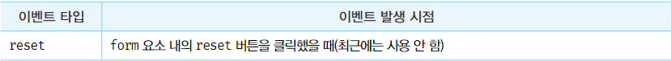

# 이벤트

### 이벤트 드리븐 프로그래밍
- 브라우저는 처리해야할 특정 사건이 발생하면 이벤트를 발생시킨다.
  - 클릭, 키보드 입력, 마우스 이동 등
- Window, document, HTMLElement 타입의 객체는 onclick과 같이 특정 이벤트에 대응하는 다양한 이벤트 핸들러 프로퍼티를 가진다. 이 이벤트 핸들러 프로퍼티에 함수를 할당하면 해당 이벤트가 발생했을 때 할당한 함수가 브라우저에 의해 호출된다.
- 이벤트 핸들러
  - 이벤트가 발생할 때 호출되는 함수
- 이벤트 핸들러 등록
  - 이벤트가 발생했을 때 브라우저에게 이벤트 핸들러의 호출을 위임하는 것
- 이벤트 드리븐 프로그래밍
  - 프로그램의 흐름을 이벤트 중심으로 제어하는 프로그래밍 방식

 
 

### 이벤트 타입
- 이벤트 종류를 나타내는 문자열
- 약 200여 가지 이벤트가 있다.
- 자세한 이벤트 목록은 MDN의 Event reference에서 확인

##### 1. 마우스 이벤트

##### 2. 키보드 이벤트

##### 3. 포커스 이벤트

- focusin, focusout
  - 이벤트 핸들러를 이벤트 핸들러 프로퍼티 방식으로 등록하면 크롬, 사파리에서 정상 동작하지 않는다.
  - addEventListener 메서드 방식을 사용해 등록해야한다.

##### 4. 폼 이벤트

##### 5. 값 변경 이벤트

##### 6. DOM 뮤테이션 이벤트

##### 7. 뷰 이벤트

##### 8. 리소스 이벤트

 
 

### 이벤트 핸들러 등록

##### 1. 이벤트 핸들러 어트리뷰트 방식

##### 2. 이벤트 핸들러 프로퍼티 방식

##### 3. addEventListener 방식

 
 

### 이벤트 핸들러 제거

 
 

### 이벤트 객체

##### 1. 이벤트 객체의 상속 구조

##### 2. 이벤트 객체의 공통 프로퍼티

##### 3. 마우스 정보 취득

##### 4. 키보드 정보 취득

 
 

### 이벤트 전파

 
 

### 이벤트 위임

 
 

### DOM 요소의 기본 동작 조작

##### 1. DOM 요소의 기본 동작 중단

##### 2. 이벤트 전파 방지

 
 

### 이벤트 핸들러 내부의 this

##### 1. 이벤트 핸들러 어트리뷰트 방식

##### 2. 이벤트 핸들러 프로퍼티 방식과 addEventListener 메서드 방식

 
 

### 이벤트 핸들러에 인수 전달

 
 

### 커스텀 이벤트

##### 1. 커스텀 이벤트 생성

##### 2. 커스텀 이벤트 디스패치

 
 

