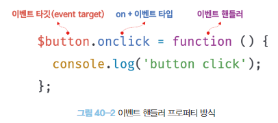

# 이벤트

### 이벤트 드리븐 프로그래밍

- 브라우저는 처리해야할 특정 사건이 발생하면 이벤트를 발생시킨다.
  - 클릭, 키보드 입력, 마우스 이동 등
- Window, document, HTMLElement 타입의 객체는 onclick과 같이 특정 이벤트에 대응하는 다양한 이벤트 핸들러 프로퍼티를 가진다. 이 이벤트 핸들러 프로퍼티에 함수를 할당하면 해당 이벤트가 발생했을 때 할당한 함수가 브라우저에 의해 호출된다.
- 이벤트 핸들러
  - 이벤트가 발생할 때 호출되는 함수
- 이벤트 핸들러 등록
  - 이벤트가 발생했을 때 브라우저에게 이벤트 핸들러의 호출을 위임하는 것
- 이벤트 드리븐 프로그래밍
  - 프로그램의 흐름을 이벤트 중심으로 제어하는 프로그래밍 방식

<br/>
<br/>

### 이벤트 타입

- 이벤트 종류를 나타내는 문자열
- 약 200여 가지 이벤트가 있다.
- 자세한 이벤트 목록은 MDN의 Event reference에서 확인

##### 1. 마우스 이벤트


##### 2. 키보드 이벤트


##### 3. 포커스 이벤트


- focusin, focusout
  - 이벤트 핸들러를 이벤트 핸들러 프로퍼티 방식으로 등록하면 크롬, 사파리에서 정상 동작하지 않는다.
  - addEventListener 메서드 방식을 사용해 등록해야한다.

##### 4. 폼 이벤트


##### 5. 값 변경 이벤트


##### 6. DOM 뮤테이션 이벤트


##### 7. 뷰 이벤트


##### 8. 리소스 이벤트


<br/>
<br/>

### 이벤트 핸들러 등록

- 이벤트 핸들러
  - 이벤트가 발생했을 때 브라우저에 호출을 위임한 함수
    = 이벤트가 발생하면 브라우저에 의해 호출될 함수
- 이벤트 핸들러 등록
  - 이벤트가 발생했을 때 브라우저에게 이벤트 핸들러의 호출을 위임하는 것

##### 1. 이벤트 핸들러 어트리뷰트 방식

- 이벤트 핸들러 어트리뷰트
  - HTML의 어트리뷰트
  - on 접두사와 이벤트의 종류를 나타내는 이벤트 타입으로 이루어져있다.
  - onclick, onfocus ...
  - 값으로 함수 호출문 등의 문을 할당하면 이벤트 핸들러가 등록된다.
    - 주의할 점으로는 함수 참조가 아닌 함수 호출문 등의 문을 할당해야한다.

```html
<button onclick="clickFunction('click')">Click</button>
```

- 이벤트 핸들러 등록이란 함수 호출을 브라우저에게 위임하는 것이다.
  따라서 이벤트 핸들러를 등록할 때 함수 참조를 등록해야 브라우저가 이벤트 핸들러를 호출할 수 있다.
  함수가 아닌 값을 반환하는 함수 호출문을 이벤트 핸들러로 등록하면 브라우저가 이벤트 핸들러를 호출할 수 없다.
- 하지만 이벤트 핸들러 어트리뷰트 값은 암묵적으로 생성될 이벤트 핸들러의 함수 몸체를 의미한다.
- 어트리뷰트는 파싱되어 아래와 같은 함수를 암묵적으로 생성하고 이벤트 핸들러 어트리뷰트 이름과 동일한 키 onclick 이벤트 핸들러 프로퍼티에 할당한다.
- 이벤트 핸들러에 인수를 전달하기 위해 이처럼 동작한다.

```js
function onclick() {
  clickFunction('click');
}
```

- 이벤트 핸들러 어트리뷰트 값은 함수 몸체이기 때문에 아래와 같이 여러 개의 문을 할당할 수 있다.
- 

```html
<button onclick="clickFunction('click'); console.log('LIM');">Click</button>
```

- 이벤트 핸들러 어트리뷰트 방식은 사용하지 않는 것이 좋다.
  - HTML과 자바스크립트의 관심사가 다르므로 혼재하지 않고 분리하는게 좋기 때문
- 하지만 모던 자바스크립트에서는 이벤트 핸들러 어트리뷰트 방식을 사용하는 경우가 있다.
- CBD(component based development) 방식의 프레임워크/라이브러리에서는 HTML, CSS, js를 뷰를 구성하기 위한 구성 요소로 보기 때문에 관심사가 다르다고 생각하지 않는다.
  

##### 2. 이벤트 핸들러 프로퍼티 방식

- window 객체와 Document, HTMLElement 타입의 DOM 노드 객체는 이벤트와 대응하는 이벤트 핸들러 프로퍼티를 가지고있다.
- 이벤트 핸들러 프로퍼티 키는 이벤트 핸들러 어트리뷰트와 마찬가지로 on 접두사와 이벤트 종류를 나타내는 이벤트 타입으로 이루어져있다.
- 이벤트 핸들러 프로퍼티에 함수를 바인딩하면 이벤트 핸들러가 등록된다.

```javascript
const $button = document.querySelector('button');
// 이벤트 핸들러 프로퍼티에 이벤트 핸들러를 바인딩
$button.onclick = function () {
  console.log('click!');
}
```

- 이벤트 핸들러 등록 방법
  - 이벤트 타깃(이벤트를 발생시킬 객체)에 [on + 이벤트 타입]에 이벤트 핸들러를 지정한다.
- 이벤트 타깃
  - 요소
- 이벤트 타입
  - ex) click
- 이벤트 핸들러
  - 이벤트가 발생하면 호출될 함수



- 이벤트 핸들러는 대부분 이벤트를 발생시킬 이벤트 타깃에 바인딩 하지만, 전파된 이벤트를 캐치할 DOM 노드 객체에도 바인딩 할 수 있다.
- 이벤트 핸들러 어트리뷰트 방식도 DOM 노드 객체의 이벤트 핸들러 프로퍼티로 변환되므로 결과적으로 동일하다고 볼 수 있다.
- 이벤트 핸들러 프로퍼티 방식은 이벤트 핸들러 어트리뷰트 방식의 HTML과 js가 섞이는 문제를 방지할 수 있지만, 프로퍼티에 하나의 이벤트 핸들러만 바인딩 할 수 있다.

  - 이벤트 핸들러 어트리뷰트 방식은 키를 함수 몸체에 정의하기 때문에 여러 함수를 기입할 수 있다.
- 이벤트 핸들러 프로퍼티는 동일한 이벤트에 대해 하나 이상의 이벤트 핸들러를 등록할 수 없다.

  - 여러개 등록해도 첫번째꺼만 실행됨


##### 3. addEventListener 메서드 방식

- EventTarget.prototype.addEventListener
  
  - addEventListener 메서드를 통해 이벤트를 등록할 수 있다.
  - 첫 번째 매개변수에는 이벤트의 종류를 나타내는 이벤트 타입을 전달
    - on 접두사를 붙이지 않는다.
  - 두 번째 매개변수에는 이벤트 핸들러를 전달
  - 마지막 매개변수에는 이벤트를 캐치할 이벤트 전파 단계를 지정
    - 생략 or false : 버블링 단계에서 이벤트 캐치
    - true : 캡처링 단계에서 이벤트 캐치

```javascript
const $button = document.querySelector('button');

$button.addEventListener('click', function () {...});
```

- addEventListener 메서드 방식은 이벤트 핸들러 프로퍼티에 바인딩 된 이벤트 핸들러에 아무런 영향을 주지 않으므로 둘 다 등록해도 각각 호출된다.
- 이벤트 핸들러 프로퍼티와 다르게 여러개를 등록할 수 있으며, 등록 순서대로 호출된다.
- 참조가 동일한 이벤트 핸들러를 중복으로 등록하면 하나의 이벤트 핸들러만 등록된다.

```javascript
const $button = document.querySelector('button');

const handleClick = () => console.log('click!');

// 중복된 이벤트 핸들러이므로 하나만 등록된다.
$button.addEventListener('click', handleClick);
$button.addEventListener('click', handleClick);
```

<br/>
<br/>

### 이벤트 핸들러 제거

- EventTarget.prototype.removeEventListener
  - addEventListener 메서드로 등록한 이벤트를 제거하는 메서드
  - addEventListener를 등록할 때 전달한 인수와 동일해야 제거된다.
    - 인수가 일치하지 않으면 제거되지 않는다.
  - 전달하는 이벤트 핸들러가 동일함수여야 하므로, 무명함수인 경우는 제거할 수 없다.
    - 기명 이벤트 핸들러 내부에서 removeEventListener  메서드를 호출하여 제거하는 것은 가능하다.
    - 이때 요소를 여러번 클릭해도 이벤트 핸들러는 단 한번만 호출된다.
- arguments.callee
  - 기명 함수를 이벤트 핸들러로 등록할 수 없다면, 함수 자신을 가리키는 arguments.callee 를 사용할 수 있다.
  - 코드 최적화를 방해하므로 strict mode에서는 사용이 금지된다.
- 이벤트 핸들러 프로퍼티 방식으로 등록한 이벤트 핸들러 제거
  - 이벤트 핸들러 프로퍼티에 null을 할당하면 이벤트 핸들러가 제거된다.
  - removeEventListener로 제거할 수 없다.

```javascript
const $button = document.querySelector('button');

const handleClick = () => console.log('click!');

// 이벤트 핸들러 등록
$button.addEventListener('click', handleClick);

// 이벤트 핸들러 제거
$button.removeEventListener('click', handleClick, true); // 실패
$button.removeEventListener('click', handleClick); // 성공

// 이벤트 핸들러 등록 후 제거
$button.addEventListener('click', function foo() {
  // 이벤트 핸들러 한번 호출 후 제거
  $button.removeEventListener('click', foo);
});

// 이벤트 핸들러 프로퍼티로 등록한 이벤트 핸들러의 제거
$button.onclick = handleClick;
$button.onclick = null;
```

<br/>
<br/>

### 이벤트 객체

- 이벤트가 발생하면 생성되는 이벤트에 관련된 정보를 담고있는 객체
- 이벤트 핸들러의 첫번째 인수로 전달된다.
- 이벤트 객체를 전달 받으려면 이벤트 핸들러에 명시적으로 매개변수를 선언해야한다.
  - 매개변수 명은 자유롭다.

```javascript
const $button = document.querySelector('button');
const handleClick = (e) => {
  console.log(e); // {...} 이벤트 객체
};
```

- 이벤트 핸들러 어트리뷰트 방식으로 이벤트 객체를 전달받으려면 이벤트 핸들러의 첫 번째 매개변수 이름을 무조건 "event"로 지정해야된다.
  - 다른 이름은 이벤트 객체를 전달받지 못함
  - 이벤트 핸들러 어트리뷰트 방식은 이벤트 핸들러 함수 몸체를 지정하는 문이기 때문에, 암묵적으로 함수가 생성되어 onclick 이벤트 핸들러 프로퍼티에 할당되기 때문
  - 암묵적으로 생성되는 onclick 이벤트 핸들러의 첫 번째 매개변수 명이 event이다.

```javascript
function onclick(event) {
  console.log(event); // {...} 이벤트 객체
};
```

##### 1. 이벤트 객체의 상속 구조

- 이벤트가 발생하면 이벤트 타입에 따라 다양한 타입의 에빈트 객체가 생성되며, 이벤트 객체는 다음과 같은 상속 구조를 갖는다.


- Event, UIEvent, MouseEvent 등 모두는 생성자 함수다. 생성자 함수를 호출하여 이벤트 객체를 생성할 수 있다.

```javascript
// foo 이벤트 타입의 Event 객체 생성
let e = new Event('foo');
console.log(e); // {...} 이벤트 객체
console.log(e.type); // "foo"

// change 이벤트 타입의 InputEvent 객체 생성
let e = new InputEvent('change');
console.log(e); // {...} 이벤트 객체
```

- 생성되는 이벤트 객체는 프로토타입으로 구성된 프로토타입 체인의 일원이 된다.


- 이벤트 객체 분류
  - 사용자 동작으로 인해 생성되는 이벤트 객체
    - MouseEvent 등
  - 자바스크립트 코드에 의해 인위적으로 생성한 이벤트 객체
    - CustomEvent
- Event 인터페이스
  - 모든 이벤트 객체의 공통 프로퍼티 정의
- FocusEvent, InputEvent 등
  - 이벤트 타입에 따라 고유한 프로퍼티 정의
- 이벤트 객체의 프로퍼티는 발생한 이벤트 타입에 따라 달라진다.
  

##### 2. 이벤트 객체의 공통 프로퍼티

- Event.prototype 에 정의되어있는 이벤트 관련 프로퍼티는 모든 이벤트 객체가 상속받는 공통 프로퍼티다.
- 이벤트 객체의 공통 프로퍼티는 다음과 같다.


```js
const $check = document.querySelector('input[type="checkbox"]');

$check.onchange = e => {
  console.log(e.target.checked); // true or false 체크박스의 상태값
}
```

- 사용자 입력에 의해 체크박스 요소의 체크 상태가 변경되면 checked 프로퍼티 값이 변경되고 change 이벤트가 발생한다.
  - 이때 Event 타입의 이벤트 객체가 생성된다.
- target
  - 이벤트 객체의 target 프로퍼티는 이벤트를 발생시킨 객체를 나타낸다.
  - target 프로퍼티는 change 이벤트를 발생시킨 DOM 요소인 $check 가 된다.
- currentTarget
  - 이벤트 핸들러가 바인딩 된 DOM 요소를 가리킨다.
  - 위 예제에서 이벤트를 발생시킨 DOM 요소와 이벤트 핸들러가 바인딩 된 DOM 요소는 $check로 동일하다.
- 일반적으로 target과 currentTarget은 동일한 요소를 가리키지만 이벤트 위임에서는 두 프로퍼티가 서로 다른 DOM 요소를 가리킬 수 있다.

##### 3. 마우스 정보 취득

- MouseEvent 타입 이벤트 객체
  - click, dblclick, mouseup, mousedown, mousemove, mouseenter, mouseleave 이벤트가 발생하면 생성되는 이벤트 객체
  - 가지는 고유 프로퍼티
  - 
- 드래그 drag
  - 드래그는 마우스 버튼을 누른 상태에서 마우스를 이동하는 것으로 시작하고 마우스 버튼을 떼면 종료한다.
  - 드래그 시작
    - mousedown 이벤트 발생 상태에서 mousemove 이벤트 발생한 시점에서 시작
  - 드래그 종료
    - mouseup 이벤트가 발생한 시점에서 종료
    - 드래그가 종료되면 드래그 대상 요소를 이동시키는 이벤트 핸들러를 제거하여 이동 멈춤
      
- 마우스 포인터 좌표는 MouseEvent 타입의 이벤트 객체에서 제공
  - 제공되는 프로퍼티 중 clientX/Y는 (뷰포트/viewport)웹페이지의 가시 영역을 기준으로 마우스 포인터의 좌표를 나타낸다.
    
    

##### 4. 키보드 정보 취득

- KeyBoardEvent 타입 이벤트 객체
  - keydown, keyup, keypress 이벤트가 발생하면 생성되는 이벤트 객체
  - 가지는 고유의 프로퍼티
    - altKey
    - ctrlKey
    - shiftKey
    - metaKey
    - key
    - keyCode
- input 요소의 입력 필드에 enter 키가 입력되면 입력된 값을 출력하는 예제
  
- 참고로 input 요소 입력 필드에 한글을 입력하고 엔터키를 누르면 keyup이벤트 핸들러가 두번 호출되는 현상이 발생한다. keyup 이벤트 대신 keydown 이벤트를 캐치하면 문제가 해결된다.

<br/>
<br/>

### 이벤트 전파

- 이벤트 전파
  - DOM 트리상에 존재하는 DOM 요소 노드에 발생한 이벤트가 DOM 트리를 통해 전파되는 것
- 요소를 클릭하면 클릭 이벤트가 발생하면서 이벤트 객체가 생성되는데, 생성된 이벤트 객체는 이벤트를 발생시킨 DOM 요소인 이벤트 타깃을 중심으로 DOM 트리를 통해 전파된다.
  이벤트 전파는 전파 방향에 따라 3단계로 구분된다.
  

```html
<!DOCTYPE html>
<html>
  <body>
    <ul id=fruits>
      <li id="apple">Apple</li>
      <li id="banana">Banana</li>
      <li id="orange">Orange</li>
    </ul>
  </body>
  <script>
    const $fruits = document.getElementById('fruits');
    $fruits.addEventListener('click', e => {
      console.log(`이벤트 단계 : ${e.eventPhase}`); // 3: 버블링 단계
      console.log(`이벤트 타깃 : ${e.target}`); // [object HTMLLIElement]
      console.log(`커런트 타깃 : ${e.currentTarget}`); // [object HTMLUListElement]
    });
  </script>
</html>
```

- ui 하위 요소인 li 요소를 클릭하면 이벤트 타깃은 li 요소이고, 커런트 타깃은 ui 요소이다.
- 캡처링 단계
  - window에서 시작해서 이벤트 타깃 방향으로 전파
- 타깃 단계
  - 이벤트 객체가 이벤트를 발생시킨 이벤트 타깃에 도착
- 버블링 단계
  - 이벤트 객체가 이벤트 타깃에서 시작해서 window 방향으로 전파
- 이벤트 핸들러 어트리뷰트/프로퍼티 방식으로 등록한 이벤트 핸들러는 타깃/버블링 단계의 이벤트만 캐치할 수 있다.
- addEventListener 메서드 방식으로 등록한 이벤트 핸들러는 3단계 모두 캐치 가능하다.
  - 캡처링 단계의 이벤트를 캐치하려면 addEventListener의 3번째 인수로 true를 전달해야한다.
    3번째 인수를 전달하지 않거나 false로 전달하면 캡처링 단계 이벤트는 캐치할 수 없다.

```html
<!DOCTYPE html>
<html>
  <body>
    <ul id=fruits>
      <li id="apple">Apple</li>
      <li id="banana">Banana</li>
      <li id="orange">Orange</li>
    </ul>
  </body>
  <script>
    const $fruits = document.getElementById('fruits');
    const $banana = document.getElementById('banana');
    // fruits 하위의 li 요소를 클릭했을 때 캡처링 단계 이벤트를 캐치한다.
    $fruits.addEventListener('click', e => {
      console.log(`이벤트 단계 : ${e.eventPhase}`); // 1: 캡처링 단계
      console.log(`이벤트 타깃 : ${e.target}`); // [object HTMLLIElement]
      console.log(`커런트 타깃 : ${e.currentTarget}`); // [object HTMLUListElement]
    }, true);

    // 타깃 단계의 이벤트를 캐치
    $banana.addEventListener('click', e => {
      console.log(`이벤트 단계 : ${e.eventPhase}`); // 2: 타깃 단계
      console.log(`이벤트 타깃 : ${e.target}`); // [object HTMLLIElement]
      console.log(`커런트 타깃 : ${e.currentTarget}`); // [object HTMLLIElement]
    });

    // 버블링 단계 이벤트 캐치
    $fruits.addEventListener('click', e => {
      console.log(`이벤트 단계 : ${e.eventPhase}`); // 3: 버블링 단계
      console.log(`이벤트 타깃 : ${e.target}`); // [object HTMLLIElement]
      console.log(`커런트 타깃 : ${e.currentTarget}`); // [object HTMLUListElement]
    }, true);
  </script>
</html>
```

- 이처럼 이벤트는 이벤트를 발생시킨 타깃은 물론, 상위 DOM 요소에서도 캐치가 가능하다.
  - 트리를 통해 전파되는 이벤트 패스에 위치한 모든 DOM 요소에서 캐치할 수 있다.
- 이벤트 버블링이 제공되지 않는 이벤트들
  - 포커스 이벤트
    - focus
    - blur
  - 리소스 이벤트
    - load
    - unload
    - abort
    - error
  - 마우스 이벤트
    - mouseenter
    - mouseleave
  - 이벤트 공통 프로퍼티의 event.bubbles의 값이 모두 false
  - 이벤트 타깃의 상위 요소에서 이벤트를 캐치하려면 캡처링 단계의 이벤트를 캐치해야한다.
- 버블링이 안되는 이벤트에 대한 대체 이벤트
  - 포커스 이벤트
    - focusin
    - focusout
  - 마우스 이벤트
    - mouseover
    - mouseout
  - 위 이벤트들은 버블링을 통해 전파된다.

```html
<!DOCTYPE html>
<html>
  <body>
    <ul id=fruits>
      <li id="apple">Apple</li>
      <li id="banana">Banana</li>
      <li id="orange">Orange</li>
    </ul>
  </body>
  <script>
    const $fruits = document.getElementById('fruits');
    const $banana = document.getElementById('banana');
    // 버블링 단계 이벤트 캐치
    document.body.addEventListener('click', e => {
      console.log(`Handler for body`);
    });

    // 캡처링 단계의 이벤트를 캐치
    $fruits.addEventListener('click', e => {
      console.log(`Handler for fruits`);
    }, true);

    // 타깃 단계 이벤트 캐치
    $banana.addEventListener('click', e => {
      console.log(`Handler for banana`);
    });
  </script>
</html>
```

- 이벤트는 캡처링 - 타깃 -  버블링 단계로 전파되므로 위의 예제에서 banana li 요소를 클릭한다면 아래 순서로 이벤트 핸들러가 호출된다.

```
Handler for fruits
Handler for banana
Handler for body
```

- 위 예제에서 body 요소는 캡처링 단계를 캐치하지 않고 fruits 요소만 캡처링 단계를 캐치한다.
- fruits 요소에서 click 이벤트가 발생했다면 fruits -> body 순서로 이벤트 핸들러가 호출된다.

<br/>
<br/>

### 이벤트 위임

- 여러개의 하위 DOM 요소에 각각 이벤트 핸들러를 등록하는 대신 하나의 상위 DOM 요소에 이벤트 핸들러를 등록하는 방법

```html
<!DOCTYPE html>
<html>
  <body>
    <ul id=fruits>
      <li id="apple">Apple</li>
      <li id="banana">Banana</li>
      <li id="orange">Orange</li>
    </ul>
    <div>선택 이름 : <em class="msg"></em></div>
  </body>
  <script>
    const $fruits = document.getElementById('fruits');
    const $msg = document.getElementById('.msg');

    function activate({ target }) {
      // 이벤트를 발생시킨 타깃(요소)이 fruits의 자식이 아니라면 무시
      if (!target.matches('#fruits > li')) {
        return;
      }
      // ...
    }
  
    $fruits.onclick = activate;
  </script>
</html>
```

- 위 예제에서는 이벤트 위임을 통해 $fruits 하위 li 요소를 클릭했을 때 이벤트 핸들러가 동작하도록 되어있다.
  때문에 정확한 타겟(li)을 클릭했을 때만 함수가 동작하도록 확인한다.
- Element.prototype.matches 메서드
  - 인수로 전달된 선택자에 의해 특정 노드를 탐색 가능한지 확인
- 일반적으로 이벤트 객체의 target 프로퍼티와 currentTarget 프로퍼티는 동일한 DOM 요소를 가리키지만, 이벤트 위임의 경우 target은 li 요소이고 currentTarget 프로퍼티는 ul#fruits 이므로 다르다.
  $fruits 요소에 이벤트를 바인딩 했기 때문
- 이 이벤트 객체의 currentTarget는 항상 $fruits를 가리키지만, $fruits의 하위 요소를 클릭한 경우, 이벤트를 발생시킨 요소인 target 요소는 항상 바뀔 수 있다.

<br/>
<br/>

### DOM 요소의 기본 동작 조작

##### 1. DOM 요소의 기본 동작 중단

- preventDefault 메서드
  - DOM 요소에 있는 각각의 기본 동작을 중단 시키는 메서드
  - ex) radio, checkbox는 클릭 시 체크 또는 해제, a 요소는 지정된 링크로 이동 등 기본 동작을 중단시킴

```javascript
document.querySelector('a').onclick = e => {
  e.preventDefault(); // a 요소의 동작 중단
}
```

##### 2. 이벤트 전파 방지

- stopPropagation 메서드
  - 이벤트의 전파를 중지시킨다.
  - 하위 DOM 요소의 이벤트를 개별적으로 처리하기 위해 이벤트의 전파를 중단시킨다.

```javascript
// 이벤트 위임
document.querySelector('.fruits').onclick = ({ target }) => {
  if (!target.matches('#fruits > li')) {
    return;
  }
  target.style.backgroundColor = 'red';
};

// 이벤트 전파 중지
document.querySelector('.apple').onclick = e => {
  e.stopPropagation(); // 상위 이벤트 전파 중단
  e.target.style.backgroundColor = 'blue';
};
```

- 위 예제에서는 .apple 요소 자신이 발생시킨 이벤트가 전파되는 것을 중단하고, 자신에게 바인딩된 이벤트 핸들러만 실행되도록 한다.
- 이벤트 전파를 중지한 요소의 하위 요소에도 전파가 중지된다.
  - 트리 구조로 이벤트가 전달돼서 그런 것으로 추측

<br/>
<br/>

### 이벤트 핸들러 내부의 this

##### 1. 이벤트 핸들러 어트리뷰트 방식

- 이벤트 핸들러 어트리뷰트의 값으로 지정한 문자열은 암묵적으로 생성되는 이벤트 핸들러의 문이다.
  따라서 아래 예제의 handleClick 함수는 이벤트 핸들러에 의해 일반 함수로 호출된다.
- 일반 함수로 호출되는 함수 내부의 호출되는 this 는 전역 객체를 가리킨다.
  this는 전역 객체 window를 가리킨다.
- 단, 이벤트 핸들러를 호출할 때 인수로 전달한 this는 이벤트를 바인딩한 DOM 요소를 가리킨다.

```html
<body onclick="handleClick(this)"></body>
<script>
  function handleClick(e) {
    console.log(e); // 이벤트를 바인딩한 요소
    console.log(this); // window
  }
</script>
```

##### 2. 이벤트 핸들러 프로퍼티 방식과 addEventListener 메서드 방식

- 이벤트 핸들러 프로퍼티 방식과 addEventListener 방식 모두 이벤트 핸들러 내부의 this는 이벤트를 바인딩한 DOM 요소를 가리킨다.

```javascript
const $button1 = document.querySelector('.btn1');
const $button2 = document.querySelector('.btn2');

$button1.onclick = function (e) {
  console.log(this); // 바인딩한 요소 $button1
  console.log(e.currentTarget); // $button1
}

$button2.addEventListener('click', function (e) {
  console.log(this); // 바인딩한 요소 $button2
  console.log(e.currentTarget); // $button2
});
```

- 화살표 함수로 정의한 이벤트 핸들러 내부의 this는 상위 스코프의 this를 가리킨다.
  화살표 함수는 자체의 this를 가지지 않는다.

```javascript
const $button1 = document.querySelector('.btn1');
const $button2 = document.querySelector('.btn2');

$button1.onclick = (e) => {
  console.log(this); // window
  console.log(e.currentTarget); // $button1
}

$button2.addEventListener('click', (e) => {
  console.log(this); // window
  console.log(e.currentTarget); // $button2
});
```

- 클래스에서 이벤트 핸들러를 바인딩 하는 경우 this를 주의하자.
  아래의 경우 이벤트 핸들러 프로퍼티 방식을 사용한다.
- 이벤트 핸들러 내부의 this는 이벤트를 바인딩한 DOM 요소를 가리킨다.

```js
class App {
  constructor() {
    this.$button = document.querySelector('.btn1');

    this.$button.onclick = this.increase;
  }

  increase() {
    // 이벤트 핸들러 내부의 this는 이벤트를 바인딩한 요소이기 때문에
    // 아래는 $button.$button.textContent 가 된다
    this.$button.textContent = 0;
  }
}
```

- 메서드를 이벤트 핸들러로 바인딩 할 때 bind 메서드를 사용해 this를 전달하여 함수 내부의 this(클래스의 인스턴스)를 지정해줄 수 있다.

```js
class App {
  constructor() {
    this.$button = document.querySelector('.btn1');

    // increase 내부의 this가 인스턴스를 가리키도록 한다
    this.$button.onclick = this.increase.bind(this);
  }

  increase() {
    // 이벤트 핸들러 내부의 this는 이벤트를 바인딩한 요소이기 때문에
    // 아래는 $button.$button.textContent 가 된다
    this.$button.textContent = 0;
  }
}
```

- 클래스 필드에 할당한 화살표 함수를 이벤트 핸들러로 등록하면 이벤트 핸들러 내부의 this가 인스턴스를 가리키게 할 수 있다.
  - 이때 이벤트 핸들러는 프로토타입 메서드가 아닌 인스턴스 메서드가 된다.

```js
class App {
  constructor() {
    this.$button = document.querySelector('.btn1');

    this.$button.onclick = this.increase;
  }

  // 클래스 필드 정의
  increase = () => {
    // 인스턴스 메서드이며 내부의 this는 호출부의 this인 인스턴스를 가리킨다.
    this.$button.textContent = 0;
  }
}
```

<br/>
<br/>

### 이벤트 핸들러에 인수 전달

- 이벤트 핸들러 어트리뷰트
  - 함수 호출문을 사용할 수 있기 때문에 인수를 전달할 수 있다.
- 이벤트 핸들러 프로퍼티와 addEventListener
  - 이벤트 핸들러를 브라우저가 호출하기 때문에 함수 호출문이 아닌 함수 자체를 등록해야 한다.
  - 일반적으로는 인수 전달 불가
- 아래와 같이 이벤트 핸들러 내부에서 함수를 호출하며 인수를 전달할 수 있다.

```javascript
const $input = document.querySelector('input[type=text]');
const $msg = document.querySelector('.msg');

const checkInput = min => {
  $msg.textContent = $input.value.length < min ? `추가 ${min}자 입력 필요` : '';
}

$input.onblur = () => {
  checkInput(5);
}
```

- 또는 이벤트 핸들러를 반환하는 함수를 호출하면서 인수를 전달한다.
- 아래 checkInput 함수는 함수를 반환하므로 $input.onblur 에는 checkInput 함수가 반환하는 함수가 바인딩 된다.

```javascript
const $input = document.querySelector('input[type=text]');
const $msg = document.querySelector('.msg');

const checkInput = min => e => {
  $msg.textContent = $input.value.length < min ? `추가 ${min}자 입력 필요` : '';
}

$input.onblur = checkInput(5);
```

<br/>
<br/>

### 커스텀 이벤트

- 임의의 이벤트 타입을 지정하여 개발자의 의도로 생성한 이벤트

##### 1. 커스텀 이벤트 생성

- Event, MouseEvent 와 같은 이벤트 생성자 함수로 생성할 수 있다.
- 이벤트 생성자 함수의 인수
  - 첫 번째 인수
    - 이벤트 타입을 나타내는 문자열
    - 기존 이벤트 타입을 사용할 수도 있고, 임의의 문자열을 사용할 수도 있다.
      임의의 문자열을 사용하는 경우 일반적으로 CustomEvent 생성자 함수를 사용한다.
  - 두 번째 인수
    - 커스텀 이벤트 객체의 이벤트 고유 프로퍼티 값을 지정한 객체
    ```js
    const custom = new MouseEvent('click', {
      bubbles: true,
      cancelable: true,
      clientX: 50,
      clientY: 100
    });
    ```
    - 위 프로퍼티 뿐만 아니라 이벤트 타입에 따라 가지는 이벤트 고유의 프로퍼티 값을 지정할 수 있다.
- 커스텀 이벤트 객체
  - 버블링이 되지 않는다.
    - bubbles : false
  - preventDefault 메서드 사용 불가
    - cancelable : false
  - bubbles와 cancelable을 true로 설정하려면 생성자 함수 두번째 인수로 해당 값을 갖는 객체를 전달한다.
- isTrusted 프로퍼티
  - 이벤트 생성자 함수로 생성한 커스텀 이벤트는 항상 false 값을 갖는다.
  - 사용자 행위에 의해 발생한 이벤트에 의해 생성된 이벤트 객체는 항상 true 값을 갖는다.

##### 2. 커스텀 이벤트 디스패치
- dispatchEvent 메서드
  - 생성된 커스텀 이벤트를 디스패치(이벤트를 발생시키는 행위) 할 수 있는 메서드
  - 인수로 이벤트 객체를 전달하면서 호출하면 인수로 전달한 이벤트 타입의 이벤트가 발생한다.

```javascript
const $button = document.querySelector('.btn');

// 커스텀 이벤트를 디스패치 하기 전에 이벤트 핸들러를 등록해야 한다.
$button.addEventListener('click', e => {
  console.log(e);
});

const customEvent = new MouseEvent('click');
$button.dispatchEvent(customEvent);
```

- 일반적으로 이벤트 핸들러는 비동기 처리 방식으로 동작하지만 dispatchEvent 메서드는 이벤트 핸들러를 동기 처리 방식으로 호출한다.
- dispatchEvent 메서드를 호출하면 커스텀 이벤트에 바인딩된 이벤트 핸들러를 직접 호출하는 것과 같다.
- dispatchEvent 메서드로 이벤트를 디스패치 하기 이전에 커스텀 이벤트를 처리할 이벤트 핸들러를 등록해야 한다. => ??

```javascript
const $button = document.querySelector('.btn');

// 커스텀 이벤트를 디스패치 하기 전에 이벤트 핸들러를 등록해야 한다.
$button.addEventListener('foo', e => {
  console.log(e.detail.message);
});

const customEvent = new CustomEvent('foo', {
  detail: {
    message: 'hello'
  }
});
$button.dispatchEvent(customEvent);
```

- 커스텀 이벤트를 생성할 때 두 번째 인수로 전달하고 싶은 정보를 담은 detail 프로퍼티를 포함하는 객체를 전달할 수 있다.
- 임의의 이벤트 타입을 지정하여 커스텀 이벤트 객체를 생성한 경우 반드시 addEventListener 방식으로 이벤트 핸들러를 등록해야 한다.
  - 이벤트 핸들러 프로퍼티/어트리뷰트 방식을 사용할 수 없는 이유는 on + 이벤트 타입으로 이루어진 이벤트 핸들러 프로퍼티/어트리뷰트가 요소 노드에 존재하지 않기 때문이다.
  - foo라는 임의의 타입으로 커스텀 이벤트를 생성한 경우 onfoo 라는 핸들러 프로퍼티/어트리뷰트가 존재하지 않기 때문에 이벤트 핸들러를 등록할 수 없다. 


<br/>
<br/>

문제 1) 다음 예제에서 id="inner" 요소를 클릭하는 경우 콘솔에 찍히는 순서를 구하시오.
```html
<!DOCTYPE html>
<html>
  <body>
    <ul id="fruits">
      <li id="apple">Apple</li>
      <li id="banana">Banana</li>
      <li id="orange">Orange</li>
      <div id="empty">
        <span id="text">Text <p id="inner">inner</p></span>
      </div>
    </ul>
  </body>
  <script>
    const $fruits = document.getElementById('fruits');
    const $banana = document.getElementById('banana');
    const $empty = document.getElementById('empty');
    const $text = document.getElementById('text');
    const $inner = document.getElementById('inner');

    document.body.addEventListener('click', e => {
      console.log(`Handler for body`);
    });

    $fruits.addEventListener('click', e => {
      console.log(`Handler for fruits`);
    }, true);

    $banana.addEventListener('click', e => {
      console.log(`Handler for banana`);
    }, true);

    $empty.addEventListener('click', e => {
      console.log(`Handler for empty`);
    });

    $text.addEventListener('click', e => {
      console.log(`Handler for text`);
    }, true);

    $inner.addEventListener('click', e => {
      console.log(`Handler for inner`);
    });
  </script>
</html>
```

<details>
  <summary>정답</summary>
  'Handler for fruits' > `Handler for text` > `Handler for inner` > `Handler for empty` > `Handler for body`
</details>
