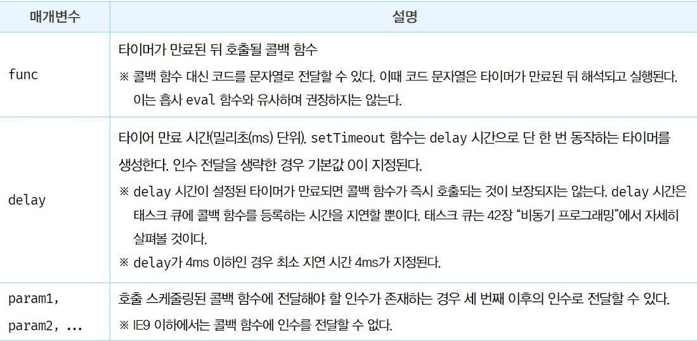
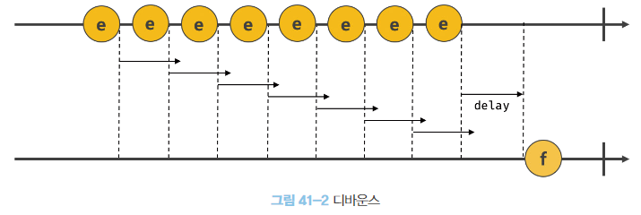
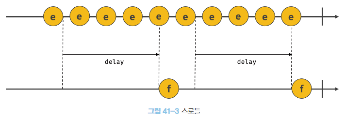

# 타이머

### 호출 스케줄링
- 함수를 명시적으로 호출하지 않고 일정 시간이 경과된 후에 호출되로록 타이머 함수를 통해 함수 호출을 예약하는 것
- 자바스크립트는 타이머를 생성할 수 있는 함수 (setTimeout/setInterval)와 타이머를 제거할 수 있는 (clearTimeout/clearInterval) 을 제공한다.
- 타이머 함수는 ECMAScript 사양에 정의된 빌트인 함수는 아니지만, 브라우저 환경과 Node.js 환경 모두 전역 객체의 메서드로 타이머 함수를 제공한다.
  타이머 함수는 호스트 객체이다. 
- 자바스크립트 엔진은 단 하나의 실행 컨텍스트 스택을 갖기 때문에 두 가지 이상의 테스크를 동시에 실행할 수 없다. 자바스크립트 엔진은 싱글 스레드로 동작한다.
때문에 타이머 함수는 비동기로 동작한다.

<br/>
<br/>

### 타이머 함수

##### 1. setTimeout / clearTimeout
- setTimeout
  - 첫 번째 인수로 호출할 함수를 전달
  - 두 번째 인수로 시간을 전달 (ms, 1/1000초)
    - 생략하면 기본 값 0이 지정된다.
  - 세 번째 이후의 인수로 콜백 함수에 전달될 인수를 전달할 수 있다.
  - 두 번째 인수로 전달받은 시간이 지나면 단 한번 동작하는 타이머를 생성한다.
  시간이 지나면 첫 번째 인수로 전달한 콜백 함수를 1회 호출한다.
  - setTimeout 함수는 생성된 타이머를 식별할 수 있는 고유한 타이머 id를 반환한다.
    타이머 id는 브라우저 환경인 경우 숫자이고, Node.js 환경인 경우 객체다.

```javascript
const timeoutId = setTimeout(func|code[, delay, param1, param2, ...]);

const timer = setTimeout(function (name) {
    console.log(`5초 이후 동작 ${name}`);
}, 5000, 'Lim');
```


- clearTimeout
  - setTimeout 타이머를 제거하는 메서드, 호출 스케줄링을 취소한다.
  - setTimeout 함수가 반환한 타이머 id를 clearTimeout의 인수로 전달하여 타이머를 취소할 수 있다. 
  
```js
const timerId = setTimeout(function {
    console.log(`hi`);
}, 5000);

clearTimeout(timerId);
```

##### 2. setInterval / clearInterval
- setInterval
  - 첫 번째 인수로 콜백함수 전달
  - 두 번째 인수로 타이머 시간 전달 (ms, 1/1000초)
  - 세 번째 인수 이후로는 콜백 함수로 전달할 인수 전달
  - 두 번째 인수로 전달한 시간으로 반복 동작하는 타이머를 생성한다.
  - 타이머가 만료될 때 마다 첫 번째 인수로 전달한 콜백 함수가 반복 호출된다.
    - 타이머가 취소될 때까지 지속
  - 전달 인수는 setTimeout과 동일하다.

- clearInterval
  - setInterval 타이머를 제거하는 메서드, 호출 스케줄링을 취소한다.
  - setInterval 함수가 반환한 타이머 id를 clearInterval 인수로 전달하여 타이머를 취소할 수 있다.
  
```javascript
const timeoutId = setInterval(func|code[, delay, param1, param2, ...]);

let count = 1;
const timerId = setInterval(function () {
    console.log(count);
    if (count++ === 5) {
        clearInterval(timerId);
    }
}, 5000);
```

<br/>
<br/>

### 디바운스와 스로틀
- 디바운스와 스로틀은 짧은 시간 간격으로 연속해서 발생하는 이벤트를 그룹화해서 과도한 이벤트 핸들러의 호출을 방지하는 프로그래밍 기법이다.
  - scroll, resize, input 등의 이벤트는 짧은 시간 간격으로 연속해서 발생한다.
    과도하게 호출되면 성능에 문제를 일으킬 수 있다.
- 디바운스와 스로틀은 이벤트를 처리할 때 매우 유용하다.
- 디바운스와 스로틀의 구현에는 타이머 함수가 사용된다.

##### 1. 디바운스
-  디바운스 (debounce)는 짧은 시간 간격으로 이벤트가 연속해서 발생하면 이벤트 핸들러를 호출하지 않다가 일정 시간이 경과한 이후에 이벤트 핸들러가 한 번만 호출되도록 한다.

```javascript
const $input = document.querySelector('input');
const debounce = (callback, delay) => {
    let timerId;
    return (...args) => {
        // delay가 경과하기 이전에 이벤트가 발생하면 이전 타이머를 취소하고 새로운 타이머를 생성한다.
        // delay보다 짧은 간격으로 이벤트가 발생하면 callback은 호출되지 않는다.
        if (timerId) {
            clearTimeout(timerId);
        }
        timerId = setTimeout(callback, delay, ...args);
    }
}

$input.oninput = debounce(e => {
    console.log('input');
}, 1000);
```

- 사용자가 텍스트 필드에 값을 입력할 때마다 연속으로 발생하는 이벤트에서 완료 이벤트를 캐치하려 할 때, debounce 함수의 두번째 인수로 전달한 시간보다 짧은 간격으로 이벤트가 발생하면 이전 타이머를 취소하고 새로운 타이머를 재설정한다. 따라서 delay보다 짧은 간격으로 이벤트를 발생시키면 debounce 함수의 첫번째 인수로 전달한 콜백 함수는 호출되지 않는다.
입력을 중단하여 이벤트 발생을 멈추고 delay 시간이 경과되면 콜백 함수가 호출된다.



- 위 예제는 이해를 위한 간략하게 구현한 것이므로 완전하지 않다.
- 실무에서는 Underscore의 debounce 함수나 lodash의 debounce 함수를 사용하는 것을 권장한다.


##### 2. 스로틀
- 스로틀(throttle)은 짧은 시간 간격으로 이벤트가 연속으로 발생하더라도 일정 간격으로 이벤트 핸들러가 최대 한 번만 호출되도록 한다.
- 짧은 기간동안 연속해서 발생하는 이벤트를 그룹화하여 일정 시간 단위로 이벤트 핸들러가 호출되도록 호출 주기를 만든다.

```javascript
const $container = document.querySelector('.container');

const throttle = (callback, delay) => {
    let timerId;
    // timerId를 기억하는 클로저를 반환한다.
    return (...args) => {
        // delay가 경과하기 이전에 이벤트가 발생하면 동작하지 않다가
        // delay가 경과했을 때 이벤트가 발생하면 새로운 타이머를 재설정한다.
        // delay 간격으로 callback이 호출된다.
        if (timerId) {
            return
        }
        timerId = setTimeout(() => {
            callback(...args);
            timerId = null;
        }, delay);
    }
}

// throttle 함수가 반환하는 클로저가 이벤트 핸들러로 등록된다.
$container.addEventListener('scroll', throttle(() => {
    // ...
}, 100));
```


- throttle 함수가 반환한 함수는 throttle 함수에 두 번째 인수로 전달한 시간이 경과하기 이전에 이벤트가 발생하면 무시하다가 delay 시간이 경과했을 때 이벤트가 발생하면 콜백함수를 호출하고 새로운 타이머를 재설정한다.
따라서 delay 시간 간격으로 콜백 함수가 호출된다.
- throttle 함수는 underscore나 lodash의 throttle 함수를 사용하는 것을 권장한다.

<br/>
<br/>

### 퀴즈

문제 1) 다음 예제가 실행된 이후, 콘솔에 찍히는 값은 무엇인가?

```javascript
const eventHandler = (delay, title) => {
    let count = 0;
    let timerId = null;

    const timer = setInterval(() => {
        if (count < 5) {
            count++;
            if (timerId) {
                clearTimeout(timerId);
            }
            timerId = setTimeout(() => {
                console.log(`repeat ${title} - ${count}`);
            }, 500);
        } else {
            clearInterval(timer);
        }
    }, delay);
}

eventHandler(1000, 'Lim');
eventHandler(300, 'Kim');

```

<details>
  <summary>정답</summary>
    repeat Lim - 1
    repeat Kim - 5
    repeat Lim - 2
    repeat Lim - 3
    repeat Lim - 4
    repeat Lim - 5
</details>