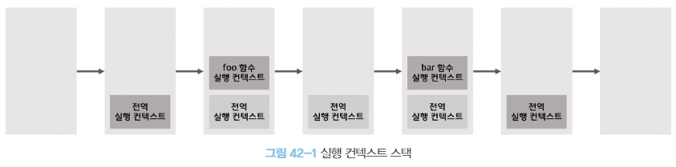
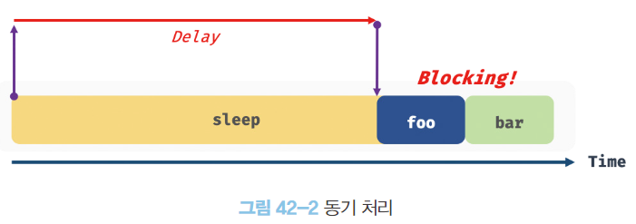
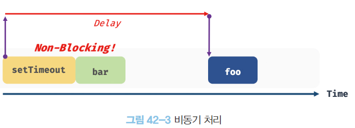
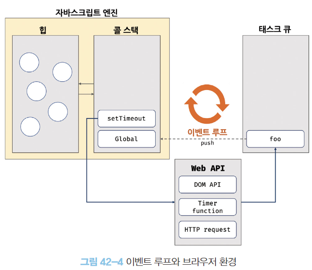
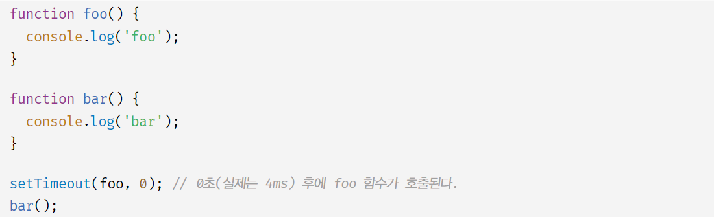
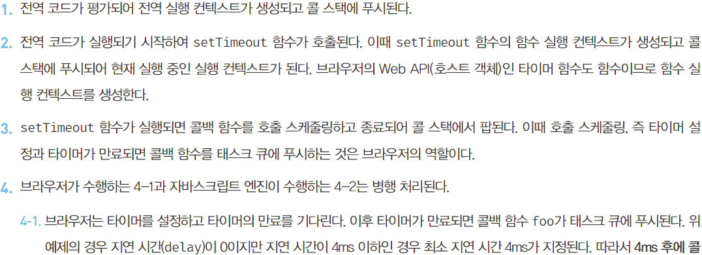
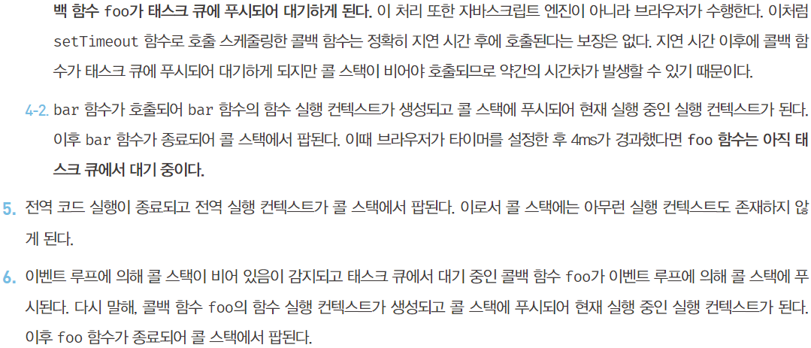

# 비동기 프로그래밍

### 동기 처리와 비동기 처리
- 실행 컨텍스트
  - 함수는 호출되면 함수 실행 컨텍스트가 생성되며, 실행 컨텍스트 스택에 푸시되고 함수가 실행된다.
  - 함수의 실행이 종료되면 실행 컨텍스트 스택에서 제거된다.
  - 실행 컨텍스트 스택에 함수 실행 컨텍스트가 푸사되는 것은 함수 실행의 시작을 의미한다.
  함수가 호출된 순서대로 순차적 실행되는 이유도 함수가 호출된 순서대로 함수 실행 컨텍스트에 푸시되기 때문이다.
  - 함수의 실행 순서는 실행 컨텍스트로 관리한다.
  - 자바스크립트는 단 하나의 함수 실행 컨텍스트 스택을 갖는다.
    - 함수를 실행할 수 있는 창구가 하나이며 동시에 2개 이상의 함수를 실행할 수 없다는 것을 의미
  - 실행 컨텍스트의 가장 상위에 쌓인 실행 컨텍스트를 제외한 모든 실행 컨텍스트는 모두 대기중인 테스크들이다. 현재 실행 중인 함수가 종료해야 순차적으로 실행된다.



- 싱글 스레드
  - 한 번에 하나의 태스크만 실행
  - 처리시간이 걸리는 태스크를 실행하는 경우 블로킹(작업 중단)이 발생한다.
- 동기 처리 방식 (synchronous)
  - 실행 중인 태스크가 종료할 때까지 다음에 실행될 태스크가 대기하는 방식
  - 장점
    - 태스크를 순서대로 하나씩 처리하므로 실행 순서가 보장된다.
  - 단점
    - 앞선 태스크가 종료되기 전까지는 이후 태스크들이 블로킹된다.



```js
function foo() {}
function bar() {}

setTimeout(foo, 3000);
bar();
```

- 위 예제에서 serTimeout은 비동기 함수이기 때문에 3초를 대기하지 않고 바로 bar 함수가 호출된다.
- 비동기 처리 방식 (asynchronous)
  - 위 처럼 실행 중인 태스크가 종료되지 않은 상태에서 다음 태스크를 바로 실행하는 방식
  - 장점
    - 블로킹이 발생하지 않음
  - 단점
    - 태스크의 실행 순서가 보장되지 않음
  - 비동기 함수는 전통적으로 콜백 패턴을 사용한다.
    - 비동기 처리를 위한 콜백 패턴은 콜백 헬(callback hell)을 발생시켜 가독성을 나쁘게하고, 비동기 처리중 발생한 에러의 예외처리가 곤란하며, 여러개의 비동기 처리를 한 번에 처리하는데 한계가 있다.
  - 타이머 함수인 setTimeout, setInterval, HTTP요청, 이벤트 핸들러는 비동기 처리 방식으로 동작한다. 




<br/>
<br/>

### 이벤트 루프와 태스크 큐
- 자바스크립트 엔진은 크게 2개의 영역으로 구분할 수 있다.



- 콜 스택 (call stack)
  - 스택 자료구조인 실행 컨텍스트 스택이 콜 스택이다.
  - 함수를 호출하면 함수 실행 컨텍스트가 순차적으로 콜 스택에 푸시되어 순차적으로 실행된다.
  자바스크립트 엔진은 단 하나의 콜스택을 사용하기 때문에 최상위 실행 컨텍스트가 종료되어 콜 스택에서 제거되기 전까지는 다른 태스크는 실행되지 않는다.
- 힙 (heap)
  - 힙은 객체가 저장되는 메모리 공간이다.
  - 콜 스택의 요소인 실행 컨텍스트는 힙에 저장된 객체를 참조한다.
  - 객체는 원시값과 달리 크기가 정해져있지 않으므로 할당해야할 메모리 공간의 크기를 런타임에 결정해야한다. 따라서 구조화 되어있지 않다는 특징이 있다.

---
- 호출 스케줄링을 위한 타이머 설정과 콜백 함수 등록은 브라우저 또는 Node.js가 담당한다.
이를 위해 브라우저는 태스크 큐와 이벤트 루프를 제공한다.
- 태스크 큐 (task queue / event queue / callback queue)
  - 비동기 함수의 콜백 함수 또는 이벤트 핸들러가 일시적으로 보관되는 영역
  - 태스크 큐와 별도로 프로미스의 후속 처리 메서드의 콜백 함수가 일시적으로 보관되는 마이크로태스크 큐도 존재한다. - 45.7절
  - 태스크 큐에 일시 보관되는 함수들은 비동기 처리 방식으로 동작한다.
- 이벤트 루프 (event loop)
  - 자바스크립트의 동시성(concurrency)을 지원하는 것
  - 브라우저 내장 기능 중 하나
  - 콜 스택에 현재 실행중인 실행 컨텍스트가 있는지, 태스트 큐에 대기중인 함수가 있는지 반복해서 확인한다.
  - 콜 스택이 비어있고 태스크 큐에 대기중인 함수가 있다면 이벤트 루프는 순차적(FIFO)으로 태스크 큐에 대기중인 함수를 콜 스택으로 이동시킨다.
  이 때 콜 스택으로 이동한 함수는 실행된다.





- 비동기함수 setTimeout의 콜백 함수는 전역 코드 및 명시적으로 호출된 함수가 모두 종료하면(콜 스택이 비게 되면) 콜 스택에 푸시되어 실행된다.
- 자바스크립트는 싱글 스레드로 동작하지만, 브라우저는 멀티 스레드로 동작한다.
  - 비동기 처리를 위함 모든 동작이 자바스크립트 엔진에서 수행된다면 setTimeout의 콜백 함수 호출 스케줄링을 위한 타이머 설정도 자바스크립트 엔진에서 수행하게 될 것이므로 다음 태스크를 실행할 수 없다.
  - 자바스크립트 엔진과 브라우저가 병렬로 동작하며 비동기 함수를 실행한다.
- 브라우저 엔진은 자바스크립트 엔진 이외에 렌더링 엔진, Web API를 제공한다.
  - Web API는 ECMAScript 사양에 정의된 함수가 아니라 브라우저에서 제공하는 API이다.
  DOM API, 타이머함수, HTTP요청과 같은 비동기 처리를 포함한다.

<br/>
<br/>

