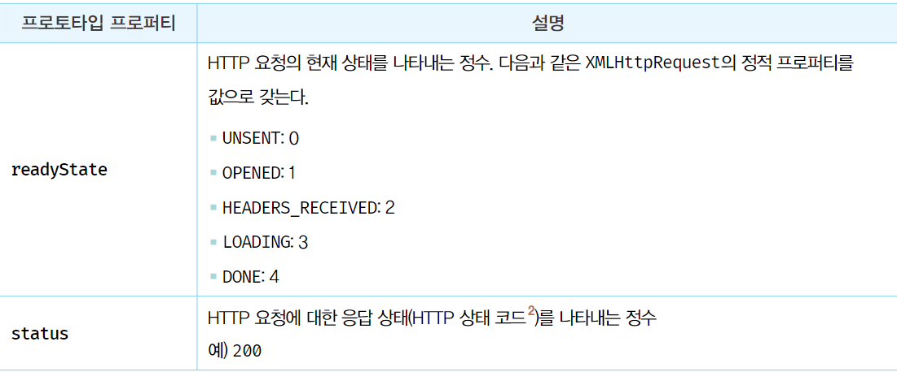
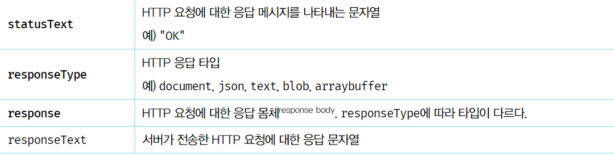
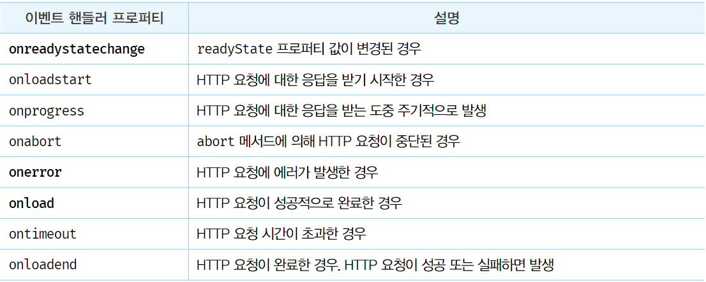
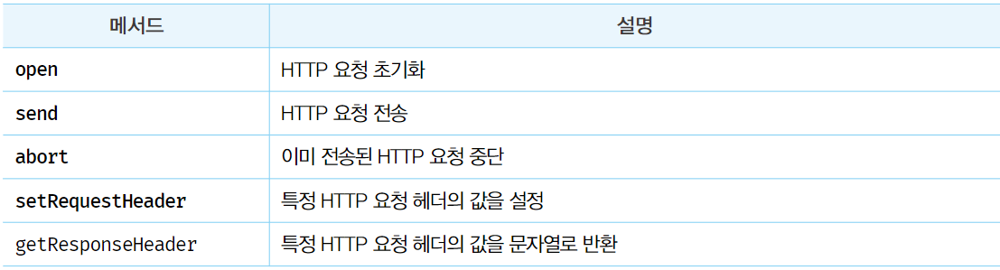
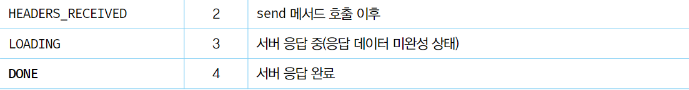
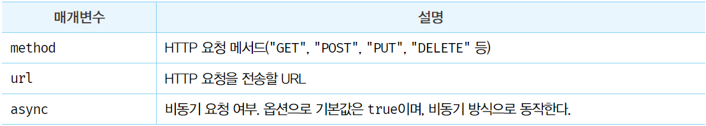
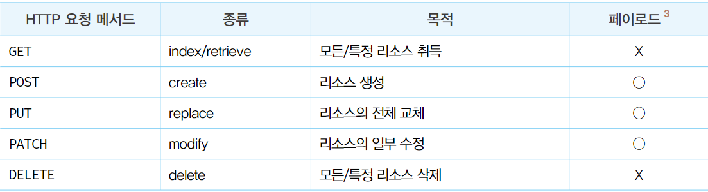
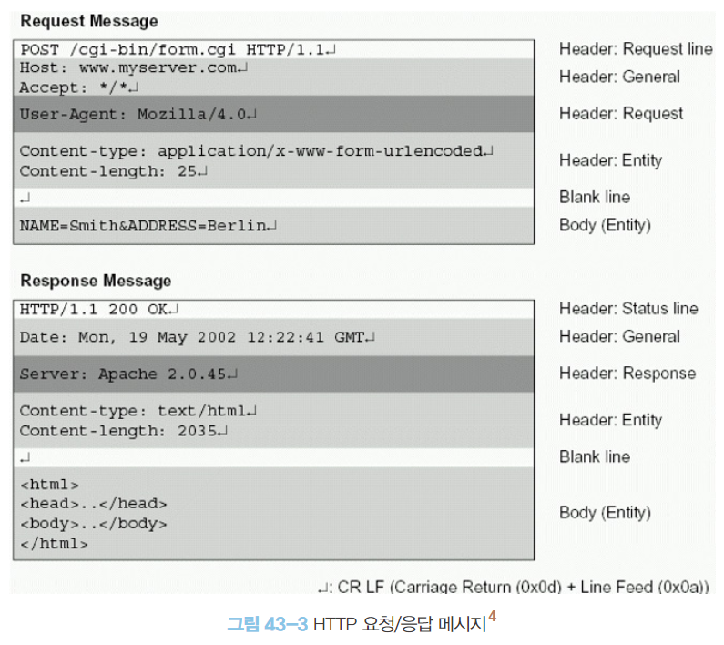
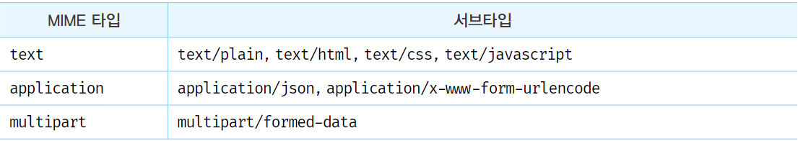

# Ajax

### Ajax 란?

- Ajax란, 자바스크립트를 사용하여 브라우저가 서버에게 비동기 방식으로 데이터를 요청하고,
  서버가 응답한 데이터를 수신하여 웹페이지를 동적으로 갱신하는 프로그래밍 방식을 말한다.
- 브라우저에서 제공하는 Web API인 XMLHttpRequest 객체를 기반으로 동작한다.
- XMLHttpRequest
  - HTTP 비동기 통신을 위한 메서드와 프로퍼티를 제공


- 전통적인 웹페이지의 생명 주기에서는 완전한 html을 전송받아 웹페이지 전체를 다시 렌더링하는 방식으로 동작했다.
  - 화면이 전환될 때마다 새로운 html을 전송받아 웹페이지 전체를 렌더링
- 전통 방식의 단점
  1. 이전 웹페이지와 차이가 없어서 변경할 필요가 없는 부분까지 포함한 완전한 HTML을 서버로부터 매번 다시 전송받기 때문에 불필요한 데이터 통신이 발생한다.
  2. 변경할 필요가 없는 부분까지 처음부터 다시 렌더링 한다.
     이로 인해 전환이 일어나면 순간적으로 깜박이는 현상이 발생한다.
  3. 클라이언트와 서버와의 통신이 동기 방식으로 동작하기 때문에 서버로부터 응답이 있을 때까지 다음 처리는 블로킹 처리된다.


- ajax는 서버로부터 웹페이지의 변경에 필욯나 데이터만 비동기 방식으로 전송받아 변경할 필요가 없는 부분은 다시 렌더링 하지 않고, 변경이 필요한 부분만 한정적으로 렌더링한다.
  이를 통해 브라우저에서도 데스크탑 애플리케이션과 유사한 빠른 퍼포먼스와 부드러운 화면 전환이 가능해졌다.
- 전통적인 방식과 비교했을 때의 ajax의 장점
  1. 변경할 부분을 갱신하는데 필요한 데이터만 서버로부터 전송받기 때문에 불필요한 데이터 통신이 발생하지 않는다.
  2. 변경할 필요가 없는 부분은 렌더링하지 않는다. 따라서 화면이 순간적으로 깜박이는 현상이 발생하지 않는다.
  3. 클라이언트와 서버 통신이 비동기 방식으로 동작하기 때문에 서버에게 요청을 보낸 이후로 블로킹이 발생하지 않는다.

<br/>
<br/>

### JSON

- 클라이언트와 서버 간의 HTTP 통신을 위한 텍스트 데이터 포멧이다.
- 자바스크립트에 종속되지 않는 언어 독립형 데이터 포멧으로, 대부분의 프로그래밍 언어에서 사용할 수 있다.

##### 1. JSON 표기 방식
- JSON은 자바스크립트의 객체 리터럴과 유사하게 키와 값으로 구성된 순수한 텍스트다.

```json
{
  "name": "soeun",
  "age": "27",
  "alive": true,
  "hobby": ["swim", "baking"]
}
```

- JSON의 키는 반드시 큰따옴표(작은 따옴표 사용불가)로 묶어야한다.
- 값은 객체 리터럴과 같은 표기법을 사용할 수 있다.

##### 2. JSON.stringify
- JSON.stringify()
  - 객체 또는 배열을 JSON 포멧의 문자열로 변환한다.
  - 첫 번째 인수로 문자열로 반환할 객체를 전달한다.
  - 두 번째 인수로 replacer 함수를 전달한다.
  - 세 번째 인수로 들여쓰기 칸 수를 전달한다.
- 직렬화
  - 클라이언트가 서버로 객체를 전송하기 위해 객체를 문자열화 하는 것

```javascript
const obj = {
  name: "Lim",
  age: 27
};

const json = JSON.stringify(obj);
console.log(json); // { "name": "Lim", "age": 27 }

const json = JSON.stringify(obj, null, 2);
console.log(json);
/* 
{ 
  "name": "Lim",
  "age": 27 
}
*/

// 값의 타입이 숫자면 반환하지 않는 replacer 함수를 전달한 결과
function filter(key, value) {
  return typeof value === 'number' ? undefined : value;
}
const json = JSON.stringify(obj, filter, 2);
console.log(json);
/* 
{ 
  "name": "Lim"
}
*/
```

##### 3. JSON.parse
- JSON.parse()
  - JSON 포멧의 문자열을 객체로 변환한다.
  - 배열이 JSON 포멧의 문자열로 변환되어 있는 경우 문자열을 배열 객체로 변환한다.
    - 배열의 요소가 객체인 경우 배열의 요소까지 객체로 변환한다.
- 역직렬화
  - 서버로부터 클라이언트에게 전송된 JSON 데이터인 문자열을 객체로 사용하기 위해 
  JSON 문자열을 객체화 하는 것

```javascript
const obj = {
  name: "Lim",
  age: 27
};

const json = JSON.stringify(obj);
const parsed = JSON.parse(json);
console.log(parsed);
/*
{
  name: "Lim",
  age: 27
}
*/
```

<br/>
<br/>

### XMLHttpRequest
- Web API인 XMLHttpRequest 객체는 HTTP 요청과 응답을 위한 다양한 메서드와 프로퍼티를 제공한다.

##### 1. XMLHttpRequest 객체 생성
- XMLHttpRequest 객체는 XMLHttpRequest 생성자 함수를 호출하여 생성한다.
- XMLHttpRequest 객체는 브라우저에서 제공하는 Web API 이므로 브라우저 환경에서만 정상적으로 실행된다.

```javascript
const xhr = new XMLHttpRequest();
```

##### 2. XMLHttpRequest 객체의 프로퍼티와 메서드
- XMLHttpRequest 객체의 프로토타입 프로퍼티



- XMLHttpRequest 객체의 이벤트 핸들러 프로퍼티


- XMLHttpRequest 객체의 메서드


- XMLHttpRequest 객체의 정적 프로퍼티




##### 3. HTTP 요청 전송
###### HTTP 요청을 전송하는 경우 다음 순서를 따른다.
1. XMLHttpRequest.prototype.open 메서드로 HTTP 요청을 초기화한다.
2. 필요에 따라 XMLHttpRequest.prototype.setRequestHeader 메서드로 특정 HTTP 요청의 헤더 값을 설정한다.
3. XMLHttpRequest.prototype.send 메서드로 HTTP 요청을 전송한다.

```javascript
const xhr = new XMLHttpRequest();
// HTTP 요청 초기화
xhr.open('GET', '/user');
// 헤더 추가
xhr.setRequestHeader('content-type', 'application/json');
// HTTP 요청 전송
xhr.send();
```

- XMLHttpRequest.prototype.open
  - open 메서드는 서버에 전송할 HTTP 요청을 초기화한다.
  ```javascript
  // open 메서드 호출법
  xhr.open(method, url[, async])
  ```


- HTTP 요청 메서드는 클라이언트가 서버에게 요청의 종류와 목적을 알리는 방법이다.
- 주로 5가지 요청 메서드를 사용하여 CRUD를 구현한다.



- XMLHttpRequest.prototype.send
  - send 메서드는 open 메서드로 초기화된 HTTP 요청을 서버에 전송한다.
  - 서버로 전송하는 데이터는 GET, POST 요청 메서드에 따라 전송 방식에 차이가 있다.
  - 요청 몸체를 담아 전송할 데이터를 인수로 전달할 수 있다.
    - payload가 객체인 경우 반드시 JSON.stringify 메서드를 사용하여 직렬화한 다음 전달해야한다.

```js
xhr.send(JSON.stringify({ id: 1, content: 'HTML', ... }));
```

- GET
  - 데이터를 URL의 일부분인 쿼리 문자열(query string)로 서버에 전송한다.
  - send 메서드에 페이로드로 전달한 인수가 있다면 무시되고 몸체는 null로 설정된다.
- POST
  - 데이터를 몸체(body)에 담아 전송한다.



- XMLHttpRequest.prototype.setRequestHeader
  - 특정 HTTP 요청의 헤더 값을 설정하는 메서드
  - 반드시 open 메서드를 호출한 이후에 호출해야한다.
  - Content-type
    - 자주 사용되는 요청 헤더이며, 몸체에 담아 전송할 데이터의 MIME 타입의 정보를 표현한다.
    
    ```js
    xhr.setRequestHeader('content-type', 'application/json');
    ```
  - Accept
    - 서버가 응답할 데이터의 MIME 타입을 지정할 수 있다.
    ```js
    xhr.setRequestHeader('accept', 'application/json');
    ```
    - Accept 헤더를 설정하지 않으면 send 메서드가 호출될 때 Accept 헤더가 */*로 전송된다.

##### 4. HTTP 응답 처리
- 서버가 전송한 응답을 처리하려면 XMLHttpRequest 객체가 발생시키는 이벤트를 캐치해야한다.
- XMLHttpRequest 객체는 여러가지 이벤트 핸들러 프로퍼티를 제공한다.
- readystatechange
  - HTTP 요청의 현재 상태를 나타내는 readyState 프로퍼티 값이 변경될 때마다 발생하는 이벤트
  - 이벤트를 캐치하여 HTTP 응답을 처리할 수 있다.
  - onreadystatechange
    - 이벤트 핸들러 프로퍼티
  - xhr.readyState 가 XMLHttpReequest.DONE인지 확인하여 서버의 응답이 완료되었는지 확인
  - xhr.status 가 200인지 확인하여 정상/에러 처리를 구분한다.

```js
const xhr = new XMLHttpRequest();
// HTTP 요청 초기화
xhr.open('GET', 'https://jsonplaceholder.typicode.com/todos/1');
// HTTP 요청 전송
xhr.send();

xhr.onreadystatechange = () => {
  // 서버 응답이 완료되지 않았으면 동작x
  if (xhr.readyState !== XMLHttpRequest.DONE) {
    return;
  }

  if (xhr.status === 200) {
    // 정상 처리
  } else {
    // 에러 처리
  }
}
```

- load 이벤트
  - HTTP 요청이 성공적으로 완료된 경우 발생하는 이벤트
  - xhr.readyStatus가 XMLHttpRequest.DONE인지 확인할 필요 없음

```js
const xhr = new XMLHttpRequest();
// HTTP 요청 초기화
xhr.open('GET', 'https://jsonplaceholder.typicode.com/todos/1');
// HTTP 요청 전송
xhr.send();

xhr.onload = () => {
  if (xhr.status === 200) {
    // 정상 처리
  } else {
    // 에러 처리
  }
}
```


<br/>
<br/>
