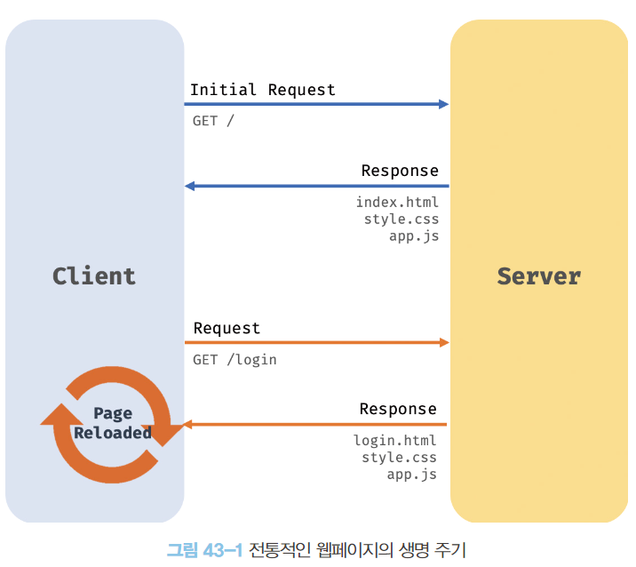
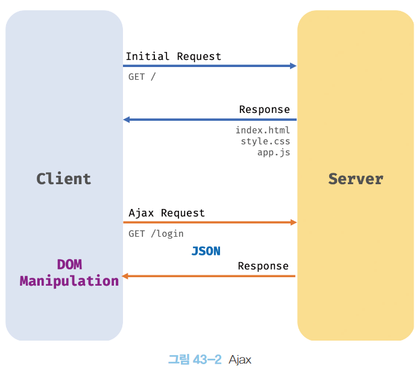

# Ajax

### Ajax 란?

- Ajax란, 자바스크립트를 사용하여 브라우저가 서버에게 비동기 방식으로 데이터를 요청하고,
  서버가 응답한 데이터를 수신하여 웹페이지를 동적으로 갱신하는 프로그래밍 방식을 말한다.
- 브라우저에서 제공하는 Web API인 XMLHttpRequest 객체를 기반으로 동작한다.
- XMLHttpRequest
  - HTTP 비동기 통신을 위한 메서드와 프로퍼티를 제공



- 전통적인 웹페이지의 생명 주기에서는 완전한 html을 전송받아 웹페이지 전체를 다시 렌더링하는 방식으로 동작했다.
  - 화면이 전환될 때마다 새로운 html을 전송받아 웹페이지 전체를 렌더링
- 전통 방식의 단점
  1. 이전 웹페이지와 차이가 없어서 변경할 필요가 없는 부분까지 포함한 완전한 HTML을 서버로부터 매번 다시 전송받기 때문에 불필요한 데이터 통신이 발생한다.
  2. 변경할 필요가 없는 부분까지 처음부터 다시 렌더링 한다.
     이로 인해 전환이 일어나면 순간적으로 깜박이는 현상이 발생한다.
  3. 클라이언트와 서버와의 통신이 동기 방식으로 동작하기 때문에 서버로부터 응답이 있을 때까지 다음 처리는 블로킹 처리된다.



- ajax는 서버로부터 웹페이지의 변경에 필욯나 데이터만 비동기 방식으로 전송받아 변경할 필요가 없는 부분은 다시 렌더링 하지 않고, 변경이 필요한 부분만 한정적으로 렌더링한다.
  이를 통해 브라우저에서도 데스크탑 애플리케이션과 유사한 빠른 퍼포먼스와 부드러운 화면 전환이 가능해졌다.
- 전통적인 방식과 비교했을 때의 ajax의 장점
  1. 변경할 부분을 갱신하는데 필요한 데이터만 서버로부터 전송받기 때문에 불필요한 데이터 통신이 발생하지 않는다.
  2. 변경할 필요가 없는 부분은 렌더링하지 않는다. 따라서 화면이 순간적으로 깜박이는 현상이 발생하지 않는다.
  3. 클라이언트와 서버 통신이 비동기 방식으로 동작하기 때문에 서버에게 요청을 보낸 이후로 블로킹이 발생하지 않는다.

<br/>
<br/>

### JSON

- 클라이언트와 서버 간의 HTTP 통신을 위한 텍스트 데이터 포멧이다.
- 자바스크립트에 종속되지 않는 언어 독립형 데이터 포멧으로, 대부분의 프로그래밍 언어에서 사용할 수 있다.

##### 1. JSON 표기 방식
- JSON은 자바스크립트의 객체 리터럴과 유사하게 키와 값으로 구성된 순수한 텍스트다.

```json
{
  "name": "soeun",
  "age": "27",
  "alive": true,
  "hobby": ["swim", "baking"]
}
```

- JSON의 키는 반드시 큰따옴표(작은 따옴표 사용불가)로 묶어야한다.
- 값은 객체 리터럴과 같은 표기법을 사용할 수 있다.

##### 2. JSON.stringify
- JSON.stringify()
  - 객체 또는 배열을 JSON 포멧의 문자열로 변환한다.
  - 첫 번째 인수로 문자열로 반환할 객체를 전달한다.
  - 두 번째 인수로 replacer 함수를 전달한다.
  - 세 번째 인수로 들여쓰기 칸 수를 전달한다.
- 직렬화
  - 클라이언트가 서버로 객체를 전송하기 위해 객체를 문자열화 하는 것

```javascript
const obj = {
  name: "Lim",
  age: 27
};

const json = JSON.stringify(obj);
console.log(json); // { "name": "Lim", "age": 27 }

const json = JSON.stringify(obj, null, 2);
console.log(json);
/* 
{ 
  "name": "Lim",
  "age": 27 
}
*/

// 값의 타입이 숫자면 반환하지 않는 replacer 함수를 전달한 결과
function filter(key, value) {
  return typeof value === 'number' ? undefined : value;
}
const json = JSON.stringify(obj, filter, 2);
console.log(json);
/* 
{ 
  "name": "Lim"
}
*/
```

##### 3. JSON.parse
- JSON.parse()
  - JSON 포멧의 문자열을 객체로 변환한다.
  - 배열이 JSON 포멧의 문자열로 변환되어 있는 경우 문자열을 배열 객체로 변환한다.
    - 배열의 요소가 객체인 경우 배열의 요소까지 객체로 변환한다.
- 역직렬화
  - 서버로부터 클라이언트에게 전송된 JSON 데이터인 문자열을 객체로 사용하기 위해 
  JSON 문자열을 객체화 하는 것

```javascript
const obj = {
  name: "Lim",
  age: 27
};

const json = JSON.stringify(obj);
const parsed = JSON.parse(json);
console.log(parsed);
/*
{
  name: "Lim",
  age: 27
}
*/
```

<br/>
<br/>

### XMLHttpRequest


##### 1. XMLHttpRequest 객체 생성

##### 2. XMLHttpRequest 객체의 프로퍼티와 메서드

##### 3. HTTP 요청 전송

##### 4. HTTP 응답 처리

<br/>
<br/>
