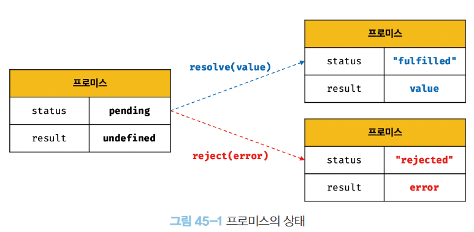
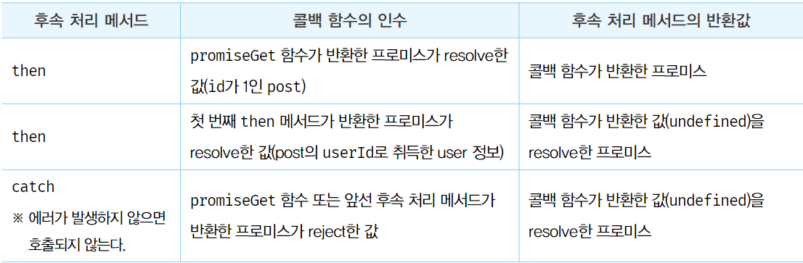

# 프로미스

- ES6에서 도입된 비동기처리를 위한 패턴
- 비동기처리를 위한 패턴 중 하나인 콜백 패턴이 가진 단점을 보완하며, 비동기 처리 시점을 명확하게 표현할 수 있다.

### 비동기 처리를 위한 콜백 패턴의 단점

##### 1. 콜백 헬

```javascript
const get = (url, successCallback, errorCallback) => {
  const xhr = new XMLHttpRequest();
  xhr.open(url);
  xhr.send();

  xhr.onload() => {
    if (xhr.status === 200) {
      successCallback(xhr);
    } else {
      errorCallback(xhr);
    }
  }
}
```

- 위와 같은 비동기 통신에 대해 응답을 받은 후 처리를 하려면 콜백 함수를 전달하여 처리하는 것이 일반적이다.
  하지만 응답의 결과로 다시 비동기 함수를 호출해야 한다면 콜백 함수 호출이 중첩되어 복잡도가 높아진다.

```javascript
// 콜백 헬이 발생하는 대표적인 사례
get('/step1', a => {
  get(`/step2/${a}`, b => {
    get(`/step3/${b}`, c => {
      get(`/step4/${c}`, d => {
        console.log(d);
      });
    });
  });
});

```

##### 2. 에러 처리의 한계

- 비동기 처리를 위한 콜백 패턴의 가장 큰 문제점은 에러 처리가 곤란한 것이다.

```javascript
try {
  setTimeout(function() { throw new Error(); }, 200);
} catch (e) {
  console.log(e);
}
```

- 위 예제의 setTimeout 함수는 비동기 함수이므로 호출된 이후 콜백함수가 호출되는 것을 기다리지 않고 즉시 종료되어 콜 스택에서 제거된다.
  이후 setTimeout 함수의 콜백 함수는 태스크 큐로 푸시되고 콜 스택이 비워지면 이벤트 루프에 의해 콜 스택으로 푸시되어 실행된다.
- 콜백함수가 실행될 때 setTimeout은 이미 콜 스택에서 제거된 상태이므로 콜백함수는 setTimeout이 호출한 것이 아님을 알 수 있다.
  - 콜백 함수의 호출자가 setTimeout 함수이려면 콜 스택에 현재 실행 중인 컨텍스트가 콜백함수일 때 하위 실행 컨텍스트가 setTimeout 함수여야 한다.
- 에러는 호출자 방향으로 전파된다.
  - setTimeout은 호출자가 아니므로 콜백 함수에서 에러가 발생해도 catch 블록에서 캐치되지 않는다.
- try ... catch ... finally 문
  - 에러 처리를 구현하는 방법
  - try 코드 블록이 먼저 실행되며, try 코드 블록에 포함된 문 중에서 에러가 발생하면 해당 에러는 catch 문의 err 변수에 전달되고 catch 코드 블록이 실행된다.
    finally 코드 블록은 에러 발생과 상관 없이 try / catch 코드 블록이 종료되고 반드시 한 번 실행된다.

<br/>
<br/>

### 프로미스 생성

- Promise 생성자 함수를 new 연산자와 함께 호출하면 프로미스(Promise 객체)를 생성한다.
- Promise는 ECMAScript 사양에 정의된 표준 빌트인 객체다.
- Promise 생성자 함수는 비동기 처리를 수행할 콜백 함수 resolve와 reject를 전달 받는다.
  - 인수들은 ECMAScript 사양에서 executor 함수라고 부른다.

```javascript
const promiseGet = url => {
  return new Promise((resolve, reject) => {
    const xhr = new XMLHttpRequest();
    xhr.open(url);
    xhr.send();

    xhr.onload() => {
      if (xhr.status === 200) {
        resolve(xhr);
      } else {
        reject(xhr);
      }
    }
  });
}
```

- 비동기 함수인 promiseGet 함수는 내부에서 프로미스를 생성하고 반환한다.
- 비동기 처리가 성공하면 resolve 함수에, 실패하면 reject 함수에 인수를 전달하여 호출한다.
- 프로미스는 다음과 같이 현재 비동기 처리가 어떻게 진행되고 있는지 나타내는 상태 정보를 갖는다.
  
  - 생성 직후의 프로미스는 기본적으로 Pending 상태이다.
  - 비동기 처리 성공: resolve 함수를 호출해 프로미스를 fulfilled 상태로 변경한다.
  - 비동기 처리 실패: reject 함수를 호출해 프로미스를 rejected 상태로 변경한다.
    
- settled 상태
  - fulfilled 상태 또는 rejected 상태
  - 처리 결과와 상관 없이 pending이 아닌 상태로 비동기 처리가 수행된 상태를 말한다.
  - settled 상태가 되면 더는 다른 상태로 변화할 수 없다.
- fulfilled 상태의 result
  - 비동기 성공 처리 결과인 1을 값으로 갖는다.
    
- rejected 상태의 result
  - 비동기 실패 처리 결과로 Error 객체를 값으로 갖는다.
    
- 프로미스는 비동기 처리 결과를 관리하는 객체이다.

<br/><br/>

### 프로미스의 후속 처리 메서드

- 프로미스는 비동기 처리 결과를 위한 후속 메서드를 제공한다.
- 비동기 처리 결과에 따라 후속 처리 메서드가 선택적으로 호출된다.
- 모든 후속 처리 메서드는 프로미스를 반환하며, 비동기로 동작한다.

##### 1. Promise.prototype.then

- then 메서드는 두개의 콜백 함수를 인수로 받는다.
- 첫 번째 콜백 함수는 프로미스가 fulfilled 상태(resolve가 호출된 상태)가 되면 호출된다.
  - 콜백 함수는 프로미스의 비동기 처리 결과를 인수로 전달받는다.
- 두 번째 콜백 함수는 프로미스가 rejected 상태(reject가 호출된 상태)가 되면 호출된다.
  - 콜백 함수는 프로미스의 에러를 인수로 전달받는다.

```javascript
new Promise(resolve => resolve('fulfilled'))
  .then(v => console.log(v), e => console.log(e)); // fulfilled
  
new Promise((_, reject) => reject(new Error('rejected')))
  .then(v => console.log(v), e => console.log(e)); // Error: rejected
```

- then 메서드는 언제나 프로미스를 반환한다.
  만약 then 메서드의 콜백 함수가 프로미스를 반환하면 그대로 반환하고, 프로미스가 아닌 값을 반환하면 그 값을 암묵적으로 resolve / reject하여 프로미스를 생성해 반환한다.

##### 2. Promise.prototype.catch

- catch 메서드는 한개의 콜백 함수를 인수로 전달받는다.
- 프로미스가 reject인 경우만 호출된다.

```javascript
new Promise((_, reject) => reject(new Error('rejected')))
  .catch(e => console.log(e)); // Error: rejected
```

- catch 메서드는 then 메서드와 동일하게 동작하므로 언제나 프로미스를 반환한다.

```javascript
new Promise((_, reject) => reject(new Error('rejected')))
  .then(undefined, e => console.log(e)); // Error: rejected
```

##### 3. Promise.prototype.finally

- finally 메서드는 한개의 콜백 함수를 인수로 전달받는다.
- finally 메서드의 콜백 함수는 프로미스의 성공/실패 여부와 상관없이 한번만 호출된다.
- 프로미스의 상태와 상관없이 공통적으로 처리할 내용이 있는 경우 유용하다.
- 언제나 프로미스를 반환한다.

```javascript
new Promise(() => {})
  .finally(() => console.log('finally')); // finally
```

<br/>
<br/>

### 프로미스의 에러 처리
- then
  - 두 번째 콜백 함수에서 처리 가능
  - 첫 번째 콜백 함수에서 발생한 에러를 캐치하지 못하고 가독성이 좋지 않다.
- catch
  - 내부적으로 then(undefined, e => {}) 로 처리된다.
  - then 메서드의 두 번째 콜백 함수보다 가독성이 좋다.
  - 모든 then 메서드를 호출한 이후에 호출하면 비동기 처리에서 발생한 에러 뿐만 아니라 then 메서드 내부에서 발생한 에러도 캐치할 수 있다.

<br/>
<br/>

### 프로미스 체이닝
- then, catch, finally 메서드를 통해 콜백 헬을 해결할 수 있다.
- 후속 처리 메서드들은 언제나 프로미스를 반환하기 때문에 연속적으로 호출 가능하다.
이를 프로미스 체이닝(promise chaining)이라고 한다.


- 위 예제에서 후속 처리 메서드의 콜백 함수는 다음과 같이 인수를 전달받으면서 호출된다.



<br/>
<br/>

### 프로미스의 정적 메서드
- Promise는 주로 생성자 함수로 사용되지만 함수도 객체이므로 메서드를 가질 수 있다.

##### 1. Promise.resolve / Promise.reject
- Promise.resolve와 Promise.reject 메서드는 이미 존재하는 값을 매핑하여 프로미스를 생성하기 위해 사용한다.
- Promise.resolve
  - 인수로 전달받은 값을 resolve하는 프로미스를 생성한다.
  ```js
    const resolvePromise = Promise.resolve([1,2,3]);
    resolvePromise.then(console.log); // [1,2,3]
    // 위 예제와 동일하게 동작한다.
    const resolvePromise2 = new Promise(resolve => resolve([1,2,3]));
    resolvePromise2.then(console.log); // [1,2,3]
  ```
- Promise.reject
  - 인수로 전달받은 값을 reject하는 프로미스를 생성한다.
  ```js
    const rejectPromise = Promise.reject('Error!');
    rejectPromise.catch(console.log); // Error: 'Error!'
    // 위 예제와 동일하게 동작한다.
    const rejectPromise2 = new Promise((_, reject) => reject('Error!'));
    rejectPromise2.catch(console.log); // Error: 'Error!'
  ```

##### 2. Promise.all
- 여러 개의 비동기 처리를 모두 병렬 처리할 때 사용된다.
- 프로미스를 요소로 갖는 배열 등의 이터러블을 인수로 전달받는다.
  - 인수로 전달받은 이터러블의 요소가 프로미스가 아닌 경우 Promise.resolve 메서드를 통해 프로미스로 래핑한다.
- 전달받은 프로미스가 모두 fulfilled 상태가 되면 모든 처리 결과를 배열에 저장해 새로운 프로미스를 반환한다.
- 처리 순서가 보장된다.
  - 첫 번째 프로미스가 가장 나중에 fulfilled 상태가 되어도 Promise.all 매서드는 첫 번째 프로미스가 resolve한 처리 결과부터 차례대로 배열에 저장해 그 배열을 resolve하는 새로운 프로미스를 반환한다.
- 전달받은 배열의 프로미스가 하나라도 rejected 상태가 되면 나머지 프로미스가 fulfilled 상태가 되는 것을 기다리지 않고 즉시 종료한다.
  - 에러를 reject 하는 새로운 프로미스를 catch 메서드로 반환한다.


##### 3. Promise.race
- Promise.all 메서드와 동일하게 프로미스를 요소로 갖는 이터러블을 인수로 전달받는다.
- Promise.race 메서드는 전달받은 프로미스 중 가장 먼저 fulfilled 상태가 된 프로미스의 처리 결과를 resolve하는 새로운 프로미스를 반환한다.
- 프로미스가 rejected 상태가 되면 Promise.all과 동일하게 처리된다.
  - 에러를 reject 하는 새로운 프로미스를 catch로 반환한다.


##### 4. Promise.allSettled
- 프로미스를 요소로 갖는 이터러블을 인수로 전달받는다.
- 전달받은 프로미스가 모두 settled 상태(모두 fulfilled 또는 rejected 상태)가 되면 처리 결과를 배열로 반환한다.


- 프로미스의 처리 결과를 나타내는 객체는 다음과 같다
  - fulfilled 상태
    - status: 비동기 처리 상태를 나타내는 프로퍼티
    - value: 처리 결과를 나타내는 프로퍼티
  - rejected 상태
    - status: 비동기 처리 상태를 나타내는 프로퍼티
    - reason: 에러를 나타내는 프로퍼티


<br/>
<br/>

### 마이크로 태스크큐
- 태스크 큐와는 별도의 큐다.
- 마이크로 태스크 큐에는 프로미스의 후속 처리 메서드의 콜백 함수가 일시 저장된다.
그 외의 비동기 함수의 콜백 함수나 이벤트 핸들러는 태스크 큐에 일시 저장된다.
- 일시 저장된다는 점에서 태스크 큐와 동일하지만 마이크로 태스크 큐는 태스크 큐보다 우선순위가 더 높다.
이벤트 큐는 콜 스택이 비면 먼저 마이크로 태스크 큐에 대기하고 있는 함수를 가져와 실행한 후, 마이크로 태스크 큐가 비면 태스크 큐에서 대기하고 있는 함수를 가져와 실행한다.

```javascript
setTimeout(() => { console.log(1) }, 0);

Promise.resolve()
  .then(() => console.log(2))
  .then(() => console.log(3));
  // 해당 예제는 2 -> 3 -> 1 순서로 출력된다.
```

<br/>
<br/>

### fetch
- fetch 함수는 HTTP 요청 전송 기능을 제공하는 클라이언트 사이드 Web API
- XMLHttpRequest 보다 사용법이 간단하고 프로미스를 지원하기 때문에 비동기 처리를 위한 콜백 패턴의 단점에서 자유롭다.
- 전달 인수
  - url
  - HTTP 요청 메서드
  - HTTP 요청 헤더
  - 페이로드 
  - 등

```js
const promise = fetch(url[, option]);
```

- fetch 함수는 HTTP 응답을 나타내는 Response 객체를 래핑한 Promise 객체를 반환한다.
  - 후속 처리 메서드인 then, catch, finally 를 사용할 수 있다.
- Response 객체
  - HTTP 응답을 나타내는 다양한 프로퍼티를 제공한다.
  - fetch에서는 then을 통해 프로미스가 resolve한 Response 객체를 받을 수 있다.
- 응답 취득 
  - Response.json()
    - mime 타입이 application/json인 HTTP 응답 몸체(response.body)를 취득하여 역직렬화하는 메서드
- 에러 처리
  - fetch의 에러처리는 주의가 필요하다.
  - fetch 함수가 반환하는 프로미스는 기본적으로 404 Not Found나 500 Internal Server Error와 같은 HTTP 에러가 발생해도 에러를 reject 하지않고 불리언 타입의 ok 상태를 false로 설정한 Response 객체를 resolve한다.
  - 오프라인 등의 네트워크 장애나 CORS 에러에 의해 요청이 완료되지 못한 경우만 프로미스를 reject한다.
  - 따라서 fetch 함수를 사용할 때는 반환된 프로미스가 resolve한 불리언 타입의 ok 상태를 확인해 명시적으로 에러 처리를 할 필요가 있다.
- *참고로 axios는 모든 HTTP 에러를 reject하는 프로미스를 반환한다.
또한 인터셉터, 요청 설정 등 fetch 보다 다양한 기능을 제공한다.

```javascript
const request = {
  get(url) {
    return fetch(url);
  },
  post(url, payload) {
    return fetch(url, {
      mathod: 'POST',
      headers: { 'content-Type': 'application/json'},
      body: JSON.stringify(payload)
    });
  },
  patch(url, payload) {
    return fetch(url, {
      mathod: 'PATCH',
      headers: { 'content-Type': 'application/json'},
      body: JSON.stringify(payload)
    });
  },
  delete(url) {
    return fetch(url, { method: 'DELETE' });
  }
}
```


<br/>
<br/>
